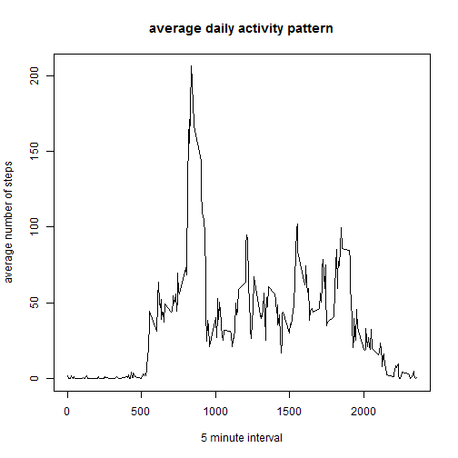
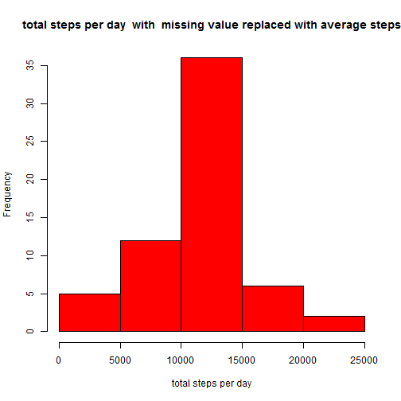
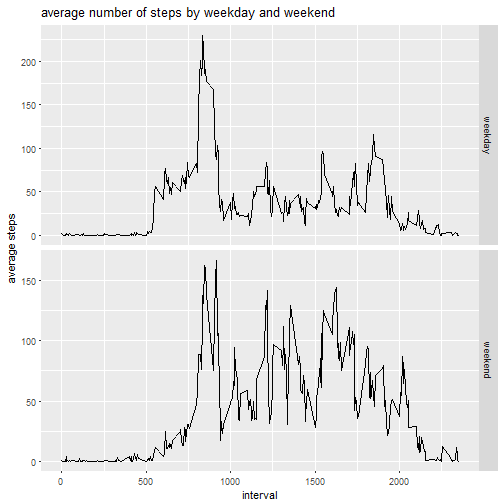

Personal activity project
==========================
*following is code for Loading and preprocessing the data

```r
setwd("C:/Users/u292859/Desktop/Reproducible Research")
url="https://d396qusza40orc.cloudfront.net/repdata%2Fdata%2Factivity.zip"
download.file(url,destfile="C:/Users/u292859/Desktop/Reproducible Research/AMD.zip")
# then unzip the zip files
unzip ("AMD.zip", exdir = "C:/Users/u292859/Desktop/Reproducible Research")

# list the files that unziped
list.files(path="C:/Users/u292859/Desktop/Reproducible Research")
```

```
##  [1] " reproducible research project 1.md"               
##  [2] "activity.csv"                                      
##  [3] "AMD.zip"                                           
##  [4] "average daily activity pattern"                    
##  [5] "average daily activity pattern.png"                
##  [6] "average number of steps by weekday and weekend.png"
##  [7] "figure"                                            
##  [8] "project 1.Rmd"                                     
##  [9] "reproducible research project 1.md"                
## [10] "reproducible research project 1.Rmd"               
## [11] "total number of steps with new data.png"           
## [12] "total number of steps.png"
```

```r
data <- read.csv("C:/Users/u292859/Desktop/Reproducible Research/activity.csv")
head(data)
```

```
##   steps       date interval
## 1    NA 2012-10-01        0
## 2    NA 2012-10-01        5
## 3    NA 2012-10-01       10
## 4    NA 2012-10-01       15
## 5    NA 2012-10-01       20
## 6    NA 2012-10-01       25
```

```r
str(data)
```

```
## 'data.frame':	17568 obs. of  3 variables:
##  $ steps   : int  NA NA NA NA NA NA NA NA NA NA ...
##  $ date    : Factor w/ 61 levels "2012-10-01","2012-10-02",..: 1 1 1 1 1 1 1 1 1 1 ...
##  $ interval: int  0 5 10 15 20 25 30 35 40 45 ...
```
* follwoing is code for Calculate the total number of steps taken per day

```r
sum<-aggregate(data$steps, by = list(date=data$date), FUN = "sum", na.rm = TRUE)
head(sum)
```

```
##         date     x
## 1 2012-10-01     0
## 2 2012-10-02   126
## 3 2012-10-03 11352
## 4 2012-10-04 12116
## 5 2012-10-05 13294
## 6 2012-10-06 15420
```

```r
colnames(sum)<-c("date","total_steps")
```
* following is code of make a histogram of the total number of steps taken each day

```r
hist(sum$total_steps,col="red",main="total steps per day",xlab="total steps per day")
```


```r
dev.copy(png,file="total number of steps.png")
```

```
## png 
##   3
```

```r
dev.off()
```

```
## png 
##   2
```

* following is code for Calculate and report the mean and median of the total number of steps taken per day

```r
mean(sum$total_steps)
```

```
## [1] 9354.23
```

```r
median(sum$total_steps)
```

```
## [1] 10395
```
* follwoing is code of  the average daily activity pattern?
Make a time series plot (i.e. type = "l") of the 5-minute interval (x-axis) and the average number of steps taken, averaged across all days (y-axis)
 

```r
average<-aggregate(data$steps, by=list(interval=data$interval),FUN="mean",na.rm=TRUE)
colnames(average)<-c("interval","average_steps")
head(average)
```

```
##   interval average_steps
## 1        0     1.7169811
## 2        5     0.3396226
## 3       10     0.1320755
## 4       15     0.1509434
## 5       20     0.0754717
## 6       25     2.0943396
```

```r
plot(average$interval,average$average_steps,type="l", xlab="5 minute interval", ylab="average number of steps",
main ="average daily activity pattern")
```



```r
dev.copy(png,file="average daily activity pattern")
```

```
## png 
##   3
```

```r
dev.off()
```

```
## png 
##   2
```
* following is code of Which 5-minute interval, on average across all the days in the dataset, contains the maximum number of steps?

```r
max(average$average_steps, na.rm = TRUE)
```

```
## [1] 206.1698
```

```r
order<-average[rev(order(average$average_steps)),]

head(order)
```

```
##     interval average_steps
## 104      835      206.1698
## 105      840      195.9245
## 107      850      183.3962
## 106      845      179.5660
## 103      830      177.3019
## 101      820      171.1509
```
Imputing missing values
*follwoing is code of Calculate and report the total number of missing values in the dataset 

```r
sum(is.na(data$steps))
```

```
## [1] 2304
```
*follwoign is a strategy for filling in all of the missing values with  the mean for that 5-minute intervalin the dataset. 
*Create a new dataset that is equal to the original dataset but with the missing data filled in.

```r
total <- merge(data,average,by="interval")
head(total)
```

```
##   interval steps       date average_steps
## 1        0    NA 2012-10-01      1.716981
## 2        0     0 2012-11-23      1.716981
## 3        0     0 2012-10-28      1.716981
## 4        0     0 2012-11-06      1.716981
## 5        0     0 2012-11-24      1.716981
## 6        0     0 2012-11-15      1.716981
```

```r
total$steps[is.na(total$steps)] <- total$average_steps[is.na(total$steps)]
newdata <- subset(total, select = -average_steps )
head(newdata)
```

```
##   interval    steps       date
## 1        0 1.716981 2012-10-01
## 2        0 0.000000 2012-11-23
## 3        0 0.000000 2012-10-28
## 4        0 0.000000 2012-11-06
## 5        0 0.000000 2012-11-24
## 6        0 0.000000 2012-11-15
```
*Make a histogram of the total number of steps taken each day 

```r
newsum<-aggregate(newdata$steps, by = list(date=newdata$date), FUN = "sum")
head(newsum)
```

```
##         date        x
## 1 2012-10-01 10766.19
## 2 2012-10-02   126.00
## 3 2012-10-03 11352.00
## 4 2012-10-04 12116.00
## 5 2012-10-05 13294.00
## 6 2012-10-06 15420.00
```

```r
colnames(newsum)<-c("date","total_steps")
hist(newsum$total_steps,col="red",main="total steps per day  with  missing value replaced with average steps",xlab="total steps per day")
```



```r
dev.copy(png,file="total number of steps with new data.png")
```

```
## png 
##   3
```

```r
dev.off()
```

```
## png 
##   2
```
* follwoing are codes of  Calculate and report the mean and median total number of steps taken per day. Do these values differ from the estimates from the first part of the assignment? What is the impact of imputing missing data on the estimates of the total daily number of steps?

```r
mean(newsum$total_steps)
```

```
## [1] 10766.19
```

```r
median(newsum$total_steps)
```

```
## [1] 10766.19
```
* Are there differences in activity patterns between weekdays and weekends?


1.Create a new factor variable in the dataset with two levels - "weekday" and "weekend" indicating whether a given date is a weekday or weekend day.


```r
newdata$date<-as.Date(newdata$date)
str(newdata)
```

```
## 'data.frame':	17568 obs. of  3 variables:
##  $ interval: int  0 0 0 0 0 0 0 0 0 0 ...
##  $ steps   : num  1.72 0 0 0 0 ...
##  $ date    : Date, format: "2012-10-01" "2012-11-23" ...
```

```r
weekdays(newdata$date)
```

```
##     [1] "Monday"    "Friday"    "Sunday"    "Tuesday"   "Saturday" 
##     [6] "Thursday"  "Saturday"  "Friday"    "Wednesday" "Sunday"   
##    [11] "Sunday"    "Thursday"  "Friday"    "Tuesday"   "Monday"   
##    [16] "Thursday"  "Tuesday"   "Wednesday" "Sunday"    "Friday"   
##    [21] "Sunday"    "Tuesday"   "Monday"    "Thursday"  "Monday"   
##    [26] "Saturday"  "Sunday"    "Thursday"  "Friday"    "Sunday"   
##    [31] "Saturday"  "Friday"    "Wednesday" "Tuesday"   "Friday"   
##    [36] "Thursday"  "Wednesday" "Tuesday"   "Thursday"  "Saturday" 
##    [41] "Wednesday" "Monday"    "Wednesday" "Friday"    "Friday"   
##    [46] "Wednesday" "Tuesday"   "Monday"    "Thursday"  "Sunday"   
##    [51] "Saturday"  "Wednesday" "Saturday"  "Monday"    "Thursday" 
##    [56] "Saturday"  "Wednesday" "Monday"    "Tuesday"   "Monday"   
##    [61] "Tuesday"   "Saturday"  "Monday"    "Sunday"    "Friday"   
##    [66] "Thursday"  "Sunday"    "Sunday"    "Friday"    "Friday"   
##    [71] "Tuesday"   "Sunday"    "Wednesday" "Thursday"  "Friday"   
##    [76] "Friday"    "Thursday"  "Tuesday"   "Monday"    "Monday"   
##    [81] "Sunday"    "Wednesday" "Monday"    "Sunday"    "Saturday" 
##    [86] "Friday"    "Monday"    "Tuesday"   "Monday"    "Wednesday"
##    [91] "Saturday"  "Tuesday"   "Wednesday" "Saturday"  "Tuesday"  
##    [96] "Saturday"  "Tuesday"   "Wednesday" "Wednesday" "Saturday" 
##   [101] "Sunday"    "Monday"    "Wednesday" "Thursday"  "Friday"   
##   [106] "Wednesday" "Friday"    "Monday"    "Tuesday"   "Thursday" 
##   [111] "Friday"    "Thursday"  "Tuesday"   "Monday"    "Sunday"   
##   [116] "Wednesday" "Tuesday"   "Thursday"  "Thursday"  "Saturday" 
##   [121] "Thursday"  "Saturday"  "Monday"    "Thursday"  "Friday"   
##   [126] "Sunday"    "Friday"    "Monday"    "Friday"    "Wednesday"
##   [131] "Saturday"  "Sunday"    "Monday"    "Friday"    "Thursday" 
##   [136] "Saturday"  "Tuesday"   "Tuesday"   "Wednesday" "Saturday" 
##   [141] "Saturday"  "Sunday"    "Friday"    "Thursday"  "Thursday" 
##   [146] "Thursday"  "Tuesday"   "Sunday"    "Tuesday"   "Saturday" 
##   [151] "Wednesday" "Sunday"    "Friday"    "Monday"    "Thursday" 
##   [156] "Friday"    "Monday"    "Tuesday"   "Monday"    "Wednesday"
##   [161] "Monday"    "Thursday"  "Sunday"    "Thursday"  "Friday"   
##   [166] "Wednesday" "Tuesday"   "Sunday"    "Sunday"    "Saturday" 
##   [171] "Friday"    "Tuesday"   "Wednesday" "Saturday"  "Thursday" 
##   [176] "Tuesday"   "Monday"    "Wednesday" "Wednesday" "Tuesday"  
##   [181] "Wednesday" "Monday"    "Saturday"  "Tuesday"   "Sunday"   
##   [186] "Friday"    "Friday"    "Wednesday" "Wednesday" "Monday"   
##   [191] "Friday"    "Sunday"    "Sunday"    "Tuesday"   "Friday"   
##   [196] "Wednesday" "Friday"    "Saturday"  "Monday"    "Thursday" 
##   [201] "Sunday"    "Friday"    "Thursday"  "Saturday"  "Monday"   
##   [206] "Friday"    "Tuesday"   "Tuesday"   "Thursday"  "Monday"   
##   [211] "Monday"    "Tuesday"   "Wednesday" "Thursday"  "Monday"   
##   [216] "Thursday"  "Saturday"  "Sunday"    "Monday"    "Wednesday"
##   [221] "Friday"    "Thursday"  "Sunday"    "Saturday"  "Sunday"   
##   [226] "Friday"    "Saturday"  "Monday"    "Wednesday" "Tuesday"  
##   [231] "Saturday"  "Thursday"  "Wednesday" "Tuesday"   "Monday"   
##   [236] "Wednesday" "Saturday"  "Thursday"  "Saturday"  "Thursday" 
##   [241] "Tuesday"   "Tuesday"   "Sunday"    "Wednesday" "Wednesday"
##   [246] "Monday"    "Monday"    "Monday"    "Monday"    "Saturday" 
##   [251] "Monday"    "Friday"    "Tuesday"   "Thursday"  "Friday"   
##   [256] "Sunday"    "Tuesday"   "Saturday"  "Friday"    "Sunday"   
##   [261] "Tuesday"   "Sunday"    "Wednesday" "Monday"    "Saturday" 
##   [266] "Friday"    "Wednesday" "Friday"    "Monday"    "Wednesday"
##   [271] "Saturday"  "Saturday"  "Sunday"    "Friday"    "Thursday" 
##   [276] "Sunday"    "Tuesday"   "Friday"    "Thursday"  "Monday"   
##   [281] "Tuesday"   "Sunday"    "Tuesday"   "Sunday"    "Thursday" 
##   [286] "Saturday"  "Wednesday" "Wednesday" "Wednesday" "Tuesday"  
##   [291] "Saturday"  "Tuesday"   "Thursday"  "Friday"    "Thursday" 
##   [296] "Monday"    "Tuesday"   "Thursday"  "Sunday"    "Thursday" 
##   [301] "Thursday"  "Saturday"  "Wednesday" "Wednesday" "Friday"   
##   [306] "Thursday"  "Tuesday"   "Saturday"  "Thursday"  "Sunday"   
##   [311] "Tuesday"   "Wednesday" "Monday"    "Sunday"    "Thursday" 
##   [316] "Friday"    "Friday"    "Tuesday"   "Wednesday" "Sunday"   
##   [321] "Saturday"  "Friday"    "Monday"    "Tuesday"   "Monday"   
##   [326] "Monday"    "Monday"    "Wednesday" "Friday"    "Saturday" 
##   [331] "Tuesday"   "Saturday"  "Sunday"    "Friday"    "Friday"   
##   [336] "Thursday"  "Wednesday" "Wednesday" "Wednesday" "Saturday" 
##   [341] "Tuesday"   "Monday"    "Saturday"  "Tuesday"   "Thursday" 
##   [346] "Friday"    "Monday"    "Sunday"    "Wednesday" "Sunday"   
##   [351] "Thursday"  "Monday"    "Saturday"  "Tuesday"   "Tuesday"  
##   [356] "Thursday"  "Monday"    "Wednesday" "Saturday"  "Wednesday"
##   [361] "Thursday"  "Thursday"  "Sunday"    "Friday"    "Friday"   
##   [366] "Sunday"    "Tuesday"   "Monday"    "Thursday"  "Thursday" 
##   [371] "Saturday"  "Tuesday"   "Wednesday" "Sunday"    "Saturday" 
##   [376] "Monday"    "Thursday"  "Monday"    "Friday"    "Thursday" 
##   [381] "Thursday"  "Friday"    "Monday"    "Saturday"  "Monday"   
##   [386] "Tuesday"   "Saturday"  "Tuesday"   "Wednesday" "Friday"   
##   [391] "Friday"    "Monday"    "Sunday"    "Saturday"  "Sunday"   
##   [396] "Monday"    "Tuesday"   "Sunday"    "Friday"    "Saturday" 
##   [401] "Friday"    "Thursday"  "Friday"    "Monday"    "Tuesday"  
##   [406] "Wednesday" "Wednesday" "Sunday"    "Tuesday"   "Wednesday"
##   [411] "Saturday"  "Sunday"    "Saturday"  "Wednesday" "Friday"   
##   [416] "Tuesday"   "Sunday"    "Thursday"  "Monday"    "Friday"   
##   [421] "Tuesday"   "Sunday"    "Thursday"  "Wednesday" "Thursday" 
##   [426] "Wednesday" "Wednesday" "Tuesday"   "Friday"    "Friday"   
##   [431] "Friday"    "Saturday"  "Sunday"    "Thursday"  "Monday"   
##   [436] "Saturday"  "Sunday"    "Thursday"  "Monday"    "Thursday" 
##   [441] "Saturday"  "Tuesday"   "Wednesday" "Thursday"  "Sunday"   
##   [446] "Wednesday" "Wednesday" "Friday"    "Sunday"    "Wednesday"
##   [451] "Friday"    "Monday"    "Friday"    "Tuesday"   "Tuesday"  
##   [456] "Sunday"    "Friday"    "Saturday"  "Thursday"  "Tuesday"  
##   [461] "Wednesday" "Monday"    "Tuesday"   "Monday"    "Friday"   
##   [466] "Saturday"  "Saturday"  "Sunday"    "Wednesday" "Monday"   
##   [471] "Monday"    "Tuesday"   "Wednesday" "Thursday"  "Thursday" 
##   [476] "Sunday"    "Wednesday" "Saturday"  "Thursday"  "Thursday" 
##   [481] "Monday"    "Tuesday"   "Friday"    "Tuesday"   "Monday"   
##   [486] "Saturday"  "Sunday"    "Wednesday" "Sunday"    "Thursday" 
##   [491] "Friday"    "Sunday"    "Friday"    "Thursday"  "Monday"   
##   [496] "Thursday"  "Friday"    "Saturday"  "Friday"    "Tuesday"  
##   [501] "Saturday"  "Wednesday" "Monday"    "Tuesday"   "Sunday"   
##   [506] "Monday"    "Thursday"  "Tuesday"   "Sunday"    "Tuesday"  
##   [511] "Wednesday" "Sunday"    "Saturday"  "Tuesday"   "Thursday" 
##   [516] "Monday"    "Saturday"  "Friday"    "Sunday"    "Monday"   
##   [521] "Saturday"  "Monday"    "Tuesday"   "Wednesday" "Friday"   
##   [526] "Sunday"    "Friday"    "Thursday"  "Monday"    "Wednesday"
##   [531] "Thursday"  "Tuesday"   "Thursday"  "Wednesday" "Tuesday"  
##   [536] "Saturday"  "Wednesday" "Monday"    "Wednesday" "Saturday" 
##   [541] "Friday"    "Sunday"    "Wednesday" "Tuesday"   "Thursday" 
##   [546] "Monday"    "Saturday"  "Friday"    "Wednesday" "Monday"   
##   [551] "Thursday"  "Monday"    "Thursday"  "Sunday"    "Wednesday"
##   [556] "Friday"    "Wednesday" "Tuesday"   "Friday"    "Monday"   
##   [561] "Friday"    "Thursday"  "Sunday"    "Tuesday"   "Saturday" 
##   [566] "Sunday"    "Tuesday"   "Thursday"  "Monday"    "Wednesday"
##   [571] "Wednesday" "Tuesday"   "Monday"    "Friday"    "Wednesday"
##   [576] "Friday"    "Saturday"  "Saturday"  "Friday"    "Monday"   
##   [581] "Saturday"  "Tuesday"   "Tuesday"   "Thursday"  "Sunday"   
##   [586] "Saturday"  "Thursday"  "Sunday"    "Monday"    "Thursday" 
##   [591] "Wednesday" "Thursday"  "Sunday"    "Friday"    "Friday"   
##   [596] "Sunday"    "Tuesday"   "Monday"    "Thursday"  "Wednesday"
##   [601] "Tuesday"   "Saturday"  "Monday"    "Sunday"    "Friday"   
##   [606] "Saturday"  "Wednesday" "Saturday"  "Wednesday" "Tuesday"  
##   [611] "Monday"    "Thursday"  "Wednesday" "Saturday"  "Monday"   
##   [616] "Sunday"    "Tuesday"   "Tuesday"   "Saturday"  "Monday"   
##   [621] "Friday"    "Friday"    "Friday"    "Saturday"  "Sunday"   
##   [626] "Monday"    "Tuesday"   "Tuesday"   "Friday"    "Monday"   
##   [631] "Friday"    "Tuesday"   "Thursday"  "Tuesday"   "Thursday" 
##   [636] "Thursday"  "Friday"    "Friday"    "Monday"    "Saturday" 
##   [641] "Wednesday" "Thursday"  "Saturday"  "Thursday"  "Tuesday"  
##   [646] "Tuesday"   "Sunday"    "Friday"    "Sunday"    "Wednesday"
##   [651] "Wednesday" "Thursday"  "Sunday"    "Wednesday" "Monday"   
##   [656] "Monday"    "Wednesday" "Saturday"  "Thursday"  "Sunday"   
##   [661] "Wednesday" "Sunday"    "Sunday"    "Monday"    "Saturday" 
##   [666] "Wednesday" "Wednesday" "Tuesday"   "Saturday"  "Thursday" 
##   [671] "Friday"    "Monday"    "Thursday"  "Thursday"  "Saturday" 
##   [676] "Friday"    "Friday"    "Tuesday"   "Friday"    "Saturday" 
##   [681] "Monday"    "Wednesday" "Thursday"  "Thursday"  "Wednesday"
##   [686] "Friday"    "Friday"    "Thursday"  "Saturday"  "Thursday" 
##   [691] "Tuesday"   "Friday"    "Monday"    "Sunday"    "Monday"   
##   [696] "Thursday"  "Tuesday"   "Sunday"    "Friday"    "Sunday"   
##   [701] "Wednesday" "Friday"    "Sunday"    "Wednesday" "Sunday"   
##   [706] "Thursday"  "Wednesday" "Friday"    "Tuesday"   "Saturday" 
##   [711] "Thursday"  "Monday"    "Saturday"  "Sunday"    "Tuesday"  
##   [716] "Monday"    "Wednesday" "Saturday"  "Tuesday"   "Monday"   
##   [721] "Monday"    "Sunday"    "Tuesday"   "Saturday"  "Sunday"   
##   [726] "Monday"    "Tuesday"   "Saturday"  "Tuesday"   "Wednesday"
##   [731] "Wednesday" "Wednesday" "Wednesday" "Saturday"  "Tuesday"  
##   [736] "Sunday"    "Friday"    "Saturday"  "Monday"    "Tuesday"  
##   [741] "Tuesday"   "Friday"    "Sunday"    "Tuesday"   "Saturday" 
##   [746] "Friday"    "Monday"    "Sunday"    "Wednesday" "Saturday" 
##   [751] "Thursday"  "Sunday"    "Friday"    "Sunday"    "Thursday" 
##   [756] "Monday"    "Sunday"    "Thursday"  "Wednesday" "Tuesday"  
##   [761] "Wednesday" "Thursday"  "Wednesday" "Tuesday"   "Wednesday"
##   [766] "Monday"    "Thursday"  "Saturday"  "Monday"    "Monday"   
##   [771] "Wednesday" "Saturday"  "Wednesday" "Friday"    "Thursday" 
##   [776] "Friday"    "Monday"    "Saturday"  "Sunday"    "Monday"   
##   [781] "Friday"    "Thursday"  "Tuesday"   "Thursday"  "Monday"   
##   [786] "Friday"    "Tuesday"   "Wednesday" "Tuesday"   "Friday"   
##   [791] "Sunday"    "Thursday"  "Saturday"  "Thursday"  "Monday"   
##   [796] "Friday"    "Friday"    "Tuesday"   "Friday"    "Sunday"   
##   [801] "Saturday"  "Tuesday"   "Friday"    "Wednesday" "Monday"   
##   [806] "Monday"    "Wednesday" "Thursday"  "Wednesday" "Tuesday"  
##   [811] "Saturday"  "Sunday"    "Wednesday" "Tuesday"   "Sunday"   
##   [816] "Saturday"  "Tuesday"   "Saturday"  "Monday"    "Wednesday"
##   [821] "Thursday"  "Thursday"  "Friday"    "Tuesday"   "Wednesday"
##   [826] "Sunday"    "Friday"    "Thursday"  "Thursday"  "Thursday" 
##   [831] "Sunday"    "Friday"    "Sunday"    "Tuesday"   "Sunday"   
##   [836] "Monday"    "Wednesday" "Saturday"  "Wednesday" "Monday"   
##   [841] "Sunday"    "Saturday"  "Thursday"  "Tuesday"   "Tuesday"  
##   [846] "Wednesday" "Monday"    "Friday"    "Monday"    "Thursday" 
##   [851] "Saturday"  "Friday"    "Saturday"  "Monday"    "Saturday" 
##   [856] "Wednesday" "Monday"    "Friday"    "Tuesday"   "Wednesday"
##   [861] "Thursday"  "Tuesday"   "Sunday"    "Thursday"  "Monday"   
##   [866] "Sunday"    "Monday"    "Friday"    "Friday"    "Wednesday"
##   [871] "Wednesday" "Wednesday" "Sunday"    "Sunday"    "Sunday"   
##   [876] "Friday"    "Thursday"  "Friday"    "Tuesday"   "Monday"   
##   [881] "Friday"    "Saturday"  "Monday"    "Saturday"  "Monday"   
##   [886] "Friday"    "Tuesday"   "Tuesday"   "Friday"    "Monday"   
##   [891] "Saturday"  "Saturday"  "Wednesday" "Wednesday" "Thursday" 
##   [896] "Thursday"  "Sunday"    "Thursday"  "Thursday"  "Friday"   
##   [901] "Thursday"  "Tuesday"   "Monday"    "Saturday"  "Sunday"   
##   [906] "Monday"    "Wednesday" "Tuesday"   "Sunday"    "Tuesday"  
##   [911] "Saturday"  "Tuesday"   "Thursday"  "Saturday"  "Wednesday"
##   [916] "Tuesday"   "Wednesday" "Sunday"    "Sunday"    "Tuesday"  
##   [921] "Friday"    "Sunday"    "Thursday"  "Monday"    "Thursday" 
##   [926] "Wednesday" "Wednesday" "Monday"    "Wednesday" "Thursday" 
##   [931] "Friday"    "Monday"    "Sunday"    "Tuesday"   "Wednesday"
##   [936] "Saturday"  "Friday"    "Saturday"  "Thursday"  "Monday"   
##   [941] "Sunday"    "Saturday"  "Tuesday"   "Monday"    "Sunday"   
##   [946] "Friday"    "Saturday"  "Saturday"  "Thursday"  "Tuesday"  
##   [951] "Wednesday" "Thursday"  "Friday"    "Tuesday"   "Tuesday"  
##   [956] "Monday"    "Saturday"  "Thursday"  "Monday"    "Wednesday"
##   [961] "Friday"    "Friday"    "Friday"    "Sunday"    "Wednesday"
##   [966] "Friday"    "Monday"    "Saturday"  "Wednesday" "Thursday" 
##   [971] "Tuesday"   "Sunday"    "Saturday"  "Monday"    "Thursday" 
##   [976] "Tuesday"   "Wednesday" "Saturday"  "Wednesday" "Friday"   
##   [981] "Monday"    "Saturday"  "Sunday"    "Thursday"  "Wednesday"
##   [986] "Wednesday" "Friday"    "Thursday"  "Monday"    "Saturday" 
##   [991] "Saturday"  "Sunday"    "Thursday"  "Tuesday"   "Friday"   
##   [996] "Saturday"  "Tuesday"   "Friday"    "Thursday"  "Monday"   
##  [1001] "Tuesday"   "Wednesday" "Sunday"    "Wednesday" "Friday"   
##  [1006] "Friday"    "Thursday"  "Monday"    "Monday"    "Sunday"   
##  [1011] "Tuesday"   "Sunday"    "Thursday"  "Saturday"  "Tuesday"  
##  [1016] "Tuesday"   "Sunday"    "Monday"    "Friday"    "Monday"   
##  [1021] "Thursday"  "Monday"    "Saturday"  "Saturday"  "Tuesday"  
##  [1026] "Monday"    "Thursday"  "Wednesday" "Friday"    "Tuesday"  
##  [1031] "Wednesday" "Wednesday" "Sunday"    "Thursday"  "Tuesday"  
##  [1036] "Sunday"    "Friday"    "Wednesday" "Monday"    "Thursday" 
##  [1041] "Tuesday"   "Friday"    "Sunday"    "Thursday"  "Thursday" 
##  [1046] "Thursday"  "Tuesday"   "Thursday"  "Wednesday" "Saturday" 
##  [1051] "Tuesday"   "Sunday"    "Thursday"  "Saturday"  "Tuesday"  
##  [1056] "Friday"    "Wednesday" "Monday"    "Friday"    "Friday"   
##  [1061] "Sunday"    "Friday"    "Friday"    "Sunday"    "Monday"   
##  [1066] "Tuesday"   "Friday"    "Tuesday"   "Monday"    "Wednesday"
##  [1071] "Sunday"    "Wednesday" "Saturday"  "Wednesday" "Monday"   
##  [1076] "Wednesday" "Thursday"  "Monday"    "Sunday"    "Saturday" 
##  [1081] "Friday"    "Saturday"  "Monday"    "Tuesday"   "Saturday" 
##  [1086] "Saturday"  "Saturday"  "Thursday"  "Sunday"    "Tuesday"  
##  [1091] "Monday"    "Wednesday" "Wednesday" "Tuesday"   "Thursday" 
##  [1096] "Friday"    "Monday"    "Sunday"    "Thursday"  "Monday"   
##  [1101] "Friday"    "Saturday"  "Friday"    "Friday"    "Wednesday"
##  [1106] "Wednesday" "Wednesday" "Thursday"  "Sunday"    "Tuesday"  
##  [1111] "Monday"    "Wednesday" "Friday"    "Tuesday"   "Sunday"   
##  [1116] "Friday"    "Thursday"  "Saturday"  "Wednesday" "Monday"   
##  [1121] "Tuesday"   "Monday"    "Tuesday"   "Thursday"  "Tuesday"  
##  [1126] "Thursday"  "Tuesday"   "Wednesday" "Friday"    "Tuesday"  
##  [1131] "Thursday"  "Saturday"  "Friday"    "Tuesday"   "Thursday" 
##  [1136] "Monday"    "Wednesday" "Saturday"  "Tuesday"   "Saturday" 
##  [1141] "Monday"    "Thursday"  "Sunday"    "Monday"    "Wednesday"
##  [1146] "Sunday"    "Saturday"  "Saturday"  "Sunday"    "Friday"   
##  [1151] "Sunday"    "Friday"    "Thursday"  "Wednesday" "Sunday"   
##  [1156] "Saturday"  "Monday"    "Sunday"    "Monday"    "Tuesday"  
##  [1161] "Sunday"    "Thursday"  "Monday"    "Tuesday"   "Saturday" 
##  [1166] "Thursday"  "Monday"    "Wednesday" "Friday"    "Friday"   
##  [1171] "Saturday"  "Friday"    "Thursday"  "Tuesday"   "Friday"   
##  [1176] "Wednesday" "Monday"    "Saturday"  "Tuesday"   "Sunday"   
##  [1181] "Saturday"  "Saturday"  "Monday"    "Tuesday"   "Friday"   
##  [1186] "Monday"    "Wednesday" "Tuesday"   "Thursday"  "Sunday"   
##  [1191] "Tuesday"   "Monday"    "Thursday"  "Monday"    "Wednesday"
##  [1196] "Sunday"    "Wednesday" "Wednesday" "Thursday"  "Thursday" 
##  [1201] "Saturday"  "Sunday"    "Monday"    "Wednesday" "Tuesday"  
##  [1206] "Sunday"    "Friday"    "Saturday"  "Friday"    "Wednesday"
##  [1211] "Friday"    "Thursday"  "Sunday"    "Tuesday"   "Friday"   
##  [1216] "Sunday"    "Wednesday" "Saturday"  "Monday"    "Thursday" 
##  [1221] "Saturday"  "Wednesday" "Tuesday"   "Sunday"    "Friday"   
##  [1226] "Friday"    "Tuesday"   "Sunday"    "Friday"    "Monday"   
##  [1231] "Wednesday" "Tuesday"   "Thursday"  "Monday"    "Wednesday"
##  [1236] "Saturday"  "Friday"    "Sunday"    "Wednesday" "Tuesday"  
##  [1241] "Wednesday" "Friday"    "Monday"    "Thursday"  "Monday"   
##  [1246] "Saturday"  "Friday"    "Monday"    "Thursday"  "Wednesday"
##  [1251] "Sunday"    "Saturday"  "Friday"    "Thursday"  "Thursday" 
##  [1256] "Sunday"    "Friday"    "Wednesday" "Thursday"  "Monday"   
##  [1261] "Saturday"  "Friday"    "Tuesday"   "Wednesday" "Sunday"   
##  [1266] "Monday"    "Thursday"  "Tuesday"   "Thursday"  "Wednesday"
##  [1271] "Sunday"    "Saturday"  "Tuesday"   "Tuesday"   "Tuesday"  
##  [1276] "Monday"    "Saturday"  "Sunday"    "Saturday"  "Thursday" 
##  [1281] "Monday"    "Tuesday"   "Monday"    "Sunday"    "Saturday" 
##  [1286] "Monday"    "Sunday"    "Friday"    "Monday"    "Tuesday"  
##  [1291] "Monday"    "Friday"    "Sunday"    "Saturday"  "Thursday" 
##  [1296] "Wednesday" "Wednesday" "Sunday"    "Tuesday"   "Thursday" 
##  [1301] "Thursday"  "Wednesday" "Thursday"  "Wednesday" "Friday"   
##  [1306] "Tuesday"   "Friday"    "Wednesday" "Thursday"  "Wednesday"
##  [1311] "Thursday"  "Tuesday"   "Sunday"    "Friday"    "Monday"   
##  [1316] "Sunday"    "Wednesday" "Wednesday" "Saturday"  "Monday"   
##  [1321] "Friday"    "Friday"    "Wednesday" "Saturday"  "Sunday"   
##  [1326] "Monday"    "Saturday"  "Monday"    "Saturday"  "Friday"   
##  [1331] "Saturday"  "Friday"    "Saturday"  "Thursday"  "Thursday" 
##  [1336] "Monday"    "Tuesday"   "Thursday"  "Sunday"    "Tuesday"  
##  [1341] "Tuesday"   "Tuesday"   "Sunday"    "Monday"    "Sunday"   
##  [1346] "Saturday"  "Sunday"    "Monday"    "Wednesday" "Friday"   
##  [1351] "Monday"    "Friday"    "Sunday"    "Wednesday" "Thursday" 
##  [1356] "Sunday"    "Thursday"  "Monday"    "Friday"    "Saturday" 
##  [1361] "Saturday"  "Wednesday" "Wednesday" "Thursday"  "Tuesday"  
##  [1366] "Wednesday" "Wednesday" "Friday"    "Friday"    "Wednesday"
##  [1371] "Thursday"  "Saturday"  "Tuesday"   "Friday"    "Sunday"   
##  [1376] "Thursday"  "Saturday"  "Thursday"  "Sunday"    "Wednesday"
##  [1381] "Thursday"  "Monday"    "Tuesday"   "Saturday"  "Saturday" 
##  [1386] "Thursday"  "Monday"    "Monday"    "Monday"    "Monday"   
##  [1391] "Tuesday"   "Saturday"  "Friday"    "Wednesday" "Friday"   
##  [1396] "Tuesday"   "Tuesday"   "Thursday"  "Tuesday"   "Sunday"   
##  [1401] "Friday"    "Tuesday"   "Tuesday"   "Friday"    "Thursday" 
##  [1406] "Monday"    "Sunday"    "Friday"    "Saturday"  "Wednesday"
##  [1411] "Tuesday"   "Wednesday" "Tuesday"   "Friday"    "Wednesday"
##  [1416] "Monday"    "Friday"    "Thursday"  "Sunday"    "Monday"   
##  [1421] "Wednesday" "Friday"    "Thursday"  "Monday"    "Monday"   
##  [1426] "Monday"    "Wednesday" "Friday"    "Thursday"  "Thursday" 
##  [1431] "Tuesday"   "Thursday"  "Thursday"  "Wednesday" "Tuesday"  
##  [1436] "Thursday"  "Saturday"  "Sunday"    "Saturday"  "Friday"   
##  [1441] "Sunday"    "Saturday"  "Monday"    "Sunday"    "Saturday" 
##  [1446] "Monday"    "Saturday"  "Thursday"  "Tuesday"   "Wednesday"
##  [1451] "Saturday"  "Saturday"  "Sunday"    "Wednesday" "Tuesday"  
##  [1456] "Sunday"    "Monday"    "Friday"    "Tuesday"   "Friday"   
##  [1461] "Wednesday" "Sunday"    "Tuesday"   "Tuesday"   "Wednesday"
##  [1466] "Friday"    "Wednesday" "Tuesday"   "Sunday"    "Thursday" 
##  [1471] "Saturday"  "Friday"    "Monday"    "Sunday"    "Tuesday"  
##  [1476] "Friday"    "Monday"    "Friday"    "Sunday"    "Saturday" 
##  [1481] "Tuesday"   "Friday"    "Thursday"  "Tuesday"   "Thursday" 
##  [1486] "Monday"    "Thursday"  "Friday"    "Sunday"    "Wednesday"
##  [1491] "Sunday"    "Wednesday" "Monday"    "Wednesday" "Saturday" 
##  [1496] "Thursday"  "Saturday"  "Tuesday"   "Saturday"  "Thursday" 
##  [1501] "Monday"    "Saturday"  "Wednesday" "Saturday"  "Tuesday"  
##  [1506] "Thursday"  "Monday"    "Sunday"    "Tuesday"   "Thursday" 
##  [1511] "Wednesday" "Wednesday" "Sunday"    "Tuesday"   "Sunday"   
##  [1516] "Tuesday"   "Friday"    "Friday"    "Monday"    "Wednesday"
##  [1521] "Friday"    "Saturday"  "Thursday"  "Monday"    "Monday"   
##  [1526] "Tuesday"   "Friday"    "Thursday"  "Wednesday" "Sunday"   
##  [1531] "Sunday"    "Friday"    "Monday"    "Saturday"  "Sunday"   
##  [1536] "Monday"    "Saturday"  "Saturday"  "Friday"    "Monday"   
##  [1541] "Tuesday"   "Friday"    "Wednesday" "Friday"    "Saturday" 
##  [1546] "Sunday"    "Monday"    "Wednesday" "Tuesday"   "Thursday" 
##  [1551] "Thursday"  "Saturday"  "Wednesday" "Friday"    "Wednesday"
##  [1556] "Thursday"  "Wednesday" "Saturday"  "Saturday"  "Thursday" 
##  [1561] "Sunday"    "Thursday"  "Friday"    "Tuesday"   "Wednesday"
##  [1566] "Sunday"    "Thursday"  "Tuesday"   "Monday"    "Wednesday"
##  [1571] "Friday"    "Monday"    "Tuesday"   "Tuesday"   "Monday"   
##  [1576] "Tuesday"   "Sunday"    "Tuesday"   "Friday"    "Wednesday"
##  [1581] "Monday"    "Thursday"  "Sunday"    "Thursday"  "Monday"   
##  [1586] "Saturday"  "Saturday"  "Friday"    "Sunday"    "Friday"   
##  [1591] "Wednesday" "Tuesday"   "Thursday"  "Monday"    "Friday"   
##  [1596] "Thursday"  "Friday"    "Wednesday" "Sunday"    "Friday"   
##  [1601] "Monday"    "Wednesday" "Sunday"    "Saturday"  "Wednesday"
##  [1606] "Saturday"  "Tuesday"   "Saturday"  "Wednesday" "Thursday" 
##  [1611] "Wednesday" "Saturday"  "Tuesday"   "Tuesday"   "Sunday"   
##  [1616] "Monday"    "Thursday"  "Monday"    "Thursday"  "Sunday"   
##  [1621] "Friday"    "Saturday"  "Tuesday"   "Wednesday" "Thursday" 
##  [1626] "Monday"    "Sunday"    "Sunday"    "Monday"    "Monday"   
##  [1631] "Friday"    "Friday"    "Tuesday"   "Thursday"  "Wednesday"
##  [1636] "Friday"    "Monday"    "Thursday"  "Wednesday" "Tuesday"  
##  [1641] "Tuesday"   "Monday"    "Saturday"  "Saturday"  "Tuesday"  
##  [1646] "Sunday"    "Thursday"  "Friday"    "Tuesday"   "Friday"   
##  [1651] "Monday"    "Wednesday" "Tuesday"   "Sunday"    "Tuesday"  
##  [1656] "Friday"    "Saturday"  "Friday"    "Thursday"  "Wednesday"
##  [1661] "Monday"    "Tuesday"   "Wednesday" "Thursday"  "Saturday" 
##  [1666] "Friday"    "Saturday"  "Wednesday" "Monday"    "Wednesday"
##  [1671] "Friday"    "Saturday"  "Sunday"    "Saturday"  "Saturday" 
##  [1676] "Monday"    "Sunday"    "Monday"    "Tuesday"   "Sunday"   
##  [1681] "Sunday"    "Monday"    "Wednesday" "Wednesday" "Monday"   
##  [1686] "Friday"    "Thursday"  "Saturday"  "Wednesday" "Monday"   
##  [1691] "Saturday"  "Tuesday"   "Thursday"  "Sunday"    "Friday"   
##  [1696] "Friday"    "Thursday"  "Thursday"  "Wednesday" "Monday"   
##  [1701] "Sunday"    "Thursday"  "Thursday"  "Tuesday"   "Thursday" 
##  [1706] "Sunday"    "Tuesday"   "Tuesday"   "Saturday"  "Tuesday"  
##  [1711] "Saturday"  "Monday"    "Friday"    "Thursday"  "Wednesday"
##  [1716] "Monday"    "Wednesday" "Friday"    "Saturday"  "Sunday"   
##  [1721] "Sunday"    "Wednesday" "Wednesday" "Wednesday" "Friday"   
##  [1726] "Thursday"  "Saturday"  "Monday"    "Saturday"  "Tuesday"  
##  [1731] "Monday"    "Thursday"  "Wednesday" "Friday"    "Tuesday"  
##  [1736] "Monday"    "Tuesday"   "Friday"    "Thursday"  "Wednesday"
##  [1741] "Thursday"  "Sunday"    "Tuesday"   "Wednesday" "Saturday" 
##  [1746] "Tuesday"   "Thursday"  "Saturday"  "Friday"    "Thursday" 
##  [1751] "Monday"    "Tuesday"   "Sunday"    "Saturday"  "Sunday"   
##  [1756] "Monday"    "Monday"    "Sunday"    "Tuesday"   "Thursday" 
##  [1761] "Sunday"    "Friday"    "Friday"    "Tuesday"   "Thursday" 
##  [1766] "Monday"    "Friday"    "Wednesday" "Sunday"    "Friday"   
##  [1771] "Friday"    "Saturday"  "Sunday"    "Monday"    "Saturday" 
##  [1776] "Wednesday" "Saturday"  "Sunday"    "Sunday"    "Thursday" 
##  [1781] "Friday"    "Wednesday" "Thursday"  "Tuesday"   "Friday"   
##  [1786] "Saturday"  "Thursday"  "Thursday"  "Friday"    "Monday"   
##  [1791] "Wednesday" "Tuesday"   "Thursday"  "Monday"    "Monday"   
##  [1796] "Tuesday"   "Wednesday" "Monday"    "Tuesday"   "Saturday" 
##  [1801] "Wednesday" "Monday"    "Thursday"  "Saturday"  "Saturday" 
##  [1806] "Tuesday"   "Thursday"  "Thursday"  "Monday"    "Sunday"   
##  [1811] "Thursday"  "Monday"    "Tuesday"   "Tuesday"   "Friday"   
##  [1816] "Sunday"    "Saturday"  "Sunday"    "Tuesday"   "Friday"   
##  [1821] "Friday"    "Sunday"    "Wednesday" "Wednesday" "Sunday"   
##  [1826] "Monday"    "Tuesday"   "Wednesday" "Wednesday" "Friday"   
##  [1831] "Thursday"  "Sunday"    "Wednesday" "Monday"    "Friday"   
##  [1836] "Tuesday"   "Tuesday"   "Friday"    "Wednesday" "Thursday" 
##  [1841] "Wednesday" "Wednesday" "Sunday"    "Saturday"  "Monday"   
##  [1846] "Saturday"  "Friday"    "Thursday"  "Thursday"  "Sunday"   
##  [1851] "Friday"    "Wednesday" "Friday"    "Tuesday"   "Monday"   
##  [1856] "Monday"    "Thursday"  "Sunday"    "Saturday"  "Friday"   
##  [1861] "Tuesday"   "Thursday"  "Sunday"    "Tuesday"   "Monday"   
##  [1866] "Thursday"  "Saturday"  "Thursday"  "Friday"    "Friday"   
##  [1871] "Wednesday" "Monday"    "Wednesday" "Thursday"  "Monday"   
##  [1876] "Saturday"  "Sunday"    "Tuesday"   "Monday"    "Sunday"   
##  [1881] "Sunday"    "Monday"    "Tuesday"   "Tuesday"   "Wednesday"
##  [1886] "Saturday"  "Tuesday"   "Friday"    "Saturday"  "Wednesday"
##  [1891] "Saturday"  "Wednesday" "Tuesday"   "Wednesday" "Sunday"   
##  [1896] "Wednesday" "Tuesday"   "Sunday"    "Tuesday"   "Sunday"   
##  [1901] "Wednesday" "Saturday"  "Thursday"  "Friday"    "Monday"   
##  [1906] "Monday"    "Friday"    "Tuesday"   "Friday"    "Thursday" 
##  [1911] "Monday"    "Friday"    "Wednesday" "Tuesday"   "Saturday" 
##  [1916] "Sunday"    "Thursday"  "Sunday"    "Thursday"  "Friday"   
##  [1921] "Thursday"  "Saturday"  "Friday"    "Saturday"  "Thursday" 
##  [1926] "Monday"    "Thursday"  "Friday"    "Monday"    "Thursday" 
##  [1931] "Saturday"  "Saturday"  "Tuesday"   "Sunday"    "Monday"   
##  [1936] "Tuesday"   "Friday"    "Wednesday" "Monday"    "Saturday" 
##  [1941] "Sunday"    "Thursday"  "Wednesday" "Monday"    "Wednesday"
##  [1946] "Monday"    "Tuesday"   "Saturday"  "Wednesday" "Tuesday"  
##  [1951] "Sunday"    "Friday"    "Thursday"  "Friday"    "Wednesday"
##  [1956] "Saturday"  "Wednesday" "Tuesday"   "Friday"    "Monday"   
##  [1961] "Thursday"  "Monday"    "Sunday"    "Sunday"    "Thursday" 
##  [1966] "Thursday"  "Monday"    "Wednesday" "Friday"    "Monday"   
##  [1971] "Saturday"  "Saturday"  "Saturday"  "Thursday"  "Friday"   
##  [1976] "Sunday"    "Monday"    "Friday"    "Wednesday" "Thursday" 
##  [1981] "Saturday"  "Wednesday" "Monday"    "Tuesday"   "Thursday" 
##  [1986] "Sunday"    "Tuesday"   "Saturday"  "Wednesday" "Tuesday"  
##  [1991] "Friday"    "Saturday"  "Sunday"    "Monday"    "Thursday" 
##  [1996] "Sunday"    "Thursday"  "Monday"    "Tuesday"   "Monday"   
##  [2001] "Saturday"  "Tuesday"   "Sunday"    "Friday"    "Friday"   
##  [2006] "Tuesday"   "Tuesday"   "Wednesday" "Sunday"    "Wednesday"
##  [2011] "Wednesday" "Friday"    "Tuesday"   "Sunday"    "Thursday" 
##  [2016] "Sunday"    "Tuesday"   "Saturday"  "Saturday"  "Sunday"   
##  [2021] "Saturday"  "Wednesday" "Wednesday" "Friday"    "Friday"   
##  [2026] "Tuesday"   "Wednesday" "Monday"    "Thursday"  "Monday"   
##  [2031] "Monday"    "Monday"    "Sunday"    "Tuesday"   "Friday"   
##  [2036] "Thursday"  "Wednesday" "Thursday"  "Wednesday" "Thursday" 
##  [2041] "Tuesday"   "Thursday"  "Wednesday" "Monday"    "Wednesday"
##  [2046] "Friday"    "Sunday"    "Monday"    "Tuesday"   "Thursday" 
##  [2051] "Monday"    "Sunday"    "Tuesday"   "Saturday"  "Tuesday"  
##  [2056] "Monday"    "Saturday"  "Saturday"  "Friday"    "Tuesday"  
##  [2061] "Friday"    "Monday"    "Thursday"  "Friday"    "Sunday"   
##  [2066] "Saturday"  "Saturday"  "Wednesday" "Sunday"    "Wednesday"
##  [2071] "Thursday"  "Tuesday"   "Friday"    "Friday"    "Saturday" 
##  [2076] "Tuesday"   "Wednesday" "Wednesday" "Saturday"  "Tuesday"  
##  [2081] "Thursday"  "Monday"    "Monday"    "Sunday"    "Friday"   
##  [2086] "Thursday"  "Wednesday" "Saturday"  "Friday"    "Friday"   
##  [2091] "Wednesday" "Friday"    "Wednesday" "Tuesday"   "Tuesday"  
##  [2096] "Saturday"  "Thursday"  "Tuesday"   "Sunday"    "Wednesday"
##  [2101] "Sunday"    "Friday"    "Monday"    "Thursday"  "Sunday"   
##  [2106] "Saturday"  "Thursday"  "Thursday"  "Tuesday"   "Sunday"   
##  [2111] "Monday"    "Friday"    "Tuesday"   "Sunday"    "Tuesday"  
##  [2116] "Monday"    "Thursday"  "Thursday"  "Monday"    "Wednesday"
##  [2121] "Monday"    "Saturday"  "Wednesday" "Friday"    "Saturday" 
##  [2126] "Thursday"  "Tuesday"   "Sunday"    "Wednesday" "Monday"   
##  [2131] "Friday"    "Sunday"    "Monday"    "Saturday"  "Friday"   
##  [2136] "Friday"    "Sunday"    "Friday"    "Wednesday" "Tuesday"  
##  [2141] "Thursday"  "Monday"    "Wednesday" "Tuesday"   "Friday"   
##  [2146] "Thursday"  "Saturday"  "Thursday"  "Friday"    "Wednesday"
##  [2151] "Saturday"  "Sunday"    "Tuesday"   "Wednesday" "Wednesday"
##  [2156] "Saturday"  "Tuesday"   "Thursday"  "Friday"    "Saturday" 
##  [2161] "Monday"    "Saturday"  "Tuesday"   "Monday"    "Monday"   
##  [2166] "Sunday"    "Wednesday" "Friday"    "Saturday"  "Friday"   
##  [2171] "Tuesday"   "Friday"    "Monday"    "Sunday"    "Thursday" 
##  [2176] "Wednesday" "Tuesday"   "Thursday"  "Monday"    "Saturday" 
##  [2181] "Sunday"    "Thursday"  "Thursday"  "Sunday"    "Monday"   
##  [2186] "Thursday"  "Sunday"    "Tuesday"   "Friday"    "Monday"   
##  [2191] "Tuesday"   "Wednesday" "Saturday"  "Wednesday" "Sunday"   
##  [2196] "Monday"    "Saturday"  "Sunday"    "Tuesday"   "Sunday"   
##  [2201] "Friday"    "Thursday"  "Tuesday"   "Thursday"  "Tuesday"  
##  [2206] "Thursday"  "Sunday"    "Wednesday" "Tuesday"   "Saturday" 
##  [2211] "Tuesday"   "Saturday"  "Tuesday"   "Friday"    "Monday"   
##  [2216] "Wednesday" "Wednesday" "Sunday"    "Monday"    "Sunday"   
##  [2221] "Monday"    "Wednesday" "Thursday"  "Monday"    "Sunday"   
##  [2226] "Wednesday" "Friday"    "Sunday"    "Saturday"  "Saturday" 
##  [2231] "Friday"    "Saturday"  "Friday"    "Thursday"  "Friday"   
##  [2236] "Monday"    "Wednesday" "Friday"    "Friday"    "Friday"   
##  [2241] "Thursday"  "Thursday"  "Wednesday" "Saturday"  "Monday"   
##  [2246] "Wednesday" "Sunday"    "Saturday"  "Monday"    "Thursday" 
##  [2251] "Tuesday"   "Tuesday"   "Monday"    "Wednesday" "Thursday" 
##  [2256] "Monday"    "Tuesday"   "Thursday"  "Tuesday"   "Tuesday"  
##  [2261] "Saturday"  "Tuesday"   "Wednesday" "Thursday"  "Tuesday"  
##  [2266] "Tuesday"   "Friday"    "Thursday"  "Sunday"    "Friday"   
##  [2271] "Wednesday" "Wednesday" "Monday"    "Wednesday" "Wednesday"
##  [2276] "Sunday"    "Friday"    "Tuesday"   "Saturday"  "Monday"   
##  [2281] "Monday"    "Wednesday" "Saturday"  "Thursday"  "Friday"   
##  [2286] "Monday"    "Friday"    "Sunday"    "Monday"    "Wednesday"
##  [2291] "Monday"    "Saturday"  "Saturday"  "Friday"    "Sunday"   
##  [2296] "Thursday"  "Thursday"  "Sunday"    "Monday"    "Saturday" 
##  [2301] "Thursday"  "Saturday"  "Friday"    "Tuesday"   "Friday"   
##  [2306] "Wednesday" "Tuesday"   "Thursday"  "Monday"    "Friday"   
##  [2311] "Thursday"  "Monday"    "Wednesday" "Saturday"  "Sunday"   
##  [2316] "Sunday"    "Sunday"    "Tuesday"   "Thursday"  "Tuesday"  
##  [2321] "Monday"    "Monday"    "Tuesday"   "Thursday"  "Friday"   
##  [2326] "Wednesday" "Friday"    "Sunday"    "Thursday"  "Sunday"   
##  [2331] "Sunday"    "Wednesday" "Friday"    "Tuesday"   "Friday"   
##  [2336] "Sunday"    "Friday"    "Wednesday" "Friday"    "Wednesday"
##  [2341] "Tuesday"   "Saturday"  "Monday"    "Monday"    "Monday"   
##  [2346] "Saturday"  "Sunday"    "Friday"    "Monday"    "Monday"   
##  [2351] "Thursday"  "Saturday"  "Saturday"  "Saturday"  "Tuesday"  
##  [2356] "Thursday"  "Tuesday"   "Thursday"  "Friday"    "Wednesday"
##  [2361] "Friday"    "Saturday"  "Wednesday" "Sunday"    "Sunday"   
##  [2366] "Tuesday"   "Wednesday" "Monday"    "Monday"    "Thursday" 
##  [2371] "Wednesday" "Thursday"  "Saturday"  "Sunday"    "Saturday" 
##  [2376] "Tuesday"   "Tuesday"   "Thursday"  "Wednesday" "Monday"   
##  [2381] "Sunday"    "Saturday"  "Wednesday" "Saturday"  "Monday"   
##  [2386] "Thursday"  "Sunday"    "Friday"    "Monday"    "Thursday" 
##  [2391] "Friday"    "Wednesday" "Thursday"  "Sunday"    "Friday"   
##  [2396] "Tuesday"   "Monday"    "Thursday"  "Sunday"    "Monday"   
##  [2401] "Wednesday" "Saturday"  "Monday"    "Wednesday" "Monday"   
##  [2406] "Saturday"  "Wednesday" "Wednesday" "Sunday"    "Tuesday"  
##  [2411] "Tuesday"   "Thursday"  "Saturday"  "Friday"    "Saturday" 
##  [2416] "Wednesday" "Friday"    "Tuesday"   "Tuesday"   "Friday"   
##  [2421] "Sunday"    "Thursday"  "Monday"    "Friday"    "Thursday" 
##  [2426] "Tuesday"   "Saturday"  "Tuesday"   "Sunday"    "Saturday" 
##  [2431] "Friday"    "Monday"    "Thursday"  "Wednesday" "Friday"   
##  [2436] "Tuesday"   "Thursday"  "Tuesday"   "Wednesday" "Sunday"   
##  [2441] "Monday"    "Saturday"  "Wednesday" "Monday"    "Friday"   
##  [2446] "Tuesday"   "Wednesday" "Friday"    "Saturday"  "Sunday"   
##  [2451] "Friday"    "Saturday"  "Monday"    "Sunday"    "Wednesday"
##  [2456] "Thursday"  "Wednesday" "Tuesday"   "Tuesday"   "Tuesday"  
##  [2461] "Sunday"    "Monday"    "Saturday"  "Tuesday"   "Tuesday"  
##  [2466] "Thursday"  "Thursday"  "Saturday"  "Saturday"  "Friday"   
##  [2471] "Tuesday"   "Thursday"  "Monday"    "Thursday"  "Friday"   
##  [2476] "Thursday"  "Thursday"  "Tuesday"   "Sunday"    "Wednesday"
##  [2481] "Tuesday"   "Thursday"  "Friday"    "Wednesday" "Sunday"   
##  [2486] "Monday"    "Monday"    "Friday"    "Thursday"  "Wednesday"
##  [2491] "Monday"    "Saturday"  "Wednesday" "Friday"    "Sunday"   
##  [2496] "Friday"    "Sunday"    "Sunday"    "Wednesday" "Monday"   
##  [2501] "Saturday"  "Friday"    "Friday"    "Monday"    "Thursday" 
##  [2506] "Tuesday"   "Saturday"  "Thursday"  "Thursday"  "Wednesday"
##  [2511] "Tuesday"   "Tuesday"   "Saturday"  "Tuesday"   "Wednesday"
##  [2516] "Friday"    "Wednesday" "Saturday"  "Wednesday" "Tuesday"  
##  [2521] "Saturday"  "Monday"    "Friday"    "Wednesday" "Friday"   
##  [2526] "Thursday"  "Friday"    "Thursday"  "Tuesday"   "Saturday" 
##  [2531] "Sunday"    "Thursday"  "Monday"    "Tuesday"   "Wednesday"
##  [2536] "Sunday"    "Sunday"    "Wednesday" "Saturday"  "Friday"   
##  [2541] "Sunday"    "Thursday"  "Friday"    "Sunday"    "Monday"   
##  [2546] "Saturday"  "Thursday"  "Sunday"    "Friday"    "Monday"   
##  [2551] "Wednesday" "Tuesday"   "Saturday"  "Monday"    "Sunday"   
##  [2556] "Thursday"  "Wednesday" "Monday"    "Monday"    "Sunday"   
##  [2561] "Tuesday"   "Monday"    "Wednesday" "Saturday"  "Wednesday"
##  [2566] "Tuesday"   "Friday"    "Wednesday" "Thursday"  "Thursday" 
##  [2571] "Sunday"    "Sunday"    "Thursday"  "Tuesday"   "Saturday" 
##  [2576] "Monday"    "Sunday"    "Sunday"    "Wednesday" "Thursday" 
##  [2581] "Monday"    "Friday"    "Thursday"  "Thursday"  "Friday"   
##  [2586] "Monday"    "Tuesday"   "Tuesday"   "Wednesday" "Friday"   
##  [2591] "Monday"    "Wednesday" "Tuesday"   "Friday"    "Saturday" 
##  [2596] "Tuesday"   "Tuesday"   "Monday"    "Friday"    "Saturday" 
##  [2601] "Wednesday" "Sunday"    "Friday"    "Thursday"  "Monday"   
##  [2606] "Wednesday" "Saturday"  "Sunday"    "Saturday"  "Wednesday"
##  [2611] "Thursday"  "Monday"    "Sunday"    "Saturday"  "Sunday"   
##  [2616] "Friday"    "Monday"    "Friday"    "Tuesday"   "Thursday" 
##  [2621] "Monday"    "Tuesday"   "Saturday"  "Thursday"  "Thursday" 
##  [2626] "Sunday"    "Saturday"  "Sunday"    "Monday"    "Monday"   
##  [2631] "Thursday"  "Tuesday"   "Friday"    "Wednesday" "Tuesday"  
##  [2636] "Thursday"  "Wednesday" "Wednesday" "Friday"    "Saturday" 
##  [2641] "Friday"    "Tuesday"   "Monday"    "Friday"    "Tuesday"  
##  [2646] "Wednesday" "Wednesday" "Tuesday"   "Thursday"  "Friday"   
##  [2651] "Tuesday"   "Saturday"  "Thursday"  "Wednesday" "Wednesday"
##  [2656] "Wednesday" "Sunday"    "Sunday"    "Monday"    "Sunday"   
##  [2661] "Friday"    "Thursday"  "Monday"    "Friday"    "Tuesday"  
##  [2666] "Saturday"  "Saturday"  "Saturday"  "Wednesday" "Thursday" 
##  [2671] "Monday"    "Saturday"  "Monday"    "Sunday"    "Monday"   
##  [2676] "Friday"    "Friday"    "Monday"    "Tuesday"   "Thursday" 
##  [2681] "Tuesday"   "Saturday"  "Sunday"    "Sunday"    "Thursday" 
##  [2686] "Friday"    "Tuesday"   "Monday"    "Tuesday"   "Friday"   
##  [2691] "Monday"    "Monday"    "Saturday"  "Thursday"  "Wednesday"
##  [2696] "Thursday"  "Friday"    "Sunday"    "Wednesday" "Sunday"   
##  [2701] "Saturday"  "Monday"    "Wednesday" "Wednesday" "Wednesday"
##  [2706] "Sunday"    "Thursday"  "Thursday"  "Wednesday" "Wednesday"
##  [2711] "Saturday"  "Saturday"  "Friday"    "Sunday"    "Friday"   
##  [2716] "Wednesday" "Monday"    "Saturday"  "Saturday"  "Monday"   
##  [2721] "Friday"    "Wednesday" "Saturday"  "Thursday"  "Tuesday"  
##  [2726] "Thursday"  "Friday"    "Sunday"    "Monday"    "Tuesday"  
##  [2731] "Friday"    "Tuesday"   "Thursday"  "Sunday"    "Monday"   
##  [2736] "Tuesday"   "Monday"    "Sunday"    "Tuesday"   "Sunday"   
##  [2741] "Friday"    "Thursday"  "Tuesday"   "Tuesday"   "Saturday" 
##  [2746] "Friday"    "Wednesday" "Monday"    "Sunday"    "Thursday" 
##  [2751] "Wednesday" "Friday"    "Saturday"  "Tuesday"   "Wednesday"
##  [2756] "Tuesday"   "Monday"    "Wednesday" "Thursday"  "Friday"   
##  [2761] "Friday"    "Wednesday" "Monday"    "Saturday"  "Thursday" 
##  [2766] "Tuesday"   "Tuesday"   "Thursday"  "Sunday"    "Monday"   
##  [2771] "Wednesday" "Saturday"  "Saturday"  "Wednesday" "Monday"   
##  [2776] "Saturday"  "Monday"    "Thursday"  "Sunday"    "Saturday" 
##  [2781] "Friday"    "Friday"    "Tuesday"   "Monday"    "Friday"   
##  [2786] "Tuesday"   "Thursday"  "Monday"    "Tuesday"   "Tuesday"  
##  [2791] "Wednesday" "Thursday"  "Sunday"    "Sunday"    "Thursday" 
##  [2796] "Thursday"  "Sunday"    "Sunday"    "Saturday"  "Sunday"   
##  [2801] "Tuesday"   "Saturday"  "Friday"    "Friday"    "Monday"   
##  [2806] "Wednesday" "Tuesday"   "Saturday"  "Friday"    "Wednesday"
##  [2811] "Monday"    "Thursday"  "Wednesday" "Friday"    "Wednesday"
##  [2816] "Wednesday" "Sunday"    "Monday"    "Sunday"    "Monday"   
##  [2821] "Wednesday" "Monday"    "Friday"    "Saturday"  "Tuesday"  
##  [2826] "Tuesday"   "Friday"    "Saturday"  "Sunday"    "Friday"   
##  [2831] "Thursday"  "Monday"    "Saturday"  "Thursday"  "Friday"   
##  [2836] "Saturday"  "Tuesday"   "Wednesday" "Saturday"  "Friday"   
##  [2841] "Tuesday"   "Saturday"  "Thursday"  "Tuesday"   "Thursday" 
##  [2846] "Friday"    "Tuesday"   "Monday"    "Sunday"    "Wednesday"
##  [2851] "Monday"    "Thursday"  "Sunday"    "Tuesday"   "Tuesday"  
##  [2856] "Monday"    "Thursday"  "Wednesday" "Friday"    "Sunday"   
##  [2861] "Thursday"  "Wednesday" "Saturday"  "Sunday"    "Monday"   
##  [2866] "Thursday"  "Sunday"    "Saturday"  "Wednesday" "Wednesday"
##  [2871] "Thursday"  "Thursday"  "Thursday"  "Friday"    "Friday"   
##  [2876] "Thursday"  "Sunday"    "Monday"    "Monday"    "Tuesday"  
##  [2881] "Friday"    "Monday"    "Saturday"  "Tuesday"   "Tuesday"  
##  [2886] "Friday"    "Saturday"  "Sunday"    "Monday"    "Tuesday"  
##  [2891] "Tuesday"   "Thursday"  "Sunday"    "Wednesday" "Friday"   
##  [2896] "Saturday"  "Friday"    "Monday"    "Friday"    "Wednesday"
##  [2901] "Sunday"    "Tuesday"   "Saturday"  "Friday"    "Saturday" 
##  [2906] "Thursday"  "Wednesday" "Wednesday" "Tuesday"   "Sunday"   
##  [2911] "Wednesday" "Sunday"    "Thursday"  "Sunday"    "Wednesday"
##  [2916] "Saturday"  "Friday"    "Monday"    "Monday"    "Thursday" 
##  [2921] "Tuesday"   "Monday"    "Thursday"  "Saturday"  "Monday"   
##  [2926] "Wednesday" "Tuesday"   "Sunday"    "Friday"    "Tuesday"  
##  [2931] "Wednesday" "Thursday"  "Monday"    "Wednesday" "Thursday" 
##  [2936] "Tuesday"   "Monday"    "Friday"    "Friday"    "Tuesday"  
##  [2941] "Thursday"  "Monday"    "Sunday"    "Wednesday" "Friday"   
##  [2946] "Thursday"  "Tuesday"   "Sunday"    "Friday"    "Monday"   
##  [2951] "Saturday"  "Wednesday" "Tuesday"   "Sunday"    "Sunday"   
##  [2956] "Saturday"  "Saturday"  "Tuesday"   "Saturday"  "Tuesday"  
##  [2961] "Sunday"    "Saturday"  "Wednesday" "Saturday"  "Sunday"   
##  [2966] "Sunday"    "Monday"    "Friday"    "Monday"    "Thursday" 
##  [2971] "Monday"    "Saturday"  "Saturday"  "Monday"    "Friday"   
##  [2976] "Thursday"  "Thursday"  "Thursday"  "Wednesday" "Sunday"   
##  [2981] "Friday"    "Thursday"  "Friday"    "Wednesday" "Wednesday"
##  [2986] "Tuesday"   "Wednesday" "Monday"    "Tuesday"   "Monday"   
##  [2991] "Sunday"    "Wednesday" "Tuesday"   "Friday"    "Tuesday"  
##  [2996] "Monday"    "Sunday"    "Saturday"  "Thursday"  "Thursday" 
##  [3001] "Sunday"    "Thursday"  "Saturday"  "Friday"    "Saturday" 
##  [3006] "Saturday"  "Wednesday" "Friday"    "Thursday"  "Saturday" 
##  [3011] "Friday"    "Tuesday"   "Saturday"  "Monday"    "Saturday" 
##  [3016] "Wednesday" "Sunday"    "Monday"    "Thursday"  "Tuesday"  
##  [3021] "Monday"    "Sunday"    "Thursday"  "Thursday"  "Tuesday"  
##  [3026] "Wednesday" "Wednesday" "Tuesday"   "Tuesday"   "Wednesday"
##  [3031] "Saturday"  "Friday"    "Monday"    "Friday"    "Tuesday"  
##  [3036] "Friday"    "Wednesday" "Tuesday"   "Sunday"    "Wednesday"
##  [3041] "Thursday"  "Sunday"    "Sunday"    "Friday"    "Monday"   
##  [3046] "Monday"    "Monday"    "Friday"    "Thursday"  "Wednesday"
##  [3051] "Tuesday"   "Saturday"  "Thursday"  "Thursday"  "Sunday"   
##  [3056] "Saturday"  "Friday"    "Thursday"  "Saturday"  "Tuesday"  
##  [3061] "Monday"    "Monday"    "Saturday"  "Tuesday"   "Sunday"   
##  [3066] "Wednesday" "Monday"    "Monday"    "Tuesday"   "Wednesday"
##  [3071] "Saturday"  "Monday"    "Thursday"  "Sunday"    "Sunday"   
##  [3076] "Friday"    "Thursday"  "Friday"    "Monday"    "Friday"   
##  [3081] "Wednesday" "Wednesday" "Tuesday"   "Wednesday" "Friday"   
##  [3086] "Friday"    "Saturday"  "Wednesday" "Wednesday" "Monday"   
##  [3091] "Tuesday"   "Saturday"  "Sunday"    "Thursday"  "Thursday" 
##  [3096] "Wednesday" "Friday"    "Thursday"  "Sunday"    "Sunday"   
##  [3101] "Tuesday"   "Friday"    "Tuesday"   "Wednesday" "Friday"   
##  [3106] "Sunday"    "Monday"    "Saturday"  "Tuesday"   "Monday"   
##  [3111] "Thursday"  "Saturday"  "Monday"    "Thursday"  "Tuesday"  
##  [3116] "Wednesday" "Sunday"    "Sunday"    "Friday"    "Monday"   
##  [3121] "Saturday"  "Monday"    "Tuesday"   "Friday"    "Wednesday"
##  [3126] "Saturday"  "Thursday"  "Thursday"  "Wednesday" "Thursday" 
##  [3131] "Thursday"  "Friday"    "Wednesday" "Thursday"  "Wednesday"
##  [3136] "Sunday"    "Sunday"    "Thursday"  "Friday"    "Monday"   
##  [3141] "Wednesday" "Monday"    "Friday"    "Tuesday"   "Monday"   
##  [3146] "Friday"    "Saturday"  "Saturday"  "Tuesday"   "Tuesday"  
##  [3151] "Sunday"    "Thursday"  "Monday"    "Sunday"    "Tuesday"  
##  [3156] "Tuesday"   "Thursday"  "Friday"    "Friday"    "Wednesday"
##  [3161] "Friday"    "Monday"    "Wednesday" "Sunday"    "Saturday" 
##  [3166] "Sunday"    "Tuesday"   "Tuesday"   "Wednesday" "Saturday" 
##  [3171] "Monday"    "Saturday"  "Monday"    "Wednesday" "Wednesday"
##  [3176] "Friday"    "Monday"    "Sunday"    "Thursday"  "Wednesday"
##  [3181] "Thursday"  "Saturday"  "Monday"    "Friday"    "Tuesday"  
##  [3186] "Friday"    "Friday"    "Monday"    "Saturday"  "Saturday" 
##  [3191] "Friday"    "Thursday"  "Saturday"  "Saturday"  "Sunday"   
##  [3196] "Thursday"  "Tuesday"   "Friday"    "Tuesday"   "Tuesday"  
##  [3201] "Wednesday" "Sunday"    "Wednesday" "Monday"    "Saturday" 
##  [3206] "Tuesday"   "Sunday"    "Tuesday"   "Thursday"  "Sunday"   
##  [3211] "Wednesday" "Monday"    "Monday"    "Sunday"    "Thursday" 
##  [3216] "Friday"    "Tuesday"   "Tuesday"   "Saturday"  "Monday"   
##  [3221] "Sunday"    "Sunday"    "Wednesday" "Thursday"  "Wednesday"
##  [3226] "Saturday"  "Monday"    "Thursday"  "Tuesday"   "Wednesday"
##  [3231] "Thursday"  "Friday"    "Friday"    "Wednesday" "Monday"   
##  [3236] "Tuesday"   "Saturday"  "Friday"    "Sunday"    "Thursday" 
##  [3241] "Monday"    "Sunday"    "Friday"    "Saturday"  "Thursday" 
##  [3246] "Saturday"  "Wednesday" "Monday"    "Saturday"  "Thursday" 
##  [3251] "Tuesday"   "Sunday"    "Sunday"    "Monday"    "Friday"   
##  [3256] "Wednesday" "Tuesday"   "Wednesday" "Tuesday"   "Friday"   
##  [3261] "Monday"    "Tuesday"   "Sunday"    "Wednesday" "Monday"   
##  [3266] "Tuesday"   "Tuesday"   "Wednesday" "Wednesday" "Friday"   
##  [3271] "Tuesday"   "Monday"    "Thursday"  "Thursday"  "Saturday" 
##  [3276] "Monday"    "Thursday"  "Friday"    "Wednesday" "Wednesday"
##  [3281] "Thursday"  "Friday"    "Sunday"    "Thursday"  "Monday"   
##  [3286] "Saturday"  "Friday"    "Tuesday"   "Thursday"  "Sunday"   
##  [3291] "Saturday"  "Saturday"  "Sunday"    "Friday"    "Thursday" 
##  [3296] "Tuesday"   "Monday"    "Wednesday" "Saturday"  "Friday"   
##  [3301] "Wednesday" "Saturday"  "Thursday"  "Thursday"  "Tuesday"  
##  [3306] "Wednesday" "Saturday"  "Sunday"    "Monday"    "Friday"   
##  [3311] "Sunday"    "Thursday"  "Tuesday"   "Sunday"    "Tuesday"  
##  [3316] "Monday"    "Friday"    "Sunday"    "Saturday"  "Monday"   
##  [3321] "Thursday"  "Sunday"    "Wednesday" "Tuesday"   "Wednesday"
##  [3326] "Monday"    "Friday"    "Friday"    "Saturday"  "Monday"   
##  [3331] "Saturday"  "Wednesday" "Tuesday"   "Monday"    "Thursday" 
##  [3336] "Sunday"    "Sunday"    "Friday"    "Saturday"  "Monday"   
##  [3341] "Thursday"  "Wednesday" "Saturday"  "Wednesday" "Sunday"   
##  [3346] "Thursday"  "Friday"    "Thursday"  "Friday"    "Wednesday"
##  [3351] "Monday"    "Tuesday"   "Friday"    "Tuesday"   "Tuesday"  
##  [3356] "Tuesday"   "Thursday"  "Saturday"  "Thursday"  "Friday"   
##  [3361] "Monday"    "Friday"    "Thursday"  "Wednesday" "Sunday"   
##  [3366] "Sunday"    "Friday"    "Wednesday" "Tuesday"   "Wednesday"
##  [3371] "Saturday"  "Sunday"    "Wednesday" "Saturday"  "Tuesday"  
##  [3376] "Monday"    "Monday"    "Friday"    "Thursday"  "Monday"   
##  [3381] "Thursday"  "Friday"    "Monday"    "Wednesday" "Wednesday"
##  [3386] "Sunday"    "Monday"    "Thursday"  "Saturday"  "Sunday"   
##  [3391] "Sunday"    "Thursday"  "Friday"    "Friday"    "Tuesday"  
##  [3396] "Saturday"  "Monday"    "Tuesday"   "Tuesday"   "Wednesday"
##  [3401] "Tuesday"   "Friday"    "Monday"    "Thursday"  "Wednesday"
##  [3406] "Sunday"    "Thursday"  "Sunday"    "Monday"    "Saturday" 
##  [3411] "Saturday"  "Wednesday" "Saturday"  "Friday"    "Tuesday"  
##  [3416] "Tuesday"   "Monday"    "Sunday"    "Wednesday" "Thursday" 
##  [3421] "Sunday"    "Friday"    "Friday"    "Wednesday" "Saturday" 
##  [3426] "Saturday"  "Tuesday"   "Thursday"  "Thursday"  "Saturday" 
##  [3431] "Tuesday"   "Monday"    "Monday"    "Sunday"    "Thursday" 
##  [3436] "Tuesday"   "Wednesday" "Tuesday"   "Wednesday" "Tuesday"  
##  [3441] "Tuesday"   "Thursday"  "Saturday"  "Monday"    "Monday"   
##  [3446] "Wednesday" "Monday"    "Friday"    "Monday"    "Saturday" 
##  [3451] "Friday"    "Friday"    "Wednesday" "Friday"    "Sunday"   
##  [3456] "Wednesday" "Tuesday"   "Thursday"  "Friday"    "Monday"   
##  [3461] "Thursday"  "Tuesday"   "Thursday"  "Saturday"  "Wednesday"
##  [3466] "Monday"    "Friday"    "Sunday"    "Sunday"    "Sunday"   
##  [3471] "Friday"    "Saturday"  "Sunday"    "Tuesday"   "Saturday" 
##  [3476] "Thursday"  "Wednesday" "Sunday"    "Sunday"    "Wednesday"
##  [3481] "Monday"    "Wednesday" "Saturday"  "Thursday"  "Tuesday"  
##  [3486] "Monday"    "Thursday"  "Friday"    "Friday"    "Monday"   
##  [3491] "Thursday"  "Tuesday"   "Thursday"  "Friday"    "Thursday" 
##  [3496] "Tuesday"   "Wednesday" "Thursday"  "Sunday"    "Friday"   
##  [3501] "Sunday"    "Friday"    "Monday"    "Sunday"    "Thursday" 
##  [3506] "Saturday"  "Saturday"  "Saturday"  "Tuesday"   "Sunday"   
##  [3511] "Friday"    "Monday"    "Tuesday"   "Sunday"    "Monday"   
##  [3516] "Tuesday"   "Friday"    "Saturday"  "Tuesday"   "Wednesday"
##  [3521] "Wednesday" "Wednesday" "Saturday"  "Friday"    "Saturday" 
##  [3526] "Monday"    "Monday"    "Friday"    "Tuesday"   "Monday"   
##  [3531] "Tuesday"   "Thursday"  "Thursday"  "Wednesday" "Wednesday"
##  [3536] "Sunday"    "Saturday"  "Wednesday" "Wednesday" "Monday"   
##  [3541] "Friday"    "Sunday"    "Tuesday"   "Tuesday"   "Sunday"   
##  [3546] "Wednesday" "Tuesday"   "Tuesday"   "Saturday"  "Sunday"   
##  [3551] "Wednesday" "Thursday"  "Sunday"    "Friday"    "Friday"   
##  [3556] "Monday"    "Monday"    "Monday"    "Tuesday"   "Wednesday"
##  [3561] "Saturday"  "Thursday"  "Thursday"  "Monday"    "Saturday" 
##  [3566] "Thursday"  "Monday"    "Friday"    "Monday"    "Wednesday"
##  [3571] "Monday"    "Sunday"    "Saturday"  "Wednesday" "Sunday"   
##  [3576] "Tuesday"   "Tuesday"   "Friday"    "Wednesday" "Saturday" 
##  [3581] "Saturday"  "Friday"    "Wednesday" "Saturday"  "Monday"   
##  [3586] "Tuesday"   "Friday"    "Thursday"  "Saturday"  "Friday"   
##  [3591] "Wednesday" "Sunday"    "Thursday"  "Thursday"  "Friday"   
##  [3596] "Thursday"  "Tuesday"   "Thursday"  "Sunday"    "Wednesday"
##  [3601] "Thursday"  "Tuesday"   "Saturday"  "Sunday"    "Saturday" 
##  [3606] "Tuesday"   "Saturday"  "Thursday"  "Monday"    "Friday"   
##  [3611] "Saturday"  "Monday"    "Wednesday" "Wednesday" "Monday"   
##  [3616] "Thursday"  "Wednesday" "Monday"    "Tuesday"   "Tuesday"  
##  [3621] "Friday"    "Friday"    "Monday"    "Wednesday" "Monday"   
##  [3626] "Thursday"  "Friday"    "Monday"    "Thursday"  "Thursday" 
##  [3631] "Tuesday"   "Friday"    "Tuesday"   "Saturday"  "Sunday"   
##  [3636] "Wednesday" "Friday"    "Thursday"  "Sunday"    "Sunday"   
##  [3641] "Tuesday"   "Monday"    "Sunday"    "Friday"    "Thursday" 
##  [3646] "Wednesday" "Monday"    "Saturday"  "Tuesday"   "Friday"   
##  [3651] "Saturday"  "Saturday"  "Tuesday"   "Wednesday" "Friday"   
##  [3656] "Wednesday" "Thursday"  "Sunday"    "Sunday"    "Sunday"   
##  [3661] "Sunday"    "Monday"    "Tuesday"   "Wednesday" "Thursday" 
##  [3666] "Monday"    "Monday"    "Saturday"  "Tuesday"   "Thursday" 
##  [3671] "Friday"    "Wednesday" "Friday"    "Saturday"  "Thursday" 
##  [3676] "Tuesday"   "Wednesday" "Wednesday" "Saturday"  "Friday"   
##  [3681] "Sunday"    "Sunday"    "Friday"    "Sunday"    "Wednesday"
##  [3686] "Wednesday" "Saturday"  "Friday"    "Monday"    "Thursday" 
##  [3691] "Saturday"  "Saturday"  "Sunday"    "Sunday"    "Monday"   
##  [3696] "Monday"    "Thursday"  "Wednesday" "Tuesday"   "Friday"   
##  [3701] "Tuesday"   "Tuesday"   "Sunday"    "Wednesday" "Friday"   
##  [3706] "Tuesday"   "Thursday"  "Sunday"    "Friday"    "Tuesday"  
##  [3711] "Friday"    "Monday"    "Monday"    "Saturday"  "Saturday" 
##  [3716] "Monday"    "Thursday"  "Tuesday"   "Wednesday" "Thursday" 
##  [3721] "Thursday"  "Monday"    "Thursday"  "Wednesday" "Sunday"   
##  [3726] "Monday"    "Sunday"    "Tuesday"   "Friday"    "Wednesday"
##  [3731] "Monday"    "Saturday"  "Wednesday" "Monday"    "Saturday" 
##  [3736] "Monday"    "Friday"    "Thursday"  "Sunday"    "Tuesday"  
##  [3741] "Tuesday"   "Saturday"  "Sunday"    "Wednesday" "Friday"   
##  [3746] "Sunday"    "Thursday"  "Monday"    "Wednesday" "Friday"   
##  [3751] "Monday"    "Friday"    "Thursday"  "Saturday"  "Saturday" 
##  [3756] "Saturday"  "Thursday"  "Wednesday" "Tuesday"   "Wednesday"
##  [3761] "Monday"    "Sunday"    "Friday"    "Friday"    "Wednesday"
##  [3766] "Friday"    "Thursday"  "Thursday"  "Sunday"    "Tuesday"  
##  [3771] "Saturday"  "Tuesday"   "Wednesday" "Tuesday"   "Thursday" 
##  [3776] "Saturday"  "Friday"    "Tuesday"   "Thursday"  "Tuesday"  
##  [3781] "Sunday"    "Monday"    "Tuesday"   "Saturday"  "Friday"   
##  [3786] "Thursday"  "Thursday"  "Sunday"    "Monday"    "Monday"   
##  [3791] "Tuesday"   "Wednesday" "Wednesday" "Sunday"    "Friday"   
##  [3796] "Saturday"  "Thursday"  "Saturday"  "Wednesday" "Thursday" 
##  [3801] "Tuesday"   "Thursday"  "Monday"    "Sunday"    "Sunday"   
##  [3806] "Friday"    "Monday"    "Wednesday" "Tuesday"   "Thursday" 
##  [3811] "Sunday"    "Wednesday" "Friday"    "Wednesday" "Wednesday"
##  [3816] "Tuesday"   "Sunday"    "Friday"    "Sunday"    "Monday"   
##  [3821] "Saturday"  "Tuesday"   "Saturday"  "Tuesday"   "Saturday" 
##  [3826] "Sunday"    "Friday"    "Saturday"  "Monday"    "Monday"   
##  [3831] "Wednesday" "Friday"    "Friday"    "Thursday"  "Thursday" 
##  [3836] "Tuesday"   "Monday"    "Saturday"  "Wednesday" "Monday"   
##  [3841] "Thursday"  "Friday"    "Tuesday"   "Monday"    "Friday"   
##  [3846] "Wednesday" "Saturday"  "Thursday"  "Wednesday" "Sunday"   
##  [3851] "Saturday"  "Monday"    "Saturday"  "Tuesday"   "Sunday"   
##  [3856] "Sunday"    "Monday"    "Thursday"  "Friday"    "Monday"   
##  [3861] "Thursday"  "Sunday"    "Wednesday" "Monday"    "Sunday"   
##  [3866] "Friday"    "Tuesday"   "Tuesday"   "Thursday"  "Thursday" 
##  [3871] "Tuesday"   "Sunday"    "Friday"    "Thursday"  "Saturday" 
##  [3876] "Tuesday"   "Tuesday"   "Tuesday"   "Saturday"  "Saturday" 
##  [3881] "Wednesday" "Wednesday" "Friday"    "Saturday"  "Sunday"   
##  [3886] "Friday"    "Wednesday" "Monday"    "Wednesday" "Friday"   
##  [3891] "Wednesday" "Wednesday" "Sunday"    "Monday"    "Monday"   
##  [3896] "Thursday"  "Monday"    "Saturday"  "Thursday"  "Friday"   
##  [3901] "Tuesday"   "Thursday"  "Tuesday"   "Friday"    "Wednesday"
##  [3906] "Sunday"    "Thursday"  "Monday"    "Thursday"  "Monday"   
##  [3911] "Sunday"    "Tuesday"   "Saturday"  "Friday"    "Sunday"   
##  [3916] "Tuesday"   "Thursday"  "Monday"    "Monday"    "Friday"   
##  [3921] "Saturday"  "Monday"    "Saturday"  "Friday"    "Thursday" 
##  [3926] "Sunday"    "Tuesday"   "Friday"    "Thursday"  "Friday"   
##  [3931] "Tuesday"   "Friday"    "Monday"    "Sunday"    "Wednesday"
##  [3936] "Wednesday" "Friday"    "Wednesday" "Sunday"    "Monday"   
##  [3941] "Saturday"  "Thursday"  "Saturday"  "Wednesday" "Sunday"   
##  [3946] "Tuesday"   "Saturday"  "Wednesday" "Sunday"    "Thursday" 
##  [3951] "Wednesday" "Friday"    "Wednesday" "Wednesday" "Saturday" 
##  [3956] "Monday"    "Thursday"  "Tuesday"   "Tuesday"   "Tuesday"  
##  [3961] "Saturday"  "Thursday"  "Tuesday"   "Monday"    "Friday"   
##  [3966] "Thursday"  "Saturday"  "Monday"    "Friday"    "Friday"   
##  [3971] "Monday"    "Tuesday"   "Friday"    "Monday"    "Sunday"   
##  [3976] "Monday"    "Thursday"  "Friday"    "Wednesday" "Thursday" 
##  [3981] "Sunday"    "Saturday"  "Tuesday"   "Sunday"    "Wednesday"
##  [3986] "Friday"    "Wednesday" "Sunday"    "Wednesday" "Tuesday"  
##  [3991] "Wednesday" "Sunday"    "Tuesday"   "Tuesday"   "Saturday" 
##  [3996] "Thursday"  "Saturday"  "Friday"    "Thursday"  "Sunday"   
##  [4001] "Thursday"  "Wednesday" "Saturday"  "Sunday"    "Tuesday"  
##  [4006] "Wednesday" "Friday"    "Wednesday" "Saturday"  "Monday"   
##  [4011] "Thursday"  "Monday"    "Thursday"  "Tuesday"   "Saturday" 
##  [4016] "Monday"    "Monday"    "Monday"    "Wednesday" "Friday"   
##  [4021] "Tuesday"   "Sunday"    "Friday"    "Thursday"  "Tuesday"  
##  [4026] "Saturday"  "Thursday"  "Saturday"  "Wednesday" "Saturday" 
##  [4031] "Monday"    "Sunday"    "Wednesday" "Monday"    "Tuesday"  
##  [4036] "Saturday"  "Sunday"    "Friday"    "Wednesday" "Wednesday"
##  [4041] "Friday"    "Friday"    "Tuesday"   "Friday"    "Saturday" 
##  [4046] "Friday"    "Tuesday"   "Sunday"    "Sunday"    "Sunday"   
##  [4051] "Thursday"  "Thursday"  "Sunday"    "Tuesday"   "Thursday" 
##  [4056] "Wednesday" "Wednesday" "Tuesday"   "Saturday"  "Tuesday"  
##  [4061] "Monday"    "Thursday"  "Wednesday" "Monday"    "Friday"   
##  [4066] "Monday"    "Sunday"    "Friday"    "Thursday"  "Tuesday"  
##  [4071] "Saturday"  "Monday"    "Thursday"  "Friday"    "Friday"   
##  [4076] "Wednesday" "Tuesday"   "Monday"    "Sunday"    "Monday"   
##  [4081] "Saturday"  "Wednesday" "Thursday"  "Saturday"  "Monday"   
##  [4086] "Tuesday"   "Thursday"  "Wednesday" "Tuesday"   "Friday"   
##  [4091] "Thursday"  "Tuesday"   "Saturday"  "Monday"    "Saturday" 
##  [4096] "Friday"    "Friday"    "Tuesday"   "Monday"    "Sunday"   
##  [4101] "Monday"    "Monday"    "Tuesday"   "Saturday"  "Thursday" 
##  [4106] "Sunday"    "Wednesday" "Monday"    "Sunday"    "Thursday" 
##  [4111] "Tuesday"   "Wednesday" "Sunday"    "Sunday"    "Wednesday"
##  [4116] "Sunday"    "Monday"    "Wednesday" "Thursday"  "Monday"   
##  [4121] "Wednesday" "Friday"    "Friday"    "Saturday"  "Wednesday"
##  [4126] "Monday"    "Tuesday"   "Saturday"  "Thursday"  "Wednesday"
##  [4131] "Friday"    "Friday"    "Saturday"  "Tuesday"   "Friday"   
##  [4136] "Saturday"  "Wednesday" "Thursday"  "Sunday"    "Monday"   
##  [4141] "Thursday"  "Friday"    "Tuesday"   "Saturday"  "Sunday"   
##  [4146] "Thursday"  "Thursday"  "Tuesday"   "Tuesday"   "Thursday" 
##  [4151] "Sunday"    "Monday"    "Saturday"  "Saturday"  "Friday"   
##  [4156] "Wednesday" "Monday"    "Saturday"  "Tuesday"   "Wednesday"
##  [4161] "Tuesday"   "Friday"    "Friday"    "Thursday"  "Wednesday"
##  [4166] "Wednesday" "Tuesday"   "Saturday"  "Monday"    "Sunday"   
##  [4171] "Monday"    "Thursday"  "Saturday"  "Sunday"    "Sunday"   
##  [4176] "Sunday"    "Friday"    "Thursday"  "Sunday"    "Tuesday"  
##  [4181] "Tuesday"   "Friday"    "Friday"    "Wednesday" "Wednesday"
##  [4186] "Wednesday" "Tuesday"   "Monday"    "Monday"    "Saturday" 
##  [4191] "Thursday"  "Friday"    "Monday"    "Tuesday"   "Saturday" 
##  [4196] "Sunday"    "Thursday"  "Monday"    "Thursday"  "Thursday" 
##  [4201] "Monday"    "Tuesday"   "Friday"    "Wednesday" "Wednesday"
##  [4206] "Sunday"    "Friday"    "Saturday"  "Thursday"  "Wednesday"
##  [4211] "Tuesday"   "Saturday"  "Tuesday"   "Sunday"    "Wednesday"
##  [4216] "Monday"    "Friday"    "Wednesday" "Wednesday" "Saturday" 
##  [4221] "Monday"    "Thursday"  "Saturday"  "Sunday"    "Tuesday"  
##  [4226] "Thursday"  "Thursday"  "Friday"    "Wednesday" "Thursday" 
##  [4231] "Sunday"    "Friday"    "Friday"    "Saturday"  "Saturday" 
##  [4236] "Sunday"    "Monday"    "Sunday"    "Wednesday" "Tuesday"  
##  [4241] "Monday"    "Friday"    "Thursday"  "Saturday"  "Thursday" 
##  [4246] "Friday"    "Thursday"  "Tuesday"   "Saturday"  "Thursday" 
##  [4251] "Tuesday"   "Tuesday"   "Friday"    "Sunday"    "Wednesday"
##  [4256] "Monday"    "Monday"    "Friday"    "Sunday"    "Tuesday"  
##  [4261] "Friday"    "Saturday"  "Thursday"  "Monday"    "Monday"   
##  [4266] "Tuesday"   "Wednesday" "Sunday"    "Wednesday" "Monday"   
##  [4271] "Sunday"    "Thursday"  "Wednesday" "Saturday"  "Monday"   
##  [4276] "Saturday"  "Friday"    "Monday"    "Thursday"  "Saturday" 
##  [4281] "Friday"    "Tuesday"   "Friday"    "Sunday"    "Friday"   
##  [4286] "Tuesday"   "Friday"    "Friday"    "Monday"    "Friday"   
##  [4291] "Tuesday"   "Tuesday"   "Wednesday" "Thursday"  "Thursday" 
##  [4296] "Thursday"  "Sunday"    "Sunday"    "Saturday"  "Thursday" 
##  [4301] "Thursday"  "Friday"    "Monday"    "Sunday"    "Monday"   
##  [4306] "Friday"    "Monday"    "Tuesday"   "Tuesday"   "Tuesday"  
##  [4311] "Tuesday"   "Thursday"  "Saturday"  "Saturday"  "Monday"   
##  [4316] "Tuesday"   "Sunday"    "Wednesday" "Sunday"    "Saturday" 
##  [4321] "Wednesday" "Sunday"    "Monday"    "Saturday"  "Wednesday"
##  [4326] "Wednesday" "Thursday"  "Monday"    "Wednesday" "Wednesday"
##  [4331] "Wednesday" "Friday"    "Friday"    "Wednesday" "Sunday"   
##  [4336] "Thursday"  "Saturday"  "Monday"    "Tuesday"   "Friday"   
##  [4341] "Monday"    "Wednesday" "Friday"    "Thursday"  "Sunday"   
##  [4346] "Tuesday"   "Friday"    "Monday"    "Tuesday"   "Tuesday"  
##  [4351] "Thursday"  "Sunday"    "Tuesday"   "Thursday"  "Friday"   
##  [4356] "Wednesday" "Tuesday"   "Sunday"    "Saturday"  "Wednesday"
##  [4361] "Friday"    "Thursday"  "Saturday"  "Saturday"  "Sunday"   
##  [4366] "Thursday"  "Monday"    "Monday"    "Monday"    "Friday"   
##  [4371] "Sunday"    "Tuesday"   "Saturday"  "Wednesday" "Wednesday"
##  [4376] "Sunday"    "Saturday"  "Wednesday" "Sunday"    "Tuesday"  
##  [4381] "Friday"    "Wednesday" "Monday"    "Monday"    "Thursday" 
##  [4386] "Monday"    "Wednesday" "Thursday"  "Saturday"  "Saturday" 
##  [4391] "Tuesday"   "Thursday"  "Sunday"    "Tuesday"   "Tuesday"  
##  [4396] "Monday"    "Friday"    "Thursday"  "Monday"    "Wednesday"
##  [4401] "Monday"    "Wednesday" "Tuesday"   "Saturday"  "Saturday" 
##  [4406] "Sunday"    "Thursday"  "Friday"    "Wednesday" "Wednesday"
##  [4411] "Friday"    "Tuesday"   "Sunday"    "Tuesday"   "Saturday" 
##  [4416] "Thursday"  "Wednesday" "Sunday"    "Tuesday"   "Wednesday"
##  [4421] "Friday"    "Thursday"  "Monday"    "Friday"    "Thursday" 
##  [4426] "Friday"    "Monday"    "Saturday"  "Tuesday"   "Wednesday"
##  [4431] "Friday"    "Tuesday"   "Saturday"  "Thursday"  "Friday"   
##  [4436] "Saturday"  "Sunday"    "Saturday"  "Monday"    "Monday"   
##  [4441] "Sunday"    "Thursday"  "Monday"    "Monday"    "Friday"   
##  [4446] "Thursday"  "Saturday"  "Tuesday"   "Wednesday" "Sunday"   
##  [4451] "Thursday"  "Sunday"    "Wednesday" "Sunday"    "Monday"   
##  [4456] "Saturday"  "Wednesday" "Thursday"  "Tuesday"   "Tuesday"  
##  [4461] "Wednesday" "Friday"    "Wednesday" "Sunday"    "Friday"   
##  [4466] "Friday"    "Sunday"    "Monday"    "Monday"    "Saturday" 
##  [4471] "Wednesday" "Friday"    "Friday"    "Tuesday"   "Sunday"   
##  [4476] "Saturday"  "Wednesday" "Friday"    "Thursday"  "Thursday" 
##  [4481] "Wednesday" "Thursday"  "Wednesday" "Tuesday"   "Saturday" 
##  [4486] "Thursday"  "Monday"    "Saturday"  "Thursday"  "Friday"   
##  [4491] "Sunday"    "Thursday"  "Tuesday"   "Tuesday"   "Monday"   
##  [4496] "Saturday"  "Sunday"    "Monday"    "Saturday"  "Tuesday"  
##  [4501] "Sunday"    "Monday"    "Thursday"  "Wednesday" "Monday"   
##  [4506] "Wednesday" "Monday"    "Sunday"    "Saturday"  "Tuesday"  
##  [4511] "Friday"    "Thursday"  "Friday"    "Tuesday"   "Sunday"   
##  [4516] "Sunday"    "Sunday"    "Saturday"  "Saturday"  "Friday"   
##  [4521] "Saturday"  "Thursday"  "Monday"    "Saturday"  "Sunday"   
##  [4526] "Thursday"  "Tuesday"   "Sunday"    "Wednesday" "Tuesday"  
##  [4531] "Monday"    "Tuesday"   "Wednesday" "Friday"    "Monday"   
##  [4536] "Monday"    "Monday"    "Tuesday"   "Thursday"  "Friday"   
##  [4541] "Tuesday"   "Thursday"  "Saturday"  "Wednesday" "Friday"   
##  [4546] "Saturday"  "Friday"    "Wednesday" "Wednesday" "Tuesday"  
##  [4551] "Sunday"    "Sunday"    "Thursday"  "Friday"    "Wednesday"
##  [4556] "Thursday"  "Thursday"  "Friday"    "Monday"    "Wednesday"
##  [4561] "Thursday"  "Friday"    "Tuesday"   "Wednesday" "Monday"   
##  [4566] "Friday"    "Saturday"  "Tuesday"   "Saturday"  "Wednesday"
##  [4571] "Monday"    "Sunday"    "Monday"    "Thursday"  "Tuesday"  
##  [4576] "Thursday"  "Tuesday"   "Saturday"  "Tuesday"   "Wednesday"
##  [4581] "Tuesday"   "Saturday"  "Thursday"  "Tuesday"   "Saturday" 
##  [4586] "Friday"    "Wednesday" "Sunday"    "Thursday"  "Friday"   
##  [4591] "Friday"    "Sunday"    "Sunday"    "Monday"    "Monday"   
##  [4596] "Saturday"  "Saturday"  "Wednesday" "Sunday"    "Wednesday"
##  [4601] "Thursday"  "Friday"    "Monday"    "Saturday"  "Tuesday"  
##  [4606] "Tuesday"   "Friday"    "Sunday"    "Thursday"  "Thursday" 
##  [4611] "Thursday"  "Friday"    "Saturday"  "Sunday"    "Sunday"   
##  [4616] "Wednesday" "Thursday"  "Monday"    "Monday"    "Monday"   
##  [4621] "Wednesday" "Tuesday"   "Wednesday" "Wednesday" "Monday"   
##  [4626] "Monday"    "Friday"    "Wednesday" "Thursday"  "Friday"   
##  [4631] "Tuesday"   "Monday"    "Sunday"    "Friday"    "Tuesday"  
##  [4636] "Saturday"  "Saturday"  "Sunday"    "Thursday"  "Sunday"   
##  [4641] "Saturday"  "Thursday"  "Wednesday" "Monday"    "Saturday" 
##  [4646] "Saturday"  "Friday"    "Tuesday"   "Sunday"    "Monday"   
##  [4651] "Tuesday"   "Wednesday" "Sunday"    "Saturday"  "Tuesday"  
##  [4656] "Friday"    "Friday"    "Thursday"  "Sunday"    "Monday"   
##  [4661] "Sunday"    "Friday"    "Thursday"  "Thursday"  "Friday"   
##  [4666] "Friday"    "Wednesday" "Monday"    "Saturday"  "Thursday" 
##  [4671] "Friday"    "Friday"    "Tuesday"   "Saturday"  "Tuesday"  
##  [4676] "Tuesday"   "Friday"    "Wednesday" "Tuesday"   "Monday"   
##  [4681] "Thursday"  "Wednesday" "Monday"    "Thursday"  "Monday"   
##  [4686] "Monday"    "Wednesday" "Monday"    "Wednesday" "Tuesday"  
##  [4691] "Sunday"    "Sunday"    "Tuesday"   "Wednesday" "Saturday" 
##  [4696] "Thursday"  "Wednesday" "Friday"    "Thursday"  "Wednesday"
##  [4701] "Monday"    "Monday"    "Saturday"  "Friday"    "Monday"   
##  [4706] "Tuesday"   "Sunday"    "Friday"    "Sunday"    "Tuesday"  
##  [4711] "Friday"    "Thursday"  "Monday"    "Tuesday"   "Sunday"   
##  [4716] "Tuesday"   "Tuesday"   "Thursday"  "Thursday"  "Tuesday"  
##  [4721] "Monday"    "Wednesday" "Saturday"  "Thursday"  "Friday"   
##  [4726] "Saturday"  "Tuesday"   "Sunday"    "Monday"    "Friday"   
##  [4731] "Monday"    "Sunday"    "Saturday"  "Tuesday"   "Wednesday"
##  [4736] "Sunday"    "Saturday"  "Thursday"  "Wednesday" "Friday"   
##  [4741] "Friday"    "Sunday"    "Thursday"  "Saturday"  "Sunday"   
##  [4746] "Wednesday" "Tuesday"   "Monday"    "Wednesday" "Monday"   
##  [4751] "Wednesday" "Wednesday" "Friday"    "Thursday"  "Saturday" 
##  [4756] "Thursday"  "Wednesday" "Saturday"  "Tuesday"   "Monday"   
##  [4761] "Thursday"  "Sunday"    "Monday"    "Wednesday" "Monday"   
##  [4766] "Friday"    "Monday"    "Thursday"  "Thursday"  "Tuesday"  
##  [4771] "Tuesday"   "Monday"    "Sunday"    "Saturday"  "Tuesday"  
##  [4776] "Tuesday"   "Sunday"    "Thursday"  "Wednesday" "Thursday" 
##  [4781] "Friday"    "Tuesday"   "Tuesday"   "Wednesday" "Saturday" 
##  [4786] "Friday"    "Wednesday" "Friday"    "Sunday"    "Friday"   
##  [4791] "Monday"    "Wednesday" "Saturday"  "Saturday"  "Friday"   
##  [4796] "Friday"    "Wednesday" "Sunday"    "Sunday"    "Thursday" 
##  [4801] "Thursday"  "Friday"    "Saturday"  "Wednesday" "Friday"   
##  [4806] "Monday"    "Wednesday" "Monday"    "Saturday"  "Tuesday"  
##  [4811] "Sunday"    "Monday"    "Thursday"  "Saturday"  "Tuesday"  
##  [4816] "Sunday"    "Thursday"  "Saturday"  "Wednesday" "Sunday"   
##  [4821] "Friday"    "Friday"    "Thursday"  "Monday"    "Saturday" 
##  [4826] "Friday"    "Tuesday"   "Tuesday"   "Tuesday"   "Thursday" 
##  [4831] "Wednesday" "Monday"    "Wednesday" "Saturday"  "Tuesday"  
##  [4836] "Saturday"  "Sunday"    "Monday"    "Wednesday" "Sunday"   
##  [4841] "Saturday"  "Wednesday" "Sunday"    "Saturday"  "Sunday"   
##  [4846] "Thursday"  "Wednesday" "Monday"    "Saturday"  "Thursday" 
##  [4851] "Friday"    "Monday"    "Monday"    "Thursday"  "Monday"   
##  [4856] "Tuesday"   "Friday"    "Wednesday" "Wednesday" "Saturday" 
##  [4861] "Wednesday" "Sunday"    "Monday"    "Friday"    "Thursday" 
##  [4866] "Monday"    "Thursday"  "Tuesday"   "Thursday"  "Sunday"   
##  [4871] "Tuesday"   "Saturday"  "Thursday"  "Tuesday"   "Friday"   
##  [4876] "Sunday"    "Friday"    "Wednesday" "Tuesday"   "Friday"   
##  [4881] "Saturday"  "Saturday"  "Friday"    "Wednesday" "Tuesday"  
##  [4886] "Sunday"    "Tuesday"   "Tuesday"   "Monday"    "Thursday" 
##  [4891] "Sunday"    "Wednesday" "Monday"    "Friday"    "Monday"   
##  [4896] "Monday"    "Friday"    "Sunday"    "Saturday"  "Sunday"   
##  [4901] "Saturday"  "Friday"    "Saturday"  "Monday"    "Friday"   
##  [4906] "Wednesday" "Tuesday"   "Tuesday"   "Thursday"  "Monday"   
##  [4911] "Wednesday" "Saturday"  "Thursday"  "Thursday"  "Sunday"   
##  [4916] "Wednesday" "Wednesday" "Thursday"  "Tuesday"   "Wednesday"
##  [4921] "Saturday"  "Sunday"    "Monday"    "Tuesday"   "Friday"   
##  [4926] "Tuesday"   "Friday"    "Friday"    "Monday"    "Monday"   
##  [4931] "Wednesday" "Sunday"    "Sunday"    "Saturday"  "Friday"   
##  [4936] "Wednesday" "Thursday"  "Thursday"  "Thursday"  "Tuesday"  
##  [4941] "Thursday"  "Friday"    "Tuesday"   "Wednesday" "Sunday"   
##  [4946] "Monday"    "Sunday"    "Wednesday" "Tuesday"   "Tuesday"  
##  [4951] "Sunday"    "Saturday"  "Thursday"  "Wednesday" "Friday"   
##  [4956] "Saturday"  "Monday"    "Monday"    "Sunday"    "Monday"   
##  [4961] "Saturday"  "Saturday"  "Thursday"  "Thursday"  "Tuesday"  
##  [4966] "Wednesday" "Monday"    "Saturday"  "Monday"    "Friday"   
##  [4971] "Friday"    "Friday"    "Thursday"  "Monday"    "Sunday"   
##  [4976] "Sunday"    "Tuesday"   "Saturday"  "Tuesday"   "Monday"   
##  [4981] "Thursday"  "Thursday"  "Tuesday"   "Wednesday" "Thursday" 
##  [4986] "Thursday"  "Tuesday"   "Saturday"  "Friday"    "Wednesday"
##  [4991] "Friday"    "Wednesday" "Tuesday"   "Wednesday" "Saturday" 
##  [4996] "Monday"    "Friday"    "Wednesday" "Thursday"  "Friday"   
##  [5001] "Sunday"    "Sunday"    "Monday"    "Thursday"  "Tuesday"  
##  [5006] "Saturday"  "Monday"    "Thursday"  "Sunday"    "Thursday" 
##  [5011] "Sunday"    "Friday"    "Saturday"  "Monday"    "Tuesday"  
##  [5016] "Wednesday" "Saturday"  "Friday"    "Tuesday"   "Friday"   
##  [5021] "Saturday"  "Friday"    "Saturday"  "Wednesday" "Wednesday"
##  [5026] "Wednesday" "Friday"    "Saturday"  "Friday"    "Saturday" 
##  [5031] "Tuesday"   "Tuesday"   "Monday"    "Wednesday" "Friday"   
##  [5036] "Thursday"  "Sunday"    "Sunday"    "Sunday"    "Thursday" 
##  [5041] "Thursday"  "Monday"    "Sunday"    "Tuesday"   "Wednesday"
##  [5046] "Monday"    "Saturday"  "Monday"    "Friday"    "Tuesday"  
##  [5051] "Monday"    "Tuesday"   "Thursday"  "Wednesday" "Sunday"   
##  [5056] "Wednesday" "Monday"    "Thursday"  "Sunday"    "Thursday" 
##  [5061] "Wednesday" "Tuesday"   "Friday"    "Tuesday"   "Monday"   
##  [5066] "Sunday"    "Thursday"  "Friday"    "Wednesday" "Tuesday"  
##  [5071] "Thursday"  "Tuesday"   "Tuesday"   "Saturday"  "Thursday" 
##  [5076] "Friday"    "Monday"    "Wednesday" "Saturday"  "Friday"   
##  [5081] "Sunday"    "Wednesday" "Saturday"  "Tuesday"   "Sunday"   
##  [5086] "Wednesday" "Monday"    "Thursday"  "Wednesday" "Saturday" 
##  [5091] "Friday"    "Sunday"    "Wednesday" "Saturday"  "Thursday" 
##  [5096] "Thursday"  "Saturday"  "Sunday"    "Tuesday"   "Thursday" 
##  [5101] "Monday"    "Sunday"    "Tuesday"   "Friday"    "Sunday"   
##  [5106] "Monday"    "Tuesday"   "Thursday"  "Monday"    "Friday"   
##  [5111] "Monday"    "Wednesday" "Sunday"    "Thursday"  "Monday"   
##  [5116] "Monday"    "Friday"    "Wednesday" "Saturday"  "Friday"   
##  [5121] "Saturday"  "Friday"    "Tuesday"   "Wednesday" "Sunday"   
##  [5126] "Monday"    "Monday"    "Monday"    "Friday"    "Sunday"   
##  [5131] "Wednesday" "Tuesday"   "Sunday"    "Tuesday"   "Friday"   
##  [5136] "Wednesday" "Monday"    "Friday"    "Tuesday"   "Wednesday"
##  [5141] "Friday"    "Monday"    "Sunday"    "Thursday"  "Sunday"   
##  [5146] "Monday"    "Wednesday" "Saturday"  "Sunday"    "Saturday" 
##  [5151] "Thursday"  "Wednesday" "Tuesday"   "Saturday"  "Thursday" 
##  [5156] "Saturday"  "Friday"    "Saturday"  "Monday"    "Tuesday"  
##  [5161] "Thursday"  "Thursday"  "Wednesday" "Thursday"  "Tuesday"  
##  [5166] "Friday"    "Sunday"    "Thursday"  "Friday"    "Wednesday"
##  [5171] "Friday"    "Sunday"    "Monday"    "Wednesday" "Saturday" 
##  [5176] "Thursday"  "Wednesday" "Tuesday"   "Friday"    "Saturday" 
##  [5181] "Saturday"  "Thursday"  "Tuesday"   "Monday"    "Tuesday"  
##  [5186] "Tuesday"   "Monday"    "Tuesday"   "Sunday"    "Saturday" 
##  [5191] "Thursday"  "Monday"    "Wednesday" "Sunday"    "Wednesday"
##  [5196] "Friday"    "Sunday"    "Sunday"    "Thursday"  "Monday"   
##  [5201] "Thursday"  "Wednesday" "Saturday"  "Saturday"  "Wednesday"
##  [5206] "Friday"    "Thursday"  "Friday"    "Monday"    "Saturday" 
##  [5211] "Friday"    "Thursday"  "Tuesday"   "Saturday"  "Monday"   
##  [5216] "Saturday"  "Wednesday" "Monday"    "Thursday"  "Friday"   
##  [5221] "Thursday"  "Sunday"    "Tuesday"   "Thursday"  "Tuesday"  
##  [5226] "Monday"    "Monday"    "Wednesday" "Friday"    "Sunday"   
##  [5231] "Saturday"  "Tuesday"   "Friday"    "Monday"    "Wednesday"
##  [5236] "Tuesday"   "Sunday"    "Thursday"  "Wednesday" "Tuesday"  
##  [5241] "Friday"    "Friday"    "Wednesday" "Saturday"  "Tuesday"  
##  [5246] "Sunday"    "Tuesday"   "Friday"    "Sunday"    "Monday"   
##  [5251] "Tuesday"   "Monday"    "Wednesday" "Saturday"  "Tuesday"  
##  [5256] "Friday"    "Friday"    "Monday"    "Wednesday" "Friday"   
##  [5261] "Monday"    "Thursday"  "Monday"    "Thursday"  "Monday"   
##  [5266] "Thursday"  "Saturday"  "Sunday"    "Wednesday" "Saturday" 
##  [5271] "Wednesday" "Saturday"  "Friday"    "Saturday"  "Thursday" 
##  [5276] "Thursday"  "Wednesday" "Tuesday"   "Friday"    "Friday"   
##  [5281] "Saturday"  "Tuesday"   "Thursday"  "Saturday"  "Sunday"   
##  [5286] "Tuesday"   "Monday"    "Thursday"  "Sunday"    "Sunday"   
##  [5291] "Saturday"  "Sunday"    "Wednesday" "Tuesday"   "Tuesday"  
##  [5296] "Wednesday" "Wednesday" "Sunday"    "Friday"    "Monday"   
##  [5301] "Wednesday" "Thursday"  "Thursday"  "Sunday"    "Friday"   
##  [5306] "Monday"    "Tuesday"   "Monday"    "Wednesday" "Tuesday"  
##  [5311] "Friday"    "Sunday"    "Tuesday"   "Saturday"  "Monday"   
##  [5316] "Friday"    "Thursday"  "Saturday"  "Tuesday"   "Thursday" 
##  [5321] "Monday"    "Friday"    "Monday"    "Sunday"    "Monday"   
##  [5326] "Friday"    "Tuesday"   "Friday"    "Tuesday"   "Thursday" 
##  [5331] "Saturday"  "Sunday"    "Thursday"  "Wednesday" "Tuesday"  
##  [5336] "Wednesday" "Sunday"    "Saturday"  "Sunday"    "Saturday" 
##  [5341] "Sunday"    "Monday"    "Friday"    "Monday"    "Friday"   
##  [5346] "Tuesday"   "Thursday"  "Saturday"  "Thursday"  "Thursday" 
##  [5351] "Saturday"  "Wednesday" "Wednesday" "Thursday"  "Sunday"   
##  [5356] "Wednesday" "Tuesday"   "Wednesday" "Wednesday" "Sunday"   
##  [5361] "Wednesday" "Thursday"  "Monday"    "Tuesday"   "Friday"   
##  [5366] "Friday"    "Monday"    "Saturday"  "Monday"    "Tuesday"  
##  [5371] "Monday"    "Tuesday"   "Tuesday"   "Thursday"  "Thursday" 
##  [5376] "Saturday"  "Wednesday" "Wednesday" "Friday"    "Friday"   
##  [5381] "Saturday"  "Sunday"    "Tuesday"   "Tuesday"   "Thursday" 
##  [5386] "Sunday"    "Thursday"  "Friday"    "Monday"    "Monday"   
##  [5391] "Sunday"    "Saturday"  "Sunday"    "Friday"    "Friday"   
##  [5396] "Saturday"  "Wednesday" "Friday"    "Tuesday"   "Saturday" 
##  [5401] "Wednesday" "Thursday"  "Thursday"  "Saturday"  "Wednesday"
##  [5406] "Thursday"  "Saturday"  "Monday"    "Monday"    "Thursday" 
##  [5411] "Sunday"    "Monday"    "Monday"    "Tuesday"   "Sunday"   
##  [5416] "Monday"    "Wednesday" "Sunday"    "Friday"    "Tuesday"  
##  [5421] "Wednesday" "Thursday"  "Friday"    "Tuesday"   "Friday"   
##  [5426] "Wednesday" "Sunday"    "Wednesday" "Saturday"  "Tuesday"  
##  [5431] "Friday"    "Friday"    "Saturday"  "Thursday"  "Wednesday"
##  [5436] "Friday"    "Wednesday" "Tuesday"   "Tuesday"   "Friday"   
##  [5441] "Sunday"    "Thursday"  "Monday"    "Thursday"  "Thursday" 
##  [5446] "Sunday"    "Wednesday" "Monday"    "Monday"    "Saturday" 
##  [5451] "Sunday"    "Monday"    "Saturday"  "Monday"    "Tuesday"  
##  [5456] "Saturday"  "Thursday"  "Friday"    "Sunday"    "Friday"   
##  [5461] "Wednesday" "Monday"    "Saturday"  "Monday"    "Tuesday"  
##  [5466] "Wednesday" "Friday"    "Tuesday"   "Sunday"    "Sunday"   
##  [5471] "Thursday"  "Saturday"  "Tuesday"   "Sunday"    "Saturday" 
##  [5476] "Wednesday" "Tuesday"   "Monday"    "Thursday"  "Friday"   
##  [5481] "Thursday"  "Friday"    "Wednesday" "Wednesday" "Sunday"   
##  [5486] "Monday"    "Tuesday"   "Saturday"  "Thursday"  "Wednesday"
##  [5491] "Tuesday"   "Friday"    "Tuesday"   "Thursday"  "Monday"   
##  [5496] "Wednesday" "Thursday"  "Thursday"  "Saturday"  "Monday"   
##  [5501] "Saturday"  "Thursday"  "Tuesday"   "Wednesday" "Monday"   
##  [5506] "Thursday"  "Friday"    "Wednesday" "Friday"    "Sunday"   
##  [5511] "Sunday"    "Monday"    "Monday"    "Wednesday" "Thursday" 
##  [5516] "Friday"    "Monday"    "Sunday"    "Saturday"  "Monday"   
##  [5521] "Tuesday"   "Friday"    "Sunday"    "Tuesday"   "Thursday" 
##  [5526] "Monday"    "Friday"    "Tuesday"   "Sunday"    "Tuesday"  
##  [5531] "Wednesday" "Wednesday" "Wednesday" "Saturday"  "Sunday"   
##  [5536] "Tuesday"   "Thursday"  "Friday"    "Friday"    "Wednesday"
##  [5541] "Saturday"  "Sunday"    "Saturday"  "Friday"    "Sunday"   
##  [5546] "Saturday"  "Monday"    "Tuesday"   "Saturday"  "Thursday" 
##  [5551] "Wednesday" "Sunday"    "Friday"    "Saturday"  "Tuesday"  
##  [5556] "Thursday"  "Saturday"  "Wednesday" "Wednesday" "Tuesday"  
##  [5561] "Friday"    "Thursday"  "Friday"    "Saturday"  "Sunday"   
##  [5566] "Monday"    "Wednesday" "Tuesday"   "Monday"    "Monday"   
##  [5571] "Sunday"    "Thursday"  "Saturday"  "Thursday"  "Tuesday"  
##  [5576] "Friday"    "Thursday"  "Sunday"    "Sunday"    "Wednesday"
##  [5581] "Wednesday" "Sunday"    "Thursday"  "Monday"    "Monday"   
##  [5586] "Monday"    "Wednesday" "Monday"    "Tuesday"   "Saturday" 
##  [5591] "Friday"    "Saturday"  "Saturday"  "Monday"    "Thursday" 
##  [5596] "Sunday"    "Friday"    "Wednesday" "Tuesday"   "Friday"   
##  [5601] "Monday"    "Sunday"    "Thursday"  "Friday"    "Saturday" 
##  [5606] "Tuesday"   "Tuesday"   "Thursday"  "Wednesday" "Friday"   
##  [5611] "Wednesday" "Tuesday"   "Saturday"  "Monday"    "Thursday" 
##  [5616] "Saturday"  "Thursday"  "Friday"    "Friday"    "Tuesday"  
##  [5621] "Wednesday" "Friday"    "Wednesday" "Monday"    "Sunday"   
##  [5626] "Wednesday" "Saturday"  "Thursday"  "Sunday"    "Tuesday"  
##  [5631] "Friday"    "Friday"    "Sunday"    "Thursday"  "Monday"   
##  [5636] "Sunday"    "Friday"    "Saturday"  "Monday"    "Friday"   
##  [5641] "Wednesday" "Sunday"    "Saturday"  "Tuesday"   "Monday"   
##  [5646] "Thursday"  "Saturday"  "Thursday"  "Thursday"  "Tuesday"  
##  [5651] "Wednesday" "Tuesday"   "Monday"    "Saturday"  "Friday"   
##  [5656] "Sunday"    "Monday"    "Monday"    "Wednesday" "Saturday" 
##  [5661] "Tuesday"   "Friday"    "Wednesday" "Thursday"  "Monday"   
##  [5666] "Wednesday" "Wednesday" "Thursday"  "Tuesday"   "Sunday"   
##  [5671] "Tuesday"   "Tuesday"   "Sunday"    "Monday"    "Friday"   
##  [5676] "Thursday"  "Tuesday"   "Saturday"  "Sunday"    "Monday"   
##  [5681] "Wednesday" "Sunday"    "Tuesday"   "Monday"    "Thursday" 
##  [5686] "Monday"    "Sunday"    "Sunday"    "Thursday"  "Wednesday"
##  [5691] "Friday"    "Tuesday"   "Wednesday" "Wednesday" "Saturday" 
##  [5696] "Friday"    "Monday"    "Wednesday" "Thursday"  "Thursday" 
##  [5701] "Saturday"  "Thursday"  "Thursday"  "Friday"    "Monday"   
##  [5706] "Tuesday"   "Sunday"    "Saturday"  "Wednesday" "Monday"   
##  [5711] "Monday"    "Friday"    "Tuesday"   "Saturday"  "Saturday" 
##  [5716] "Tuesday"   "Wednesday" "Wednesday" "Friday"    "Saturday" 
##  [5721] "Friday"    "Thursday"  "Sunday"    "Sunday"    "Saturday" 
##  [5726] "Tuesday"   "Friday"    "Thursday"  "Tuesday"   "Sunday"   
##  [5731] "Wednesday" "Monday"    "Friday"    "Tuesday"   "Monday"   
##  [5736] "Thursday"  "Tuesday"   "Saturday"  "Monday"    "Thursday" 
##  [5741] "Sunday"    "Friday"    "Thursday"  "Thursday"  "Tuesday"  
##  [5746] "Tuesday"   "Saturday"  "Friday"    "Tuesday"   "Friday"   
##  [5751] "Wednesday" "Saturday"  "Saturday"  "Monday"    "Sunday"   
##  [5756] "Saturday"  "Monday"    "Wednesday" "Wednesday" "Thursday" 
##  [5761] "Wednesday" "Friday"    "Monday"    "Thursday"  "Wednesday"
##  [5766] "Wednesday" "Wednesday" "Friday"    "Sunday"    "Saturday" 
##  [5771] "Thursday"  "Monday"    "Tuesday"   "Friday"    "Sunday"   
##  [5776] "Wednesday" "Saturday"  "Thursday"  "Monday"    "Thursday" 
##  [5781] "Saturday"  "Friday"    "Monday"    "Sunday"    "Friday"   
##  [5786] "Tuesday"   "Tuesday"   "Tuesday"   "Monday"    "Tuesday"  
##  [5791] "Wednesday" "Sunday"    "Friday"    "Sunday"    "Sunday"   
##  [5796] "Tuesday"   "Saturday"  "Sunday"    "Tuesday"   "Tuesday"  
##  [5801] "Sunday"    "Thursday"  "Saturday"  "Friday"    "Thursday" 
##  [5806] "Friday"    "Saturday"  "Friday"    "Thursday"  "Friday"   
##  [5811] "Tuesday"   "Sunday"    "Wednesday" "Wednesday" "Monday"   
##  [5816] "Friday"    "Wednesday" "Monday"    "Wednesday" "Monday"   
##  [5821] "Wednesday" "Saturday"  "Friday"    "Monday"    "Thursday" 
##  [5826] "Saturday"  "Thursday"  "Wednesday" "Tuesday"   "Tuesday"  
##  [5831] "Thursday"  "Monday"    "Sunday"    "Wednesday" "Monday"   
##  [5836] "Wednesday" "Friday"    "Tuesday"   "Sunday"    "Saturday" 
##  [5841] "Monday"    "Sunday"    "Sunday"    "Friday"    "Tuesday"  
##  [5846] "Monday"    "Saturday"  "Sunday"    "Thursday"  "Monday"   
##  [5851] "Friday"    "Thursday"  "Thursday"  "Wednesday" "Tuesday"  
##  [5856] "Saturday"  "Friday"    "Wednesday" "Tuesday"   "Friday"   
##  [5861] "Saturday"  "Sunday"    "Monday"    "Tuesday"   "Saturday" 
##  [5866] "Tuesday"   "Wednesday" "Sunday"    "Saturday"  "Tuesday"  
##  [5871] "Monday"    "Sunday"    "Friday"    "Sunday"    "Wednesday"
##  [5876] "Monday"    "Thursday"  "Tuesday"   "Thursday"  "Saturday" 
##  [5881] "Saturday"  "Sunday"    "Monday"    "Wednesday" "Thursday" 
##  [5886] "Monday"    "Saturday"  "Wednesday" "Wednesday" "Friday"   
##  [5891] "Monday"    "Tuesday"   "Thursday"  "Sunday"    "Thursday" 
##  [5896] "Thursday"  "Friday"    "Friday"    "Sunday"    "Tuesday"  
##  [5901] "Monday"    "Friday"    "Saturday"  "Thursday"  "Saturday" 
##  [5906] "Wednesday" "Monday"    "Sunday"    "Tuesday"   "Tuesday"  
##  [5911] "Monday"    "Thursday"  "Friday"    "Wednesday" "Wednesday"
##  [5916] "Friday"    "Thursday"  "Wednesday" "Tuesday"   "Wednesday"
##  [5921] "Monday"    "Tuesday"   "Sunday"    "Monday"    "Monday"   
##  [5926] "Wednesday" "Friday"    "Friday"    "Sunday"    "Friday"   
##  [5931] "Saturday"  "Tuesday"   "Saturday"  "Saturday"  "Sunday"   
##  [5936] "Monday"    "Thursday"  "Thursday"  "Saturday"  "Thursday" 
##  [5941] "Saturday"  "Saturday"  "Friday"    "Thursday"  "Monday"   
##  [5946] "Wednesday" "Sunday"    "Friday"    "Sunday"    "Saturday" 
##  [5951] "Wednesday" "Sunday"    "Thursday"  "Friday"    "Monday"   
##  [5956] "Sunday"    "Monday"    "Monday"    "Friday"    "Thursday" 
##  [5961] "Thursday"  "Wednesday" "Thursday"  "Tuesday"   "Friday"   
##  [5966] "Monday"    "Friday"    "Tuesday"   "Wednesday" "Tuesday"  
##  [5971] "Sunday"    "Tuesday"   "Saturday"  "Thursday"  "Tuesday"  
##  [5976] "Wednesday" "Tuesday"   "Wednesday" "Sunday"    "Thursday" 
##  [5981] "Saturday"  "Sunday"    "Thursday"  "Saturday"  "Friday"   
##  [5986] "Monday"    "Wednesday" "Monday"    "Sunday"    "Friday"   
##  [5991] "Thursday"  "Tuesday"   "Thursday"  "Saturday"  "Saturday" 
##  [5996] "Friday"    "Sunday"    "Tuesday"   "Saturday"  "Tuesday"  
##  [6001] "Saturday"  "Sunday"    "Friday"    "Sunday"    "Tuesday"  
##  [6006] "Friday"    "Monday"    "Tuesday"   "Thursday"  "Tuesday"  
##  [6011] "Wednesday" "Monday"    "Tuesday"   "Thursday"  "Wednesday"
##  [6016] "Friday"    "Saturday"  "Thursday"  "Monday"    "Friday"   
##  [6021] "Sunday"    "Wednesday" "Friday"    "Wednesday" "Thursday" 
##  [6026] "Wednesday" "Wednesday" "Monday"    "Tuesday"   "Tuesday"  
##  [6031] "Saturday"  "Friday"    "Wednesday" "Monday"    "Wednesday"
##  [6036] "Thursday"  "Sunday"    "Monday"    "Monday"    "Sunday"   
##  [6041] "Thursday"  "Friday"    "Thursday"  "Thursday"  "Wednesday"
##  [6046] "Saturday"  "Friday"    "Saturday"  "Monday"    "Sunday"   
##  [6051] "Friday"    "Friday"    "Monday"    "Saturday"  "Tuesday"  
##  [6056] "Thursday"  "Monday"    "Saturday"  "Thursday"  "Monday"   
##  [6061] "Friday"    "Monday"    "Saturday"  "Tuesday"   "Saturday" 
##  [6066] "Thursday"  "Friday"    "Sunday"    "Thursday"  "Wednesday"
##  [6071] "Saturday"  "Tuesday"   "Thursday"  "Friday"    "Tuesday"  
##  [6076] "Sunday"    "Tuesday"   "Wednesday" "Sunday"    "Tuesday"  
##  [6081] "Saturday"  "Wednesday" "Monday"    "Friday"    "Sunday"   
##  [6086] "Tuesday"   "Wednesday" "Wednesday" "Sunday"    "Wednesday"
##  [6091] "Tuesday"   "Wednesday" "Monday"    "Wednesday" "Sunday"   
##  [6096] "Monday"    "Tuesday"   "Thursday"  "Friday"    "Monday"   
##  [6101] "Sunday"    "Thursday"  "Sunday"    "Sunday"    "Monday"   
##  [6106] "Saturday"  "Monday"    "Tuesday"   "Sunday"    "Friday"   
##  [6111] "Thursday"  "Friday"    "Saturday"  "Friday"    "Saturday" 
##  [6116] "Monday"    "Friday"    "Saturday"  "Tuesday"   "Sunday"   
##  [6121] "Tuesday"   "Saturday"  "Thursday"  "Thursday"  "Saturday" 
##  [6126] "Monday"    "Thursday"  "Wednesday" "Wednesday" "Sunday"   
##  [6131] "Tuesday"   "Wednesday" "Thursday"  "Friday"    "Sunday"   
##  [6136] "Monday"    "Wednesday" "Monday"    "Friday"    "Tuesday"  
##  [6141] "Friday"    "Wednesday" "Thursday"  "Friday"    "Saturday" 
##  [6146] "Tuesday"   "Wednesday" "Tuesday"   "Monday"    "Thursday" 
##  [6151] "Monday"    "Wednesday" "Tuesday"   "Wednesday" "Thursday" 
##  [6156] "Friday"    "Tuesday"   "Saturday"  "Wednesday" "Sunday"   
##  [6161] "Monday"    "Wednesday" "Thursday"  "Monday"    "Saturday" 
##  [6166] "Wednesday" "Saturday"  "Thursday"  "Sunday"    "Friday"   
##  [6171] "Tuesday"   "Friday"    "Friday"    "Tuesday"   "Sunday"   
##  [6176] "Wednesday" "Wednesday" "Tuesday"   "Friday"    "Monday"   
##  [6181] "Tuesday"   "Monday"    "Sunday"    "Monday"    "Thursday" 
##  [6186] "Saturday"  "Tuesday"   "Friday"    "Friday"    "Monday"   
##  [6191] "Thursday"  "Wednesday" "Monday"    "Thursday"  "Wednesday"
##  [6196] "Sunday"    "Thursday"  "Thursday"  "Monday"    "Sunday"   
##  [6201] "Wednesday" "Tuesday"   "Monday"    "Friday"    "Saturday" 
##  [6206] "Saturday"  "Thursday"  "Wednesday" "Saturday"  "Thursday" 
##  [6211] "Tuesday"   "Sunday"    "Tuesday"   "Sunday"    "Tuesday"  
##  [6216] "Monday"    "Friday"    "Sunday"    "Wednesday" "Saturday" 
##  [6221] "Friday"    "Saturday"  "Monday"    "Wednesday" "Saturday" 
##  [6226] "Wednesday" "Wednesday" "Saturday"  "Monday"    "Wednesday"
##  [6231] "Tuesday"   "Tuesday"   "Monday"    "Saturday"  "Friday"   
##  [6236] "Friday"    "Sunday"    "Sunday"    "Tuesday"   "Thursday" 
##  [6241] "Saturday"  "Sunday"    "Monday"    "Sunday"    "Monday"   
##  [6246] "Saturday"  "Wednesday" "Thursday"  "Friday"    "Wednesday"
##  [6251] "Thursday"  "Sunday"    "Thursday"  "Thursday"  "Monday"   
##  [6256] "Friday"    "Friday"    "Friday"    "Sunday"    "Monday"   
##  [6261] "Saturday"  "Tuesday"   "Tuesday"   "Monday"    "Saturday" 
##  [6266] "Thursday"  "Tuesday"   "Thursday"  "Sunday"    "Saturday" 
##  [6271] "Monday"    "Tuesday"   "Tuesday"   "Friday"    "Thursday" 
##  [6276] "Friday"    "Wednesday" "Sunday"    "Wednesday" "Tuesday"  
##  [6281] "Thursday"  "Wednesday" "Friday"    "Monday"    "Sunday"   
##  [6286] "Friday"    "Wednesday" "Wednesday" "Saturday"  "Friday"   
##  [6291] "Thursday"  "Sunday"    "Monday"    "Saturday"  "Saturday" 
##  [6296] "Monday"    "Tuesday"   "Tuesday"   "Saturday"  "Tuesday"  
##  [6301] "Thursday"  "Friday"    "Tuesday"   "Sunday"    "Friday"   
##  [6306] "Saturday"  "Sunday"    "Thursday"  "Thursday"  "Sunday"   
##  [6311] "Friday"    "Sunday"    "Wednesday" "Saturday"  "Monday"   
##  [6316] "Saturday"  "Tuesday"   "Wednesday" "Monday"    "Wednesday"
##  [6321] "Thursday"  "Tuesday"   "Thursday"  "Friday"    "Friday"   
##  [6326] "Monday"    "Wednesday" "Wednesday" "Friday"    "Monday"   
##  [6331] "Thursday"  "Wednesday" "Sunday"    "Monday"    "Tuesday"  
##  [6336] "Sunday"    "Friday"    "Saturday"  "Monday"    "Thursday" 
##  [6341] "Thursday"  "Tuesday"   "Tuesday"   "Wednesday" "Sunday"   
##  [6346] "Monday"    "Saturday"  "Tuesday"   "Wednesday" "Friday"   
##  [6351] "Saturday"  "Wednesday" "Thursday"  "Wednesday" "Tuesday"  
##  [6356] "Tuesday"   "Saturday"  "Friday"    "Monday"    "Saturday" 
##  [6361] "Thursday"  "Thursday"  "Friday"    "Wednesday" "Saturday" 
##  [6366] "Monday"    "Wednesday" "Sunday"    "Saturday"  "Thursday" 
##  [6371] "Thursday"  "Monday"    "Sunday"    "Monday"    "Tuesday"  
##  [6376] "Thursday"  "Thursday"  "Friday"    "Sunday"    "Friday"   
##  [6381] "Sunday"    "Monday"    "Tuesday"   "Monday"    "Sunday"   
##  [6386] "Thursday"  "Tuesday"   "Sunday"    "Friday"    "Monday"   
##  [6391] "Tuesday"   "Friday"    "Thursday"  "Wednesday" "Friday"   
##  [6396] "Tuesday"   "Tuesday"   "Saturday"  "Sunday"    "Wednesday"
##  [6401] "Wednesday" "Friday"    "Saturday"  "Monday"    "Wednesday"
##  [6406] "Friday"    "Thursday"  "Sunday"    "Wednesday" "Saturday" 
##  [6411] "Thursday"  "Wednesday" "Monday"    "Sunday"    "Saturday" 
##  [6416] "Tuesday"   "Thursday"  "Thursday"  "Friday"    "Friday"   
##  [6421] "Monday"    "Thursday"  "Tuesday"   "Friday"    "Tuesday"  
##  [6426] "Saturday"  "Thursday"  "Wednesday" "Sunday"    "Tuesday"  
##  [6431] "Friday"    "Monday"    "Saturday"  "Monday"    "Friday"   
##  [6436] "Friday"    "Tuesday"   "Monday"    "Wednesday" "Thursday" 
##  [6441] "Saturday"  "Sunday"    "Wednesday" "Wednesday" "Friday"   
##  [6446] "Tuesday"   "Sunday"    "Thursday"  "Tuesday"   "Wednesday"
##  [6451] "Sunday"    "Sunday"    "Thursday"  "Monday"    "Saturday" 
##  [6456] "Tuesday"   "Tuesday"   "Monday"    "Saturday"  "Wednesday"
##  [6461] "Saturday"  "Monday"    "Friday"    "Monday"    "Wednesday"
##  [6466] "Sunday"    "Sunday"    "Wednesday" "Thursday"  "Wednesday"
##  [6471] "Friday"    "Thursday"  "Saturday"  "Thursday"  "Friday"   
##  [6476] "Saturday"  "Wednesday" "Friday"    "Monday"    "Thursday" 
##  [6481] "Saturday"  "Tuesday"   "Sunday"    "Tuesday"   "Monday"   
##  [6486] "Sunday"    "Sunday"    "Friday"    "Saturday"  "Monday"   
##  [6491] "Friday"    "Tuesday"   "Saturday"  "Monday"    "Monday"   
##  [6496] "Saturday"  "Thursday"  "Wednesday" "Tuesday"   "Sunday"   
##  [6501] "Sunday"    "Friday"    "Tuesday"   "Monday"    "Sunday"   
##  [6506] "Monday"    "Wednesday" "Wednesday" "Friday"    "Sunday"   
##  [6511] "Thursday"  "Thursday"  "Wednesday" "Saturday"  "Monday"   
##  [6516] "Tuesday"   "Thursday"  "Friday"    "Monday"    "Friday"   
##  [6521] "Tuesday"   "Wednesday" "Saturday"  "Tuesday"   "Tuesday"  
##  [6526] "Wednesday" "Thursday"  "Saturday"  "Friday"    "Wednesday"
##  [6531] "Saturday"  "Thursday"  "Friday"    "Wednesday" "Saturday" 
##  [6536] "Tuesday"   "Monday"    "Wednesday" "Friday"    "Tuesday"  
##  [6541] "Sunday"    "Monday"    "Friday"    "Thursday"  "Sunday"   
##  [6546] "Thursday"  "Wednesday" "Saturday"  "Friday"    "Monday"   
##  [6551] "Tuesday"   "Thursday"  "Sunday"    "Sunday"    "Tuesday"  
##  [6556] "Friday"    "Wednesday" "Thursday"  "Monday"    "Monday"   
##  [6561] "Friday"    "Wednesday" "Thursday"  "Saturday"  "Friday"   
##  [6566] "Tuesday"   "Thursday"  "Monday"    "Thursday"  "Wednesday"
##  [6571] "Saturday"  "Wednesday" "Monday"    "Tuesday"   "Sunday"   
##  [6576] "Monday"    "Monday"    "Sunday"    "Saturday"  "Wednesday"
##  [6581] "Tuesday"   "Sunday"    "Sunday"    "Thursday"  "Tuesday"  
##  [6586] "Tuesday"   "Friday"    "Saturday"  "Thursday"  "Friday"   
##  [6591] "Monday"    "Saturday"  "Wednesday" "Thursday"  "Wednesday"
##  [6596] "Friday"    "Wednesday" "Sunday"    "Sunday"    "Monday"   
##  [6601] "Monday"    "Sunday"    "Friday"    "Monday"    "Saturday" 
##  [6606] "Saturday"  "Tuesday"   "Wednesday" "Monday"    "Saturday" 
##  [6611] "Tuesday"   "Friday"    "Monday"    "Tuesday"   "Friday"   
##  [6616] "Saturday"  "Tuesday"   "Thursday"  "Tuesday"   "Tuesday"  
##  [6621] "Sunday"    "Monday"    "Wednesday" "Thursday"  "Thursday" 
##  [6626] "Thursday"  "Wednesday" "Friday"    "Tuesday"   "Friday"   
##  [6631] "Thursday"  "Saturday"  "Friday"    "Thursday"  "Sunday"   
##  [6636] "Sunday"    "Saturday"  "Tuesday"   "Monday"    "Wednesday"
##  [6641] "Wednesday" "Wednesday" "Saturday"  "Friday"    "Tuesday"  
##  [6646] "Monday"    "Sunday"    "Thursday"  "Sunday"    "Friday"   
##  [6651] "Wednesday" "Monday"    "Saturday"  "Saturday"  "Thursday" 
##  [6656] "Sunday"    "Monday"    "Saturday"  "Tuesday"   "Wednesday"
##  [6661] "Monday"    "Wednesday" "Saturday"  "Sunday"    "Tuesday"  
##  [6666] "Sunday"    "Monday"    "Wednesday" "Saturday"  "Sunday"   
##  [6671] "Friday"    "Friday"    "Tuesday"   "Tuesday"   "Wednesday"
##  [6676] "Monday"    "Sunday"    "Thursday"  "Thursday"  "Sunday"   
##  [6681] "Tuesday"   "Friday"    "Tuesday"   "Monday"    "Friday"   
##  [6686] "Saturday"  "Monday"    "Thursday"  "Monday"    "Sunday"   
##  [6691] "Wednesday" "Tuesday"   "Friday"    "Saturday"  "Friday"   
##  [6696] "Saturday"  "Wednesday" "Friday"    "Wednesday" "Tuesday"  
##  [6701] "Thursday"  "Thursday"  "Thursday"  "Wednesday" "Thursday" 
##  [6706] "Monday"    "Tuesday"   "Thursday"  "Sunday"    "Friday"   
##  [6711] "Wednesday" "Tuesday"   "Wednesday" "Saturday"  "Thursday" 
##  [6716] "Friday"    "Saturday"  "Sunday"    "Saturday"  "Thursday" 
##  [6721] "Friday"    "Tuesday"   "Monday"    "Monday"    "Saturday" 
##  [6726] "Friday"    "Wednesday" "Saturday"  "Monday"    "Sunday"   
##  [6731] "Monday"    "Wednesday" "Thursday"  "Sunday"    "Saturday" 
##  [6736] "Saturday"  "Wednesday" "Sunday"    "Monday"    "Tuesday"  
##  [6741] "Thursday"  "Tuesday"   "Monday"    "Sunday"    "Saturday" 
##  [6746] "Thursday"  "Thursday"  "Thursday"  "Sunday"    "Tuesday"  
##  [6751] "Wednesday" "Friday"    "Tuesday"   "Friday"    "Friday"   
##  [6756] "Sunday"    "Wednesday" "Friday"    "Tuesday"   "Tuesday"  
##  [6761] "Wednesday" "Friday"    "Friday"    "Monday"    "Thursday" 
##  [6766] "Wednesday" "Thursday"  "Sunday"    "Tuesday"   "Monday"   
##  [6771] "Monday"    "Wednesday" "Tuesday"   "Sunday"    "Sunday"   
##  [6776] "Wednesday" "Saturday"  "Monday"    "Friday"    "Tuesday"  
##  [6781] "Thursday"  "Monday"    "Sunday"    "Thursday"  "Saturday" 
##  [6786] "Sunday"    "Sunday"    "Tuesday"   "Saturday"  "Saturday" 
##  [6791] "Monday"    "Tuesday"   "Friday"    "Wednesday" "Friday"   
##  [6796] "Tuesday"   "Thursday"  "Saturday"  "Monday"    "Wednesday"
##  [6801] "Wednesday" "Thursday"  "Thursday"  "Wednesday" "Wednesday"
##  [6806] "Friday"    "Monday"    "Tuesday"   "Thursday"  "Friday"   
##  [6811] "Wednesday" "Tuesday"   "Monday"    "Thursday"  "Saturday" 
##  [6816] "Saturday"  "Sunday"    "Friday"    "Wednesday" "Monday"   
##  [6821] "Friday"    "Thursday"  "Saturday"  "Tuesday"   "Friday"   
##  [6826] "Tuesday"   "Monday"    "Sunday"    "Friday"    "Thursday" 
##  [6831] "Sunday"    "Monday"    "Friday"    "Thursday"  "Tuesday"  
##  [6836] "Monday"    "Monday"    "Saturday"  "Monday"    "Friday"   
##  [6841] "Saturday"  "Monday"    "Wednesday" "Friday"    "Tuesday"  
##  [6846] "Friday"    "Sunday"    "Thursday"  "Sunday"    "Tuesday"  
##  [6851] "Wednesday" "Friday"    "Thursday"  "Friday"    "Monday"   
##  [6856] "Wednesday" "Saturday"  "Thursday"  "Sunday"    "Wednesday"
##  [6861] "Tuesday"   "Monday"    "Thursday"  "Tuesday"   "Saturday" 
##  [6866] "Thursday"  "Friday"    "Tuesday"   "Thursday"  "Wednesday"
##  [6871] "Sunday"    "Saturday"  "Wednesday" "Wednesday" "Friday"   
##  [6876] "Monday"    "Sunday"    "Sunday"    "Monday"    "Wednesday"
##  [6881] "Tuesday"   "Saturday"  "Saturday"  "Wednesday" "Sunday"   
##  [6886] "Friday"    "Sunday"    "Tuesday"   "Thursday"  "Saturday" 
##  [6891] "Monday"    "Thursday"  "Tuesday"   "Sunday"    "Monday"   
##  [6896] "Monday"    "Thursday"  "Wednesday" "Wednesday" "Friday"   
##  [6901] "Wednesday" "Thursday"  "Saturday"  "Sunday"    "Monday"   
##  [6906] "Friday"    "Thursday"  "Tuesday"   "Friday"    "Saturday" 
##  [6911] "Saturday"  "Monday"    "Sunday"    "Wednesday" "Sunday"   
##  [6916] "Thursday"  "Thursday"  "Sunday"    "Monday"    "Saturday" 
##  [6921] "Monday"    "Tuesday"   "Thursday"  "Tuesday"   "Tuesday"  
##  [6926] "Wednesday" "Wednesday" "Thursday"  "Wednesday" "Sunday"   
##  [6931] "Friday"    "Tuesday"   "Tuesday"   "Wednesday" "Friday"   
##  [6936] "Saturday"  "Friday"    "Sunday"    "Saturday"  "Tuesday"  
##  [6941] "Monday"    "Thursday"  "Thursday"  "Friday"    "Monday"   
##  [6946] "Tuesday"   "Saturday"  "Monday"    "Wednesday" "Friday"   
##  [6951] "Sunday"    "Tuesday"   "Saturday"  "Friday"    "Saturday" 
##  [6956] "Wednesday" "Saturday"  "Thursday"  "Wednesday" "Saturday" 
##  [6961] "Sunday"    "Friday"    "Thursday"  "Friday"    "Monday"   
##  [6966] "Tuesday"   "Friday"    "Thursday"  "Saturday"  "Monday"   
##  [6971] "Sunday"    "Wednesday" "Monday"    "Tuesday"   "Sunday"   
##  [6976] "Monday"    "Saturday"  "Tuesday"   "Monday"    "Friday"   
##  [6981] "Tuesday"   "Thursday"  "Sunday"    "Monday"    "Monday"   
##  [6986] "Tuesday"   "Wednesday" "Thursday"  "Friday"    "Monday"   
##  [6991] "Tuesday"   "Saturday"  "Sunday"    "Saturday"  "Wednesday"
##  [6996] "Tuesday"   "Thursday"  "Friday"    "Wednesday" "Thursday" 
##  [7001] "Sunday"    "Thursday"  "Tuesday"   "Sunday"    "Saturday" 
##  [7006] "Wednesday" "Friday"    "Wednesday" "Friday"    "Wednesday"
##  [7011] "Tuesday"   "Sunday"    "Monday"    "Friday"    "Thursday" 
##  [7016] "Sunday"    "Saturday"  "Saturday"  "Monday"    "Friday"   
##  [7021] "Thursday"  "Saturday"  "Tuesday"   "Thursday"  "Wednesday"
##  [7026] "Thursday"  "Friday"    "Monday"    "Sunday"    "Thursday" 
##  [7031] "Friday"    "Monday"    "Sunday"    "Wednesday" "Tuesday"  
##  [7036] "Monday"    "Wednesday" "Wednesday" "Monday"    "Monday"   
##  [7041] "Wednesday" "Thursday"  "Friday"    "Tuesday"   "Tuesday"  
##  [7046] "Sunday"    "Saturday"  "Monday"    "Saturday"  "Tuesday"  
##  [7051] "Thursday"  "Sunday"    "Tuesday"   "Tuesday"   "Saturday" 
##  [7056] "Wednesday" "Monday"    "Friday"    "Tuesday"   "Wednesday"
##  [7061] "Friday"    "Sunday"    "Friday"    "Wednesday" "Saturday" 
##  [7066] "Thursday"  "Thursday"  "Friday"    "Friday"    "Monday"   
##  [7071] "Sunday"    "Thursday"  "Sunday"    "Saturday"  "Tuesday"  
##  [7076] "Wednesday" "Saturday"  "Wednesday" "Wednesday" "Saturday" 
##  [7081] "Friday"    "Thursday"  "Saturday"  "Friday"    "Tuesday"  
##  [7086] "Monday"    "Thursday"  "Friday"    "Saturday"  "Sunday"   
##  [7091] "Thursday"  "Thursday"  "Sunday"    "Monday"    "Wednesday"
##  [7096] "Thursday"  "Monday"    "Monday"    "Saturday"  "Friday"   
##  [7101] "Tuesday"   "Tuesday"   "Tuesday"   "Wednesday" "Sunday"   
##  [7106] "Wednesday" "Tuesday"   "Monday"    "Saturday"  "Tuesday"  
##  [7111] "Monday"    "Friday"    "Tuesday"   "Monday"    "Thursday" 
##  [7116] "Sunday"    "Monday"    "Wednesday" "Wednesday" "Thursday" 
##  [7121] "Tuesday"   "Monday"    "Friday"    "Sunday"    "Friday"   
##  [7126] "Wednesday" "Saturday"  "Sunday"    "Thursday"  "Friday"   
##  [7131] "Sunday"    "Wednesday" "Sunday"    "Friday"    "Tuesday"  
##  [7136] "Thursday"  "Saturday"  "Thursday"  "Friday"    "Monday"   
##  [7141] "Monday"    "Wednesday" "Friday"    "Friday"    "Thursday" 
##  [7146] "Wednesday" "Thursday"  "Sunday"    "Tuesday"   "Saturday" 
##  [7151] "Sunday"    "Wednesday" "Saturday"  "Friday"    "Sunday"   
##  [7156] "Saturday"  "Saturday"  "Tuesday"   "Wednesday" "Saturday" 
##  [7161] "Wednesday" "Thursday"  "Friday"    "Wednesday" "Thursday" 
##  [7166] "Friday"    "Tuesday"   "Friday"    "Thursday"  "Wednesday"
##  [7171] "Friday"    "Monday"    "Tuesday"   "Sunday"    "Thursday" 
##  [7176] "Sunday"    "Wednesday" "Tuesday"   "Monday"    "Sunday"   
##  [7181] "Sunday"    "Monday"    "Saturday"  "Tuesday"   "Wednesday"
##  [7186] "Thursday"  "Friday"    "Tuesday"   "Monday"    "Thursday" 
##  [7191] "Saturday"  "Sunday"    "Monday"    "Tuesday"   "Tuesday"  
##  [7196] "Monday"    "Saturday"  "Monday"    "Wednesday" "Wednesday"
##  [7201] "Monday"    "Sunday"    "Tuesday"   "Wednesday" "Wednesday"
##  [7206] "Friday"    "Saturday"  "Tuesday"   "Saturday"  "Friday"   
##  [7211] "Friday"    "Saturday"  "Sunday"    "Tuesday"   "Monday"   
##  [7216] "Tuesday"   "Wednesday" "Friday"    "Sunday"    "Thursday" 
##  [7221] "Wednesday" "Friday"    "Thursday"  "Thursday"  "Friday"   
##  [7226] "Tuesday"   "Thursday"  "Saturday"  "Sunday"    "Thursday" 
##  [7231] "Friday"    "Saturday"  "Thursday"  "Monday"    "Sunday"   
##  [7236] "Monday"    "Saturday"  "Monday"    "Tuesday"   "Thursday" 
##  [7241] "Wednesday" "Saturday"  "Tuesday"   "Saturday"  "Thursday" 
##  [7246] "Sunday"    "Monday"    "Sunday"    "Monday"    "Thursday" 
##  [7251] "Monday"    "Monday"    "Wednesday" "Wednesday" "Friday"   
##  [7256] "Sunday"    "Tuesday"   "Tuesday"   "Friday"    "Friday"   
##  [7261] "Saturday"  "Sunday"    "Monday"    "Tuesday"   "Thursday" 
##  [7266] "Tuesday"   "Friday"    "Monday"    "Saturday"  "Wednesday"
##  [7271] "Tuesday"   "Thursday"  "Wednesday" "Saturday"  "Friday"   
##  [7276] "Tuesday"   "Monday"    "Friday"    "Saturday"  "Tuesday"  
##  [7281] "Wednesday" "Tuesday"   "Tuesday"   "Wednesday" "Friday"   
##  [7286] "Sunday"    "Thursday"  "Sunday"    "Monday"    "Monday"   
##  [7291] "Sunday"    "Wednesday" "Wednesday" "Thursday"  "Friday"   
##  [7296] "Thursday"  "Saturday"  "Tuesday"   "Wednesday" "Thursday" 
##  [7301] "Sunday"    "Tuesday"   "Friday"    "Monday"    "Monday"   
##  [7306] "Monday"    "Thursday"  "Friday"    "Monday"    "Sunday"   
##  [7311] "Saturday"  "Thursday"  "Saturday"  "Wednesday" "Saturday" 
##  [7316] "Wednesday" "Friday"    "Thursday"  "Sunday"    "Sunday"   
##  [7321] "Tuesday"   "Saturday"  "Wednesday" "Wednesday" "Friday"   
##  [7326] "Wednesday" "Saturday"  "Sunday"    "Friday"    "Friday"   
##  [7331] "Saturday"  "Friday"    "Saturday"  "Tuesday"   "Tuesday"  
##  [7336] "Tuesday"   "Monday"    "Monday"    "Tuesday"   "Thursday" 
##  [7341] "Thursday"  "Tuesday"   "Monday"    "Thursday"  "Sunday"   
##  [7346] "Saturday"  "Wednesday" "Monday"    "Tuesday"   "Sunday"   
##  [7351] "Wednesday" "Thursday"  "Friday"    "Wednesday" "Sunday"   
##  [7356] "Monday"    "Monday"    "Saturday"  "Friday"    "Monday"   
##  [7361] "Thursday"  "Sunday"    "Sunday"    "Saturday"  "Wednesday"
##  [7366] "Wednesday" "Friday"    "Tuesday"   "Sunday"    "Friday"   
##  [7371] "Thursday"  "Tuesday"   "Thursday"  "Friday"    "Thursday" 
##  [7376] "Thursday"  "Monday"    "Sunday"    "Wednesday" "Monday"   
##  [7381] "Saturday"  "Tuesday"   "Friday"    "Friday"    "Saturday" 
##  [7386] "Saturday"  "Saturday"  "Monday"    "Tuesday"   "Friday"   
##  [7391] "Wednesday" "Monday"    "Sunday"    "Wednesday" "Thursday" 
##  [7396] "Thursday"  "Sunday"    "Thursday"  "Monday"    "Saturday" 
##  [7401] "Wednesday" "Monday"    "Tuesday"   "Saturday"  "Sunday"   
##  [7406] "Thursday"  "Sunday"    "Wednesday" "Wednesday" "Wednesday"
##  [7411] "Monday"    "Tuesday"   "Sunday"    "Friday"    "Thursday" 
##  [7416] "Thursday"  "Thursday"  "Saturday"  "Wednesday" "Friday"   
##  [7421] "Monday"    "Wednesday" "Sunday"    "Tuesday"   "Sunday"   
##  [7426] "Tuesday"   "Monday"    "Friday"    "Tuesday"   "Friday"   
##  [7431] "Monday"    "Tuesday"   "Sunday"    "Friday"    "Saturday" 
##  [7436] "Friday"    "Monday"    "Wednesday" "Saturday"  "Thursday" 
##  [7441] "Thursday"  "Tuesday"   "Saturday"  "Thursday"  "Friday"   
##  [7446] "Friday"    "Saturday"  "Monday"    "Monday"    "Thursday" 
##  [7451] "Saturday"  "Friday"    "Wednesday" "Sunday"    "Friday"   
##  [7456] "Thursday"  "Saturday"  "Tuesday"   "Saturday"  "Friday"   
##  [7461] "Sunday"    "Thursday"  "Wednesday" "Thursday"  "Sunday"   
##  [7466] "Tuesday"   "Monday"    "Thursday"  "Wednesday" "Thursday" 
##  [7471] "Friday"    "Wednesday" "Friday"    "Sunday"    "Tuesday"  
##  [7476] "Wednesday" "Tuesday"   "Thursday"  "Tuesday"   "Monday"   
##  [7481] "Thursday"  "Saturday"  "Wednesday" "Monday"    "Wednesday"
##  [7486] "Saturday"  "Monday"    "Monday"    "Friday"    "Wednesday"
##  [7491] "Sunday"    "Sunday"    "Tuesday"   "Friday"    "Saturday" 
##  [7496] "Tuesday"   "Wednesday" "Tuesday"   "Sunday"    "Tuesday"  
##  [7501] "Monday"    "Monday"    "Sunday"    "Tuesday"   "Thursday" 
##  [7506] "Friday"    "Friday"    "Sunday"    "Monday"    "Wednesday"
##  [7511] "Monday"    "Thursday"  "Friday"    "Saturday"  "Saturday" 
##  [7516] "Monday"    "Sunday"    "Tuesday"   "Tuesday"   "Thursday" 
##  [7521] "Monday"    "Friday"    "Saturday"  "Saturday"  "Tuesday"  
##  [7526] "Saturday"  "Monday"    "Sunday"    "Thursday"  "Wednesday"
##  [7531] "Sunday"    "Thursday"  "Sunday"    "Monday"    "Monday"   
##  [7536] "Wednesday" "Sunday"    "Thursday"  "Wednesday" "Wednesday"
##  [7541] "Tuesday"   "Friday"    "Saturday"  "Wednesday" "Tuesday"  
##  [7546] "Monday"    "Sunday"    "Saturday"  "Tuesday"   "Thursday" 
##  [7551] "Friday"    "Tuesday"   "Wednesday" "Friday"    "Friday"   
##  [7556] "Tuesday"   "Saturday"  "Wednesday" "Monday"    "Thursday" 
##  [7561] "Sunday"    "Thursday"  "Friday"    "Wednesday" "Sunday"   
##  [7566] "Wednesday" "Monday"    "Thursday"  "Sunday"    "Monday"   
##  [7571] "Monday"    "Thursday"  "Tuesday"   "Tuesday"   "Wednesday"
##  [7576] "Friday"    "Monday"    "Saturday"  "Saturday"  "Wednesday"
##  [7581] "Monday"    "Friday"    "Friday"    "Tuesday"   "Wednesday"
##  [7586] "Monday"    "Sunday"    "Friday"    "Sunday"    "Wednesday"
##  [7591] "Sunday"    "Wednesday" "Friday"    "Thursday"  "Saturday" 
##  [7596] "Tuesday"   "Thursday"  "Tuesday"   "Wednesday" "Thursday" 
##  [7601] "Wednesday" "Saturday"  "Tuesday"   "Thursday"  "Friday"   
##  [7606] "Tuesday"   "Sunday"    "Saturday"  "Monday"    "Thursday" 
##  [7611] "Tuesday"   "Sunday"    "Tuesday"   "Sunday"    "Friday"   
##  [7616] "Friday"    "Thursday"  "Friday"    "Saturday"  "Saturday" 
##  [7621] "Saturday"  "Thursday"  "Wednesday" "Monday"    "Monday"   
##  [7626] "Monday"    "Friday"    "Tuesday"   "Friday"    "Saturday" 
##  [7631] "Monday"    "Thursday"  "Saturday"  "Thursday"  "Saturday" 
##  [7636] "Sunday"    "Tuesday"   "Wednesday" "Wednesday" "Sunday"   
##  [7641] "Wednesday" "Tuesday"   "Tuesday"   "Sunday"    "Thursday" 
##  [7646] "Friday"    "Thursday"  "Friday"    "Wednesday" "Monday"   
##  [7651] "Tuesday"   "Monday"    "Monday"    "Wednesday" "Monday"   
##  [7656] "Wednesday" "Wednesday" "Wednesday" "Monday"    "Tuesday"  
##  [7661] "Wednesday" "Friday"    "Monday"    "Friday"    "Thursday" 
##  [7666] "Tuesday"   "Thursday"  "Tuesday"   "Saturday"  "Thursday" 
##  [7671] "Friday"    "Sunday"    "Sunday"    "Thursday"  "Sunday"   
##  [7676] "Thursday"  "Friday"    "Friday"    "Tuesday"   "Saturday" 
##  [7681] "Monday"    "Saturday"  "Saturday"  "Sunday"    "Saturday" 
##  [7686] "Sunday"    "Friday"    "Monday"    "Thursday"  "Friday"   
##  [7691] "Tuesday"   "Wednesday" "Wednesday" "Sunday"    "Tuesday"  
##  [7696] "Tuesday"   "Wednesday" "Wednesday" "Sunday"    "Monday"   
##  [7701] "Thursday"  "Saturday"  "Saturday"  "Monday"    "Friday"   
##  [7706] "Tuesday"   "Tuesday"   "Sunday"    "Tuesday"   "Tuesday"  
##  [7711] "Thursday"  "Monday"    "Thursday"  "Friday"    "Saturday" 
##  [7716] "Saturday"  "Monday"    "Wednesday" "Thursday"  "Monday"   
##  [7721] "Tuesday"   "Friday"    "Wednesday" "Saturday"  "Tuesday"  
##  [7726] "Friday"    "Wednesday" "Friday"    "Monday"    "Monday"   
##  [7731] "Thursday"  "Monday"    "Sunday"    "Thursday"  "Wednesday"
##  [7736] "Thursday"  "Sunday"    "Wednesday" "Sunday"    "Friday"   
##  [7741] "Saturday"  "Thursday"  "Friday"    "Saturday"  "Sunday"   
##  [7746] "Sunday"    "Saturday"  "Thursday"  "Thursday"  "Friday"   
##  [7751] "Wednesday" "Sunday"    "Sunday"    "Wednesday" "Tuesday"  
##  [7756] "Tuesday"   "Saturday"  "Monday"    "Friday"    "Tuesday"  
##  [7761] "Wednesday" "Monday"    "Monday"    "Saturday"  "Monday"   
##  [7766] "Monday"    "Friday"    "Wednesday" "Friday"    "Friday"   
##  [7771] "Sunday"    "Saturday"  "Tuesday"   "Thursday"  "Monday"   
##  [7776] "Wednesday" "Saturday"  "Saturday"  "Tuesday"   "Wednesday"
##  [7781] "Thursday"  "Sunday"    "Thursday"  "Friday"    "Thursday" 
##  [7786] "Thursday"  "Friday"    "Saturday"  "Wednesday" "Monday"   
##  [7791] "Tuesday"   "Friday"    "Tuesday"   "Sunday"    "Wednesday"
##  [7796] "Tuesday"   "Saturday"  "Sunday"    "Wednesday" "Thursday" 
##  [7801] "Tuesday"   "Saturday"  "Sunday"    "Sunday"    "Monday"   
##  [7806] "Thursday"  "Monday"    "Friday"    "Saturday"  "Saturday" 
##  [7811] "Friday"    "Wednesday" "Thursday"  "Tuesday"   "Wednesday"
##  [7816] "Monday"    "Saturday"  "Thursday"  "Friday"    "Thursday" 
##  [7821] "Monday"    "Sunday"    "Friday"    "Sunday"    "Sunday"   
##  [7826] "Wednesday" "Friday"    "Tuesday"   "Wednesday" "Saturday" 
##  [7831] "Sunday"    "Tuesday"   "Wednesday" "Sunday"    "Thursday" 
##  [7836] "Tuesday"   "Saturday"  "Monday"    "Thursday"  "Friday"   
##  [7841] "Friday"    "Monday"    "Friday"    "Sunday"    "Monday"   
##  [7846] "Monday"    "Wednesday" "Tuesday"   "Monday"    "Wednesday"
##  [7851] "Friday"    "Sunday"    "Wednesday" "Sunday"    "Friday"   
##  [7856] "Saturday"  "Monday"    "Thursday"  "Monday"    "Tuesday"  
##  [7861] "Wednesday" "Tuesday"   "Saturday"  "Thursday"  "Saturday" 
##  [7866] "Tuesday"   "Thursday"  "Tuesday"   "Thursday"  "Tuesday"  
##  [7871] "Wednesday" "Tuesday"   "Friday"    "Tuesday"   "Friday"   
##  [7876] "Thursday"  "Saturday"  "Saturday"  "Friday"    "Monday"   
##  [7881] "Sunday"    "Wednesday" "Wednesday" "Wednesday" "Tuesday"  
##  [7886] "Wednesday" "Thursday"  "Thursday"  "Monday"    "Monday"   
##  [7891] "Monday"    "Thursday"  "Tuesday"   "Sunday"    "Thursday" 
##  [7896] "Friday"    "Saturday"  "Sunday"    "Thursday"  "Thursday" 
##  [7901] "Sunday"    "Monday"    "Tuesday"   "Friday"    "Monday"   
##  [7906] "Wednesday" "Saturday"  "Friday"    "Monday"    "Saturday" 
##  [7911] "Saturday"  "Tuesday"   "Friday"    "Sunday"    "Tuesday"  
##  [7916] "Sunday"    "Wednesday" "Thursday"  "Wednesday" "Sunday"   
##  [7921] "Friday"    "Monday"    "Tuesday"   "Monday"    "Saturday" 
##  [7926] "Wednesday" "Sunday"    "Saturday"  "Friday"    "Thursday" 
##  [7931] "Friday"    "Tuesday"   "Thursday"  "Saturday"  "Wednesday"
##  [7936] "Tuesday"   "Monday"    "Sunday"    "Friday"    "Thursday" 
##  [7941] "Tuesday"   "Wednesday" "Tuesday"   "Friday"    "Sunday"   
##  [7946] "Saturday"  "Wednesday" "Monday"    "Saturday"  "Saturday" 
##  [7951] "Monday"    "Saturday"  "Thursday"  "Saturday"  "Sunday"   
##  [7956] "Monday"    "Tuesday"   "Monday"    "Sunday"    "Tuesday"  
##  [7961] "Thursday"  "Wednesday" "Monday"    "Friday"    "Saturday" 
##  [7966] "Friday"    "Sunday"    "Tuesday"   "Wednesday" "Sunday"   
##  [7971] "Monday"    "Saturday"  "Wednesday" "Sunday"    "Thursday" 
##  [7976] "Wednesday" "Friday"    "Thursday"  "Friday"    "Monday"   
##  [7981] "Friday"    "Thursday"  "Tuesday"   "Friday"    "Thursday" 
##  [7986] "Wednesday" "Wednesday" "Monday"    "Thursday"  "Tuesday"  
##  [7991] "Sunday"    "Saturday"  "Tuesday"   "Tuesday"   "Monday"   
##  [7996] "Tuesday"   "Thursday"  "Wednesday" "Thursday"  "Sunday"   
##  [8001] "Tuesday"   "Sunday"    "Saturday"  "Monday"    "Wednesday"
##  [8006] "Friday"    "Sunday"    "Friday"    "Monday"    "Saturday" 
##  [8011] "Monday"    "Sunday"    "Tuesday"   "Wednesday" "Monday"   
##  [8016] "Monday"    "Monday"    "Wednesday" "Thursday"  "Friday"   
##  [8021] "Tuesday"   "Tuesday"   "Saturday"  "Friday"    "Saturday" 
##  [8026] "Sunday"    "Wednesday" "Thursday"  "Wednesday" "Tuesday"  
##  [8031] "Thursday"  "Monday"    "Friday"    "Thursday"  "Saturday" 
##  [8036] "Thursday"  "Thursday"  "Friday"    "Thursday"  "Wednesday"
##  [8041] "Monday"    "Friday"    "Saturday"  "Sunday"    "Saturday" 
##  [8046] "Wednesday" "Friday"    "Sunday"    "Sunday"    "Friday"   
##  [8051] "Tuesday"   "Wednesday" "Tuesday"   "Wednesday" "Friday"   
##  [8056] "Monday"    "Monday"    "Monday"    "Saturday"  "Sunday"   
##  [8061] "Tuesday"   "Tuesday"   "Thursday"  "Friday"    "Saturday" 
##  [8066] "Tuesday"   "Tuesday"   "Sunday"    "Tuesday"   "Sunday"   
##  [8071] "Wednesday" "Monday"    "Wednesday" "Saturday"  "Friday"   
##  [8076] "Thursday"  "Thursday"  "Wednesday" "Thursday"  "Wednesday"
##  [8081] "Sunday"    "Friday"    "Thursday"  "Monday"    "Monday"   
##  [8086] "Friday"    "Friday"    "Friday"    "Monday"    "Friday"   
##  [8091] "Saturday"  "Thursday"  "Saturday"  "Sunday"    "Saturday" 
##  [8096] "Friday"    "Wednesday" "Thursday"  "Saturday"  "Sunday"   
##  [8101] "Monday"    "Saturday"  "Tuesday"   "Wednesday" "Tuesday"  
##  [8106] "Sunday"    "Sunday"    "Tuesday"   "Wednesday" "Thursday" 
##  [8111] "Wednesday" "Thursday"  "Monday"    "Thursday"  "Thursday" 
##  [8116] "Tuesday"   "Monday"    "Wednesday" "Monday"    "Monday"   
##  [8121] "Sunday"    "Saturday"  "Tuesday"   "Friday"    "Tuesday"  
##  [8126] "Friday"    "Wednesday" "Sunday"    "Thursday"  "Monday"   
##  [8131] "Friday"    "Saturday"  "Wednesday" "Saturday"  "Tuesday"  
##  [8136] "Sunday"    "Monday"    "Friday"    "Tuesday"   "Wednesday"
##  [8141] "Saturday"  "Monday"    "Wednesday" "Friday"    "Sunday"   
##  [8146] "Wednesday" "Thursday"  "Tuesday"   "Sunday"    "Wednesday"
##  [8151] "Sunday"    "Wednesday" "Thursday"  "Monday"    "Saturday" 
##  [8156] "Tuesday"   "Thursday"  "Tuesday"   "Thursday"  "Thursday" 
##  [8161] "Saturday"  "Sunday"    "Friday"    "Monday"    "Friday"   
##  [8166] "Friday"    "Saturday"  "Monday"    "Wednesday" "Saturday" 
##  [8171] "Friday"    "Thursday"  "Tuesday"   "Sunday"    "Tuesday"  
##  [8176] "Saturday"  "Sunday"    "Tuesday"   "Wednesday" "Tuesday"  
##  [8181] "Wednesday" "Saturday"  "Thursday"  "Friday"    "Wednesday"
##  [8186] "Thursday"  "Thursday"  "Tuesday"   "Friday"    "Wednesday"
##  [8191] "Thursday"  "Friday"    "Sunday"    "Friday"    "Friday"   
##  [8196] "Thursday"  "Tuesday"   "Thursday"  "Monday"    "Sunday"   
##  [8201] "Tuesday"   "Saturday"  "Thursday"  "Monday"    "Monday"   
##  [8206] "Wednesday" "Tuesday"   "Monday"    "Monday"    "Saturday" 
##  [8211] "Sunday"    "Monday"    "Tuesday"   "Saturday"  "Monday"   
##  [8216] "Monday"    "Friday"    "Thursday"  "Sunday"    "Monday"   
##  [8221] "Tuesday"   "Saturday"  "Wednesday" "Sunday"    "Friday"   
##  [8226] "Wednesday" "Wednesday" "Saturday"  "Sunday"    "Wednesday"
##  [8231] "Sunday"    "Thursday"  "Friday"    "Friday"    "Saturday" 
##  [8236] "Wednesday" "Tuesday"   "Friday"    "Monday"    "Saturday" 
##  [8241] "Thursday"  "Thursday"  "Tuesday"   "Friday"    "Tuesday"  
##  [8246] "Monday"    "Wednesday" "Wednesday" "Saturday"  "Wednesday"
##  [8251] "Saturday"  "Sunday"    "Thursday"  "Friday"    "Sunday"   
##  [8256] "Saturday"  "Monday"    "Friday"    "Saturday"  "Monday"   
##  [8261] "Monday"    "Thursday"  "Monday"    "Friday"    "Thursday" 
##  [8266] "Sunday"    "Saturday"  "Wednesday" "Wednesday" "Friday"   
##  [8271] "Wednesday" "Wednesday" "Sunday"    "Wednesday" "Monday"   
##  [8276] "Saturday"  "Friday"    "Thursday"  "Tuesday"   "Thursday" 
##  [8281] "Friday"    "Sunday"    "Thursday"  "Thursday"  "Tuesday"  
##  [8286] "Sunday"    "Tuesday"   "Monday"    "Tuesday"   "Saturday" 
##  [8291] "Sunday"    "Tuesday"   "Friday"    "Sunday"    "Monday"   
##  [8296] "Tuesday"   "Saturday"  "Friday"    "Monday"    "Saturday" 
##  [8301] "Friday"    "Sunday"    "Tuesday"   "Sunday"    "Monday"   
##  [8306] "Tuesday"   "Monday"    "Saturday"  "Sunday"    "Wednesday"
##  [8311] "Tuesday"   "Thursday"  "Monday"    "Tuesday"   "Thursday" 
##  [8316] "Wednesday" "Sunday"    "Friday"    "Sunday"    "Friday"   
##  [8321] "Friday"    "Wednesday" "Thursday"  "Thursday"  "Thursday" 
##  [8326] "Wednesday" "Sunday"    "Monday"    "Saturday"  "Wednesday"
##  [8331] "Thursday"  "Wednesday" "Monday"    "Wednesday" "Saturday" 
##  [8336] "Friday"    "Monday"    "Tuesday"   "Tuesday"   "Sunday"   
##  [8341] "Wednesday" "Sunday"    "Saturday"  "Monday"    "Friday"   
##  [8346] "Friday"    "Thursday"  "Saturday"  "Tuesday"   "Tuesday"  
##  [8351] "Saturday"  "Tuesday"   "Wednesday" "Monday"    "Thursday" 
##  [8356] "Thursday"  "Friday"    "Tuesday"   "Monday"    "Wednesday"
##  [8361] "Tuesday"   "Monday"    "Sunday"    "Wednesday" "Thursday" 
##  [8366] "Sunday"    "Monday"    "Monday"    "Thursday"  "Tuesday"  
##  [8371] "Wednesday" "Sunday"    "Saturday"  "Friday"    "Sunday"   
##  [8376] "Saturday"  "Monday"    "Thursday"  "Thursday"  "Tuesday"  
##  [8381] "Friday"    "Tuesday"   "Friday"    "Monday"    "Thursday" 
##  [8386] "Wednesday" "Saturday"  "Friday"    "Saturday"  "Monday"   
##  [8391] "Tuesday"   "Friday"    "Monday"    "Thursday"  "Sunday"   
##  [8396] "Tuesday"   "Monday"    "Tuesday"   "Friday"    "Friday"   
##  [8401] "Sunday"    "Wednesday" "Friday"    "Saturday"  "Sunday"   
##  [8406] "Wednesday" "Saturday"  "Thursday"  "Saturday"  "Wednesday"
##  [8411] "Thursday"  "Saturday"  "Wednesday" "Tuesday"   "Thursday" 
##  [8416] "Friday"    "Sunday"    "Wednesday" "Monday"    "Sunday"   
##  [8421] "Monday"    "Monday"    "Thursday"  "Tuesday"   "Wednesday"
##  [8426] "Tuesday"   "Wednesday" "Thursday"  "Thursday"  "Saturday" 
##  [8431] "Thursday"  "Friday"    "Wednesday" "Tuesday"   "Friday"   
##  [8436] "Monday"    "Tuesday"   "Friday"    "Tuesday"   "Sunday"   
##  [8441] "Thursday"  "Friday"    "Thursday"  "Saturday"  "Monday"   
##  [8446] "Thursday"  "Monday"    "Saturday"  "Tuesday"   "Friday"   
##  [8451] "Monday"    "Friday"    "Wednesday" "Wednesday" "Monday"   
##  [8456] "Sunday"    "Monday"    "Tuesday"   "Tuesday"   "Sunday"   
##  [8461] "Tuesday"   "Thursday"  "Saturday"  "Sunday"    "Sunday"   
##  [8466] "Friday"    "Friday"    "Wednesday" "Saturday"  "Wednesday"
##  [8471] "Friday"    "Wednesday" "Sunday"    "Saturday"  "Wednesday"
##  [8476] "Sunday"    "Saturday"  "Thursday"  "Saturday"  "Thursday" 
##  [8481] "Monday"    "Tuesday"   "Monday"    "Friday"    "Wednesday"
##  [8486] "Sunday"    "Wednesday" "Monday"    "Saturday"  "Friday"   
##  [8491] "Saturday"  "Thursday"  "Tuesday"   "Friday"    "Friday"   
##  [8496] "Sunday"    "Wednesday" "Sunday"    "Monday"    "Saturday" 
##  [8501] "Wednesday" "Tuesday"   "Friday"    "Tuesday"   "Thursday" 
##  [8506] "Sunday"    "Thursday"  "Saturday"  "Tuesday"   "Friday"   
##  [8511] "Monday"    "Monday"    "Tuesday"   "Wednesday" "Tuesday"  
##  [8516] "Thursday"  "Tuesday"   "Monday"    "Friday"    "Wednesday"
##  [8521] "Thursday"  "Thursday"  "Sunday"    "Friday"    "Thursday" 
##  [8526] "Saturday"  "Saturday"  "Monday"    "Wednesday" "Sunday"   
##  [8531] "Monday"    "Tuesday"   "Thursday"  "Saturday"  "Saturday" 
##  [8536] "Wednesday" "Sunday"    "Wednesday" "Sunday"    "Friday"   
##  [8541] "Sunday"    "Monday"    "Tuesday"   "Saturday"  "Monday"   
##  [8546] "Tuesday"   "Saturday"  "Friday"    "Tuesday"   "Tuesday"  
##  [8551] "Saturday"  "Wednesday" "Friday"    "Tuesday"   "Wednesday"
##  [8556] "Thursday"  "Sunday"    "Sunday"    "Monday"    "Wednesday"
##  [8561] "Saturday"  "Thursday"  "Sunday"    "Friday"    "Friday"   
##  [8566] "Thursday"  "Monday"    "Friday"    "Thursday"  "Tuesday"  
##  [8571] "Thursday"  "Saturday"  "Wednesday" "Friday"    "Friday"   
##  [8576] "Friday"    "Sunday"    "Monday"    "Wednesday" "Wednesday"
##  [8581] "Sunday"    "Monday"    "Friday"    "Thursday"  "Saturday" 
##  [8586] "Wednesday" "Tuesday"   "Tuesday"   "Monday"    "Wednesday"
##  [8591] "Saturday"  "Sunday"    "Wednesday" "Monday"    "Saturday" 
##  [8596] "Tuesday"   "Thursday"  "Thursday"  "Thursday"  "Monday"   
##  [8601] "Sunday"    "Saturday"  "Friday"    "Tuesday"   "Monday"   
##  [8606] "Wednesday" "Wednesday" "Tuesday"   "Saturday"  "Friday"   
##  [8611] "Saturday"  "Friday"    "Thursday"  "Sunday"    "Sunday"   
##  [8616] "Thursday"  "Monday"    "Saturday"  "Wednesday" "Wednesday"
##  [8621] "Sunday"    "Thursday"  "Thursday"  "Saturday"  "Thursday" 
##  [8626] "Saturday"  "Tuesday"   "Sunday"    "Tuesday"   "Thursday" 
##  [8631] "Sunday"    "Friday"    "Tuesday"   "Wednesday" "Friday"   
##  [8636] "Friday"    "Monday"    "Monday"    "Saturday"  "Thursday" 
##  [8641] "Monday"    "Monday"    "Tuesday"   "Friday"    "Sunday"   
##  [8646] "Monday"    "Wednesday" "Thursday"  "Wednesday" "Saturday" 
##  [8651] "Wednesday" "Wednesday" "Thursday"  "Monday"    "Tuesday"  
##  [8656] "Tuesday"   "Monday"    "Sunday"    "Friday"    "Tuesday"  
##  [8661] "Sunday"    "Friday"    "Saturday"  "Monday"    "Tuesday"  
##  [8666] "Thursday"  "Saturday"  "Sunday"    "Saturday"  "Sunday"   
##  [8671] "Thursday"  "Monday"    "Tuesday"   "Friday"    "Monday"   
##  [8676] "Sunday"    "Friday"    "Monday"    "Wednesday" "Wednesday"
##  [8681] "Monday"    "Sunday"    "Tuesday"   "Saturday"  "Wednesday"
##  [8686] "Sunday"    "Monday"    "Friday"    "Wednesday" "Saturday" 
##  [8691] "Friday"    "Wednesday" "Saturday"  "Tuesday"   "Thursday" 
##  [8696] "Tuesday"   "Tuesday"   "Friday"    "Sunday"    "Sunday"   
##  [8701] "Thursday"  "Wednesday" "Friday"    "Thursday"  "Saturday" 
##  [8706] "Thursday"  "Friday"    "Tuesday"   "Monday"    "Friday"   
##  [8711] "Thursday"  "Monday"    "Wednesday" "Monday"    "Tuesday"  
##  [8716] "Thursday"  "Thursday"  "Wednesday" "Wednesday" "Friday"   
##  [8721] "Tuesday"   "Sunday"    "Saturday"  "Sunday"    "Wednesday"
##  [8726] "Wednesday" "Saturday"  "Monday"    "Sunday"    "Thursday" 
##  [8731] "Tuesday"   "Monday"    "Friday"    "Saturday"  "Tuesday"  
##  [8736] "Sunday"    "Wednesday" "Sunday"    "Wednesday" "Thursday" 
##  [8741] "Monday"    "Sunday"    "Thursday"  "Wednesday" "Friday"   
##  [8746] "Thursday"  "Sunday"    "Friday"    "Saturday"  "Tuesday"  
##  [8751] "Thursday"  "Friday"    "Tuesday"   "Monday"    "Thursday" 
##  [8756] "Sunday"    "Monday"    "Thursday"  "Wednesday" "Monday"   
##  [8761] "Tuesday"   "Saturday"  "Monday"    "Saturday"  "Friday"   
##  [8766] "Tuesday"   "Saturday"  "Monday"    "Wednesday" "Tuesday"  
##  [8771] "Friday"    "Monday"    "Tuesday"   "Saturday"  "Friday"   
##  [8776] "Thursday"  "Tuesday"   "Thursday"  "Sunday"    "Wednesday"
##  [8781] "Saturday"  "Wednesday" "Friday"    "Friday"    "Monday"   
##  [8786] "Monday"    "Wednesday" "Sunday"    "Wednesday" "Saturday" 
##  [8791] "Tuesday"   "Thursday"  "Tuesday"   "Monday"    "Sunday"   
##  [8796] "Thursday"  "Friday"    "Monday"    "Thursday"  "Wednesday"
##  [8801] "Friday"    "Sunday"    "Thursday"  "Monday"    "Sunday"   
##  [8806] "Friday"    "Sunday"    "Thursday"  "Friday"    "Wednesday"
##  [8811] "Tuesday"   "Friday"    "Saturday"  "Tuesday"   "Friday"   
##  [8816] "Thursday"  "Monday"    "Tuesday"   "Thursday"  "Sunday"   
##  [8821] "Monday"    "Saturday"  "Tuesday"   "Monday"    "Wednesday"
##  [8826] "Tuesday"   "Saturday"  "Friday"    "Tuesday"   "Wednesday"
##  [8831] "Saturday"  "Wednesday" "Saturday"  "Thursday"  "Sunday"   
##  [8836] "Monday"    "Friday"    "Thursday"  "Tuesday"   "Saturday" 
##  [8841] "Friday"    "Sunday"    "Wednesday" "Wednesday" "Saturday" 
##  [8846] "Sunday"    "Saturday"  "Thursday"  "Monday"    "Wednesday"
##  [8851] "Wednesday" "Tuesday"   "Tuesday"   "Thursday"  "Friday"   
##  [8856] "Wednesday" "Friday"    "Tuesday"   "Monday"    "Friday"   
##  [8861] "Thursday"  "Monday"    "Tuesday"   "Sunday"    "Tuesday"  
##  [8866] "Monday"    "Wednesday" "Tuesday"   "Saturday"  "Saturday" 
##  [8871] "Monday"    "Thursday"  "Thursday"  "Tuesday"   "Thursday" 
##  [8876] "Sunday"    "Wednesday" "Monday"    "Sunday"    "Wednesday"
##  [8881] "Monday"    "Friday"    "Saturday"  "Wednesday" "Sunday"   
##  [8886] "Thursday"  "Saturday"  "Friday"    "Wednesday" "Wednesday"
##  [8891] "Friday"    "Monday"    "Saturday"  "Friday"    "Monday"   
##  [8896] "Thursday"  "Friday"    "Tuesday"   "Saturday"  "Sunday"   
##  [8901] "Saturday"  "Sunday"    "Tuesday"   "Thursday"  "Friday"   
##  [8906] "Sunday"    "Monday"    "Saturday"  "Thursday"  "Monday"   
##  [8911] "Saturday"  "Friday"    "Thursday"  "Thursday"  "Friday"   
##  [8916] "Tuesday"   "Wednesday" "Wednesday" "Sunday"    "Wednesday"
##  [8921] "Tuesday"   "Wednesday" "Friday"    "Saturday"  "Monday"   
##  [8926] "Thursday"  "Friday"    "Friday"    "Tuesday"   "Sunday"   
##  [8931] "Friday"    "Friday"    "Monday"    "Monday"    "Wednesday"
##  [8936] "Thursday"  "Monday"    "Saturday"  "Tuesday"   "Thursday" 
##  [8941] "Saturday"  "Thursday"  "Sunday"    "Tuesday"   "Sunday"   
##  [8946] "Tuesday"   "Tuesday"   "Saturday"  "Wednesday" "Wednesday"
##  [8951] "Sunday"    "Friday"    "Tuesday"   "Saturday"  "Saturday" 
##  [8956] "Tuesday"   "Monday"    "Sunday"    "Monday"    "Sunday"   
##  [8961] "Thursday"  "Wednesday" "Wednesday" "Friday"    "Thursday" 
##  [8966] "Monday"    "Sunday"    "Saturday"  "Friday"    "Tuesday"  
##  [8971] "Tuesday"   "Tuesday"   "Thursday"  "Sunday"    "Friday"   
##  [8976] "Wednesday" "Saturday"  "Sunday"    "Wednesday" "Friday"   
##  [8981] "Thursday"  "Thursday"  "Wednesday" "Sunday"    "Tuesday"  
##  [8986] "Monday"    "Friday"    "Saturday"  "Wednesday" "Wednesday"
##  [8991] "Friday"    "Saturday"  "Monday"    "Monday"    "Monday"   
##  [8996] "Wednesday" "Sunday"    "Tuesday"   "Thursday"  "Tuesday"  
##  [9001] "Monday"    "Friday"    "Tuesday"   "Monday"    "Monday"   
##  [9006] "Saturday"  "Tuesday"   "Sunday"    "Wednesday" "Friday"   
##  [9011] "Saturday"  "Saturday"  "Tuesday"   "Wednesday" "Thursday" 
##  [9016] "Monday"    "Wednesday" "Sunday"    "Thursday"  "Thursday" 
##  [9021] "Monday"    "Sunday"    "Thursday"  "Friday"    "Sunday"   
##  [9026] "Thursday"  "Friday"    "Saturday"  "Monday"    "Saturday" 
##  [9031] "Wednesday" "Saturday"  "Wednesday" "Sunday"    "Sunday"   
##  [9036] "Tuesday"   "Thursday"  "Friday"    "Saturday"  "Wednesday"
##  [9041] "Friday"    "Sunday"    "Sunday"    "Tuesday"   "Monday"   
##  [9046] "Saturday"  "Tuesday"   "Tuesday"   "Wednesday" "Monday"   
##  [9051] "Friday"    "Thursday"  "Tuesday"   "Thursday"  "Wednesday"
##  [9056] "Thursday"  "Friday"    "Friday"    "Monday"    "Thursday" 
##  [9061] "Sunday"    "Tuesday"   "Saturday"  "Tuesday"   "Thursday" 
##  [9066] "Monday"    "Thursday"  "Wednesday" "Sunday"    "Friday"   
##  [9071] "Saturday"  "Wednesday" "Saturday"  "Monday"    "Monday"   
##  [9076] "Thursday"  "Tuesday"   "Sunday"    "Monday"    "Sunday"   
##  [9081] "Friday"    "Wednesday" "Saturday"  "Wednesday" "Monday"   
##  [9086] "Friday"    "Thursday"  "Friday"    "Tuesday"   "Sunday"   
##  [9091] "Tuesday"   "Sunday"    "Saturday"  "Wednesday" "Sunday"   
##  [9096] "Saturday"  "Wednesday" "Monday"    "Wednesday" "Sunday"   
##  [9101] "Wednesday" "Monday"    "Monday"    "Saturday"  "Saturday" 
##  [9106] "Sunday"    "Tuesday"   "Thursday"  "Saturday"  "Thursday" 
##  [9111] "Thursday"  "Friday"    "Saturday"  "Friday"    "Wednesday"
##  [9116] "Wednesday" "Monday"    "Friday"    "Monday"    "Thursday" 
##  [9121] "Sunday"    "Friday"    "Tuesday"   "Friday"    "Sunday"   
##  [9126] "Tuesday"   "Monday"    "Tuesday"   "Saturday"  "Thursday" 
##  [9131] "Monday"    "Thursday"  "Friday"    "Monday"    "Thursday" 
##  [9136] "Wednesday" "Monday"    "Tuesday"   "Sunday"    "Tuesday"  
##  [9141] "Tuesday"   "Wednesday" "Thursday"  "Wednesday" "Thursday" 
##  [9146] "Tuesday"   "Friday"    "Friday"    "Saturday"  "Friday"   
##  [9151] "Wednesday" "Saturday"  "Monday"    "Tuesday"   "Thursday" 
##  [9156] "Wednesday" "Sunday"    "Tuesday"   "Wednesday" "Sunday"   
##  [9161] "Tuesday"   "Sunday"    "Wednesday" "Saturday"  "Sunday"   
##  [9166] "Monday"    "Wednesday" "Saturday"  "Monday"    "Monday"   
##  [9171] "Thursday"  "Friday"    "Thursday"  "Saturday"  "Tuesday"  
##  [9176] "Friday"    "Monday"    "Thursday"  "Friday"    "Sunday"   
##  [9181] "Monday"    "Sunday"    "Wednesday" "Tuesday"   "Friday"   
##  [9186] "Monday"    "Thursday"  "Monday"    "Thursday"  "Tuesday"  
##  [9191] "Tuesday"   "Friday"    "Sunday"    "Saturday"  "Monday"   
##  [9196] "Sunday"    "Saturday"  "Wednesday" "Thursday"  "Tuesday"  
##  [9201] "Friday"    "Friday"    "Saturday"  "Tuesday"   "Wednesday"
##  [9206] "Saturday"  "Friday"    "Thursday"  "Wednesday" "Friday"   
##  [9211] "Thursday"  "Monday"    "Tuesday"   "Tuesday"   "Friday"   
##  [9216] "Wednesday" "Thursday"  "Sunday"    "Thursday"  "Thursday" 
##  [9221] "Sunday"    "Tuesday"   "Monday"    "Monday"    "Friday"   
##  [9226] "Sunday"    "Saturday"  "Wednesday" "Saturday"  "Thursday" 
##  [9231] "Thursday"  "Friday"    "Monday"    "Sunday"    "Wednesday"
##  [9236] "Friday"    "Wednesday" "Tuesday"   "Wednesday" "Sunday"   
##  [9241] "Friday"    "Saturday"  "Wednesday" "Tuesday"   "Tuesday"  
##  [9246] "Tuesday"   "Wednesday" "Monday"    "Monday"    "Saturday" 
##  [9251] "Monday"    "Saturday"  "Wednesday" "Tuesday"   "Thursday" 
##  [9256] "Friday"    "Tuesday"   "Thursday"  "Wednesday" "Saturday" 
##  [9261] "Sunday"    "Friday"    "Thursday"  "Friday"    "Saturday" 
##  [9266] "Thursday"  "Saturday"  "Monday"    "Sunday"    "Friday"   
##  [9271] "Monday"    "Sunday"    "Thursday"  "Friday"    "Saturday" 
##  [9276] "Monday"    "Thursday"  "Saturday"  "Sunday"    "Thursday" 
##  [9281] "Friday"    "Thursday"  "Saturday"  "Thursday"  "Tuesday"  
##  [9286] "Tuesday"   "Saturday"  "Monday"    "Tuesday"   "Thursday" 
##  [9291] "Tuesday"   "Monday"    "Sunday"    "Friday"    "Wednesday"
##  [9296] "Saturday"  "Wednesday" "Wednesday" "Monday"    "Wednesday"
##  [9301] "Wednesday" "Sunday"    "Saturday"  "Tuesday"   "Monday"   
##  [9306] "Friday"    "Tuesday"   "Friday"    "Friday"    "Sunday"   
##  [9311] "Monday"    "Friday"    "Sunday"    "Saturday"  "Monday"   
##  [9316] "Tuesday"   "Saturday"  "Sunday"    "Wednesday" "Sunday"   
##  [9321] "Wednesday" "Wednesday" "Friday"    "Thursday"  "Monday"   
##  [9326] "Thursday"  "Tuesday"   "Tuesday"   "Sunday"    "Friday"   
##  [9331] "Monday"    "Thursday"  "Wednesday" "Sunday"    "Monday"   
##  [9336] "Monday"    "Tuesday"   "Saturday"  "Wednesday" "Saturday" 
##  [9341] "Sunday"    "Wednesday" "Wednesday" "Monday"    "Saturday" 
##  [9346] "Wednesday" "Sunday"    "Thursday"  "Friday"    "Saturday" 
##  [9351] "Tuesday"   "Monday"    "Friday"    "Friday"    "Sunday"   
##  [9356] "Thursday"  "Friday"    "Saturday"  "Sunday"    "Friday"   
##  [9361] "Friday"    "Thursday"  "Wednesday" "Friday"    "Friday"   
##  [9366] "Tuesday"   "Sunday"    "Thursday"  "Saturday"  "Friday"   
##  [9371] "Tuesday"   "Thursday"  "Tuesday"   "Monday"    "Monday"   
##  [9376] "Saturday"  "Monday"    "Tuesday"   "Wednesday" "Monday"   
##  [9381] "Thursday"  "Tuesday"   "Tuesday"   "Wednesday" "Monday"   
##  [9386] "Tuesday"   "Sunday"    "Wednesday" "Thursday"  "Wednesday"
##  [9391] "Thursday"  "Saturday"  "Sunday"    "Thursday"  "Saturday" 
##  [9396] "Thursday"  "Tuesday"   "Monday"    "Sunday"    "Wednesday"
##  [9401] "Friday"    "Sunday"    "Monday"    "Monday"    "Friday"   
##  [9406] "Monday"    "Saturday"  "Sunday"    "Tuesday"   "Tuesday"  
##  [9411] "Thursday"  "Tuesday"   "Thursday"  "Sunday"    "Friday"   
##  [9416] "Tuesday"   "Wednesday" "Saturday"  "Wednesday" "Saturday" 
##  [9421] "Thursday"  "Tuesday"   "Wednesday" "Saturday"  "Monday"   
##  [9426] "Wednesday" "Friday"    "Sunday"    "Wednesday" "Thursday" 
##  [9431] "Monday"    "Friday"    "Saturday"  "Thursday"  "Sunday"   
##  [9436] "Wednesday" "Sunday"    "Monday"    "Friday"    "Tuesday"  
##  [9441] "Saturday"  "Wednesday" "Monday"    "Thursday"  "Monday"   
##  [9446] "Thursday"  "Sunday"    "Saturday"  "Friday"    "Friday"   
##  [9451] "Wednesday" "Friday"    "Thursday"  "Tuesday"   "Tuesday"  
##  [9456] "Friday"    "Tuesday"   "Wednesday" "Tuesday"   "Wednesday"
##  [9461] "Thursday"  "Saturday"  "Saturday"  "Thursday"  "Wednesday"
##  [9466] "Thursday"  "Sunday"    "Friday"    "Saturday"  "Sunday"   
##  [9471] "Tuesday"   "Wednesday" "Monday"    "Sunday"    "Saturday" 
##  [9476] "Sunday"    "Tuesday"   "Sunday"    "Monday"    "Friday"   
##  [9481] "Monday"    "Monday"    "Monday"    "Friday"    "Friday"   
##  [9486] "Tuesday"   "Monday"    "Saturday"  "Wednesday" "Tuesday"  
##  [9491] "Wednesday" "Tuesday"   "Tuesday"   "Monday"    "Sunday"   
##  [9496] "Wednesday" "Friday"    "Wednesday" "Saturday"  "Thursday" 
##  [9501] "Saturday"  "Thursday"  "Thursday"  "Sunday"    "Monday"   
##  [9506] "Tuesday"   "Thursday"  "Thursday"  "Saturday"  "Sunday"   
##  [9511] "Friday"    "Friday"    "Friday"    "Monday"    "Wednesday"
##  [9516] "Thursday"  "Wednesday" "Thursday"  "Monday"    "Saturday" 
##  [9521] "Saturday"  "Monday"    "Wednesday" "Sunday"    "Saturday" 
##  [9526] "Sunday"    "Monday"    "Friday"    "Wednesday" "Tuesday"  
##  [9531] "Monday"    "Tuesday"   "Tuesday"   "Sunday"    "Tuesday"  
##  [9536] "Monday"    "Friday"    "Tuesday"   "Thursday"  "Wednesday"
##  [9541] "Tuesday"   "Wednesday" "Saturday"  "Sunday"    "Monday"   
##  [9546] "Sunday"    "Thursday"  "Thursday"  "Monday"    "Tuesday"  
##  [9551] "Wednesday" "Friday"    "Friday"    "Friday"    "Wednesday"
##  [9556] "Thursday"  "Saturday"  "Friday"    "Sunday"    "Friday"   
##  [9561] "Monday"    "Saturday"  "Monday"    "Wednesday" "Friday"   
##  [9566] "Sunday"    "Saturday"  "Thursday"  "Saturday"  "Tuesday"  
##  [9571] "Wednesday" "Tuesday"   "Thursday"  "Friday"    "Thursday" 
##  [9576] "Thursday"  "Sunday"    "Saturday"  "Thursday"  "Tuesday"  
##  [9581] "Friday"    "Wednesday" "Wednesday" "Tuesday"   "Monday"   
##  [9586] "Thursday"  "Tuesday"   "Monday"    "Friday"    "Monday"   
##  [9591] "Tuesday"   "Monday"    "Wednesday" "Tuesday"   "Saturday" 
##  [9596] "Wednesday" "Sunday"    "Friday"    "Saturday"  "Wednesday"
##  [9601] "Thursday"  "Saturday"  "Monday"    "Sunday"    "Monday"   
##  [9606] "Friday"    "Wednesday" "Tuesday"   "Thursday"  "Saturday" 
##  [9611] "Friday"    "Thursday"  "Friday"    "Saturday"  "Sunday"   
##  [9616] "Tuesday"   "Sunday"    "Friday"    "Sunday"    "Sunday"   
##  [9621] "Friday"    "Wednesday" "Sunday"    "Saturday"  "Monday"   
##  [9626] "Thursday"  "Wednesday" "Thursday"  "Tuesday"   "Monday"   
##  [9631] "Saturday"  "Friday"    "Thursday"  "Wednesday" "Sunday"   
##  [9636] "Tuesday"   "Thursday"  "Monday"    "Tuesday"   "Monday"   
##  [9641] "Sunday"    "Saturday"  "Wednesday" "Sunday"    "Friday"   
##  [9646] "Thursday"  "Friday"    "Monday"    "Saturday"  "Wednesday"
##  [9651] "Tuesday"   "Wednesday" "Saturday"  "Thursday"  "Saturday" 
##  [9656] "Monday"    "Thursday"  "Sunday"    "Sunday"    "Friday"   
##  [9661] "Monday"    "Sunday"    "Wednesday" "Friday"    "Monday"   
##  [9666] "Thursday"  "Friday"    "Saturday"  "Tuesday"   "Tuesday"  
##  [9671] "Saturday"  "Sunday"    "Monday"    "Tuesday"   "Saturday" 
##  [9676] "Thursday"  "Tuesday"   "Friday"    "Friday"    "Friday"   
##  [9681] "Tuesday"   "Tuesday"   "Wednesday" "Thursday"  "Wednesday"
##  [9686] "Wednesday" "Wednesday" "Saturday"  "Friday"    "Monday"   
##  [9691] "Sunday"    "Sunday"    "Tuesday"   "Monday"    "Thursday" 
##  [9696] "Monday"    "Thursday"  "Wednesday" "Thursday"  "Tuesday"  
##  [9701] "Thursday"  "Tuesday"   "Thursday"  "Sunday"    "Tuesday"  
##  [9706] "Sunday"    "Thursday"  "Wednesday" "Thursday"  "Friday"   
##  [9711] "Tuesday"   "Friday"    "Sunday"    "Monday"    "Saturday" 
##  [9716] "Wednesday" "Saturday"  "Monday"    "Wednesday" "Friday"   
##  [9721] "Thursday"  "Wednesday" "Friday"    "Friday"    "Saturday" 
##  [9726] "Monday"    "Friday"    "Monday"    "Monday"    "Tuesday"  
##  [9731] "Friday"    "Sunday"    "Thursday"  "Tuesday"   "Saturday" 
##  [9736] "Wednesday" "Thursday"  "Saturday"  "Sunday"    "Wednesday"
##  [9741] "Thursday"  "Monday"    "Wednesday" "Saturday"  "Saturday" 
##  [9746] "Monday"    "Saturday"  "Friday"    "Tuesday"   "Monday"   
##  [9751] "Tuesday"   "Sunday"    "Friday"    "Wednesday" "Thursday" 
##  [9756] "Tuesday"   "Wednesday" "Monday"    "Sunday"    "Sunday"   
##  [9761] "Monday"    "Friday"    "Tuesday"   "Friday"    "Saturday" 
##  [9766] "Saturday"  "Sunday"    "Thursday"  "Tuesday"   "Wednesday"
##  [9771] "Saturday"  "Sunday"    "Thursday"  "Wednesday" "Saturday" 
##  [9776] "Thursday"  "Monday"    "Thursday"  "Friday"    "Wednesday"
##  [9781] "Sunday"    "Monday"    "Tuesday"   "Tuesday"   "Monday"   
##  [9786] "Tuesday"   "Saturday"  "Tuesday"   "Wednesday" "Thursday" 
##  [9791] "Sunday"    "Sunday"    "Wednesday" "Friday"    "Tuesday"  
##  [9796] "Thursday"  "Sunday"    "Saturday"  "Monday"    "Monday"   
##  [9801] "Wednesday" "Monday"    "Friday"    "Friday"    "Sunday"   
##  [9806] "Friday"    "Friday"    "Wednesday" "Thursday"  "Monday"   
##  [9811] "Friday"    "Sunday"    "Thursday"  "Thursday"  "Wednesday"
##  [9816] "Saturday"  "Saturday"  "Wednesday" "Monday"    "Tuesday"  
##  [9821] "Tuesday"   "Sunday"    "Saturday"  "Saturday"  "Sunday"   
##  [9826] "Monday"    "Tuesday"   "Sunday"    "Monday"    "Saturday" 
##  [9831] "Wednesday" "Saturday"  "Tuesday"   "Wednesday" "Tuesday"  
##  [9836] "Saturday"  "Friday"    "Tuesday"   "Friday"    "Friday"   
##  [9841] "Monday"    "Wednesday" "Monday"    "Thursday"  "Sunday"   
##  [9846] "Wednesday" "Monday"    "Thursday"  "Friday"    "Tuesday"  
##  [9851] "Wednesday" "Friday"    "Sunday"    "Sunday"    "Monday"   
##  [9856] "Tuesday"   "Friday"    "Tuesday"   "Thursday"  "Thursday" 
##  [9861] "Saturday"  "Thursday"  "Thursday"  "Monday"    "Friday"   
##  [9866] "Sunday"    "Sunday"    "Tuesday"   "Friday"    "Saturday" 
##  [9871] "Wednesday" "Wednesday" "Thursday"  "Thursday"  "Saturday" 
##  [9876] "Wednesday" "Wednesday" "Thursday"  "Monday"    "Tuesday"  
##  [9881] "Friday"    "Monday"    "Saturday"  "Sunday"    "Saturday" 
##  [9886] "Sunday"    "Sunday"    "Friday"    "Sunday"    "Thursday" 
##  [9891] "Monday"    "Monday"    "Tuesday"   "Saturday"  "Tuesday"  
##  [9896] "Saturday"  "Saturday"  "Monday"    "Tuesday"   "Sunday"   
##  [9901] "Thursday"  "Tuesday"   "Thursday"  "Tuesday"   "Monday"   
##  [9906] "Friday"    "Monday"    "Wednesday" "Thursday"  "Friday"   
##  [9911] "Wednesday" "Wednesday" "Wednesday" "Friday"    "Wednesday"
##  [9916] "Friday"    "Friday"    "Thursday"  "Friday"    "Wednesday"
##  [9921] "Monday"    "Tuesday"   "Monday"    "Tuesday"   "Saturday" 
##  [9926] "Thursday"  "Thursday"  "Wednesday" "Saturday"  "Wednesday"
##  [9931] "Wednesday" "Thursday"  "Saturday"  "Sunday"    "Tuesday"  
##  [9936] "Sunday"    "Tuesday"   "Friday"    "Sunday"    "Monday"   
##  [9941] "Thursday"  "Monday"    "Friday"    "Friday"    "Friday"   
##  [9946] "Wednesday" "Tuesday"   "Sunday"    "Sunday"    "Sunday"   
##  [9951] "Monday"    "Tuesday"   "Monday"    "Monday"    "Saturday" 
##  [9956] "Thursday"  "Saturday"  "Thursday"  "Tuesday"   "Friday"   
##  [9961] "Sunday"    "Saturday"  "Thursday"  "Monday"    "Tuesday"  
##  [9966] "Thursday"  "Sunday"    "Wednesday" "Tuesday"   "Wednesday"
##  [9971] "Thursday"  "Tuesday"   "Thursday"  "Sunday"    "Tuesday"  
##  [9976] "Monday"    "Wednesday" "Saturday"  "Wednesday" "Saturday" 
##  [9981] "Monday"    "Saturday"  "Friday"    "Wednesday" "Thursday" 
##  [9986] "Monday"    "Monday"    "Friday"    "Wednesday" "Sunday"   
##  [9991] "Sunday"    "Friday"    "Monday"    "Wednesday" "Thursday" 
##  [9996] "Thursday"  "Tuesday"   "Friday"    "Friday"    "Saturday" 
## [10001] "Tuesday"   "Friday"    "Wednesday" "Saturday"  "Wednesday"
## [10006] "Monday"    "Tuesday"   "Saturday"  "Tuesday"   "Friday"   
## [10011] "Wednesday" "Sunday"    "Thursday"  "Monday"    "Monday"   
## [10016] "Wednesday" "Thursday"  "Monday"    "Tuesday"   "Thursday" 
## [10021] "Sunday"    "Saturday"  "Friday"    "Thursday"  "Wednesday"
## [10026] "Sunday"    "Monday"    "Thursday"  "Wednesday" "Wednesday"
## [10031] "Tuesday"   "Saturday"  "Wednesday" "Friday"    "Friday"   
## [10036] "Saturday"  "Tuesday"   "Saturday"  "Wednesday" "Tuesday"  
## [10041] "Saturday"  "Friday"    "Sunday"    "Thursday"  "Sunday"   
## [10046] "Sunday"    "Monday"    "Friday"    "Tuesday"   "Thursday" 
## [10051] "Thursday"  "Saturday"  "Friday"    "Sunday"    "Sunday"   
## [10056] "Monday"    "Tuesday"   "Friday"    "Wednesday" "Friday"   
## [10061] "Saturday"  "Monday"    "Monday"    "Tuesday"   "Thursday" 
## [10066] "Saturday"  "Friday"    "Friday"    "Thursday"  "Saturday" 
## [10071] "Thursday"  "Wednesday" "Thursday"  "Sunday"    "Monday"   
## [10076] "Thursday"  "Saturday"  "Saturday"  "Wednesday" "Monday"   
## [10081] "Friday"    "Friday"    "Sunday"    "Wednesday" "Friday"   
## [10086] "Wednesday" "Sunday"    "Tuesday"   "Friday"    "Thursday" 
## [10091] "Tuesday"   "Thursday"  "Wednesday" "Thursday"  "Saturday" 
## [10096] "Monday"    "Wednesday" "Monday"    "Tuesday"   "Wednesday"
## [10101] "Tuesday"   "Friday"    "Thursday"  "Saturday"  "Tuesday"  
## [10106] "Wednesday" "Tuesday"   "Saturday"  "Monday"    "Sunday"   
## [10111] "Thursday"  "Sunday"    "Tuesday"   "Monday"    "Saturday" 
## [10116] "Wednesday" "Monday"    "Sunday"    "Tuesday"   "Friday"   
## [10121] "Friday"    "Sunday"    "Monday"    "Monday"    "Tuesday"  
## [10126] "Sunday"    "Thursday"  "Tuesday"   "Tuesday"   "Sunday"   
## [10131] "Wednesday" "Friday"    "Monday"    "Sunday"    "Monday"   
## [10136] "Saturday"  "Thursday"  "Friday"    "Monday"    "Thursday" 
## [10141] "Monday"    "Friday"    "Thursday"  "Saturday"  "Thursday" 
## [10146] "Saturday"  "Wednesday" "Friday"    "Monday"    "Wednesday"
## [10151] "Sunday"    "Tuesday"   "Tuesday"   "Tuesday"   "Monday"   
## [10156] "Saturday"  "Thursday"  "Friday"    "Wednesday" "Wednesday"
## [10161] "Wednesday" "Saturday"  "Tuesday"   "Saturday"  "Sunday"   
## [10166] "Thursday"  "Friday"    "Wednesday" "Sunday"    "Friday"   
## [10171] "Tuesday"   "Saturday"  "Tuesday"   "Tuesday"   "Wednesday"
## [10176] "Saturday"  "Friday"    "Wednesday" "Monday"    "Thursday" 
## [10181] "Friday"    "Sunday"    "Sunday"    "Sunday"    "Monday"   
## [10186] "Monday"    "Thursday"  "Sunday"    "Friday"    "Wednesday"
## [10191] "Saturday"  "Friday"    "Tuesday"   "Tuesday"   "Monday"   
## [10196] "Tuesday"   "Thursday"  "Tuesday"   "Monday"    "Saturday" 
## [10201] "Thursday"  "Monday"    "Wednesday" "Wednesday" "Sunday"   
## [10206] "Saturday"  "Saturday"  "Tuesday"   "Friday"    "Monday"   
## [10211] "Sunday"    "Friday"    "Friday"    "Saturday"  "Wednesday"
## [10216] "Monday"    "Tuesday"   "Wednesday" "Saturday"  "Thursday" 
## [10221] "Friday"    "Wednesday" "Sunday"    "Saturday"  "Tuesday"  
## [10226] "Friday"    "Thursday"  "Tuesday"   "Tuesday"   "Thursday" 
## [10231] "Friday"    "Friday"    "Thursday"  "Thursday"  "Thursday" 
## [10236] "Sunday"    "Monday"    "Sunday"    "Monday"    "Monday"   
## [10241] "Saturday"  "Sunday"    "Wednesday" "Monday"    "Wednesday"
## [10246] "Wednesday" "Sunday"    "Thursday"  "Saturday"  "Saturday" 
## [10251] "Tuesday"   "Monday"    "Wednesday" "Sunday"    "Wednesday"
## [10256] "Sunday"    "Tuesday"   "Sunday"    "Saturday"  "Friday"   
## [10261] "Monday"    "Tuesday"   "Friday"    "Friday"    "Friday"   
## [10266] "Monday"    "Thursday"  "Saturday"  "Tuesday"   "Wednesday"
## [10271] "Thursday"  "Sunday"    "Tuesday"   "Monday"    "Tuesday"  
## [10276] "Wednesday" "Wednesday" "Saturday"  "Friday"    "Friday"   
## [10281] "Saturday"  "Tuesday"   "Saturday"  "Monday"    "Wednesday"
## [10286] "Thursday"  "Thursday"  "Wednesday" "Thursday"  "Sunday"   
## [10291] "Monday"    "Friday"    "Thursday"  "Monday"    "Sunday"   
## [10296] "Wednesday" "Tuesday"   "Thursday"  "Wednesday" "Sunday"   
## [10301] "Friday"    "Monday"    "Thursday"  "Tuesday"   "Thursday" 
## [10306] "Friday"    "Saturday"  "Sunday"    "Monday"    "Monday"   
## [10311] "Thursday"  "Thursday"  "Saturday"  "Monday"    "Wednesday"
## [10316] "Wednesday" "Friday"    "Friday"    "Tuesday"   "Friday"   
## [10321] "Saturday"  "Friday"    "Saturday"  "Tuesday"   "Sunday"   
## [10326] "Thursday"  "Sunday"    "Wednesday" "Tuesday"   "Thursday" 
## [10331] "Friday"    "Sunday"    "Friday"    "Saturday"  "Friday"   
## [10336] "Tuesday"   "Sunday"    "Monday"    "Tuesday"   "Saturday" 
## [10341] "Sunday"    "Tuesday"   "Thursday"  "Monday"    "Tuesday"  
## [10346] "Tuesday"   "Monday"    "Wednesday" "Tuesday"   "Saturday" 
## [10351] "Monday"    "Wednesday" "Thursday"  "Friday"    "Thursday" 
## [10356] "Saturday"  "Sunday"    "Monday"    "Monday"    "Sunday"   
## [10361] "Thursday"  "Sunday"    "Monday"    "Wednesday" "Wednesday"
## [10366] "Thursday"  "Saturday"  "Friday"    "Wednesday" "Wednesday"
## [10371] "Friday"    "Sunday"    "Friday"    "Thursday"  "Thursday" 
## [10376] "Friday"    "Saturday"  "Sunday"    "Tuesday"   "Friday"   
## [10381] "Thursday"  "Monday"    "Tuesday"   "Wednesday" "Thursday" 
## [10386] "Sunday"    "Friday"    "Saturday"  "Saturday"  "Friday"   
## [10391] "Thursday"  "Wednesday" "Saturday"  "Tuesday"   "Saturday" 
## [10396] "Thursday"  "Friday"    "Monday"    "Wednesday" "Tuesday"  
## [10401] "Monday"    "Thursday"  "Monday"    "Tuesday"   "Wednesday"
## [10406] "Monday"    "Tuesday"   "Wednesday" "Sunday"    "Wednesday"
## [10411] "Thursday"  "Sunday"    "Sunday"    "Saturday"  "Monday"   
## [10416] "Sunday"    "Wednesday" "Saturday"  "Sunday"    "Thursday" 
## [10421] "Saturday"  "Tuesday"   "Wednesday" "Tuesday"   "Monday"   
## [10426] "Monday"    "Wednesday" "Friday"    "Friday"    "Monday"   
## [10431] "Tuesday"   "Sunday"    "Tuesday"   "Thursday"  "Monday"   
## [10436] "Saturday"  "Wednesday" "Saturday"  "Monday"    "Tuesday"  
## [10441] "Saturday"  "Sunday"    "Wednesday" "Monday"    "Saturday" 
## [10446] "Monday"    "Friday"    "Thursday"  "Tuesday"   "Wednesday"
## [10451] "Wednesday" "Friday"    "Saturday"  "Tuesday"   "Friday"   
## [10456] "Thursday"  "Monday"    "Friday"    "Thursday"  "Sunday"   
## [10461] "Friday"    "Thursday"  "Wednesday" "Saturday"  "Wednesday"
## [10466] "Thursday"  "Thursday"  "Thursday"  "Monday"    "Sunday"   
## [10471] "Friday"    "Friday"    "Tuesday"   "Wednesday" "Friday"   
## [10476] "Saturday"  "Tuesday"   "Tuesday"   "Saturday"  "Sunday"   
## [10481] "Monday"    "Tuesday"   "Friday"    "Thursday"  "Monday"   
## [10486] "Sunday"    "Tuesday"   "Monday"    "Sunday"    "Wednesday"
## [10491] "Wednesday" "Sunday"    "Wednesday" "Thursday"  "Sunday"   
## [10496] "Saturday"  "Tuesday"   "Saturday"  "Friday"    "Monday"   
## [10501] "Monday"    "Tuesday"   "Tuesday"   "Sunday"    "Wednesday"
## [10506] "Monday"    "Saturday"  "Monday"    "Wednesday" "Thursday" 
## [10511] "Monday"    "Friday"    "Wednesday" "Sunday"    "Thursday" 
## [10516] "Thursday"  "Saturday"  "Tuesday"   "Thursday"  "Sunday"   
## [10521] "Friday"    "Sunday"    "Saturday"  "Thursday"  "Thursday" 
## [10526] "Monday"    "Tuesday"   "Wednesday" "Friday"    "Friday"   
## [10531] "Wednesday" "Wednesday" "Friday"    "Thursday"  "Wednesday"
## [10536] "Saturday"  "Friday"    "Monday"    "Tuesday"   "Saturday" 
## [10541] "Friday"    "Monday"    "Tuesday"   "Wednesday" "Tuesday"  
## [10546] "Thursday"  "Sunday"    "Tuesday"   "Monday"    "Friday"   
## [10551] "Sunday"    "Sunday"    "Saturday"  "Tuesday"   "Monday"   
## [10556] "Friday"    "Saturday"  "Thursday"  "Wednesday" "Monday"   
## [10561] "Wednesday" "Monday"    "Wednesday" "Sunday"    "Saturday" 
## [10566] "Thursday"  "Tuesday"   "Saturday"  "Tuesday"   "Wednesday"
## [10571] "Monday"    "Tuesday"   "Thursday"  "Wednesday" "Sunday"   
## [10576] "Saturday"  "Sunday"    "Thursday"  "Friday"    "Monday"   
## [10581] "Tuesday"   "Wednesday" "Thursday"  "Friday"    "Friday"   
## [10586] "Saturday"  "Tuesday"   "Thursday"  "Monday"    "Friday"   
## [10591] "Thursday"  "Sunday"    "Friday"    "Saturday"  "Thursday" 
## [10596] "Friday"    "Wednesday" "Saturday"  "Friday"    "Sunday"   
## [10601] "Tuesday"   "Monday"    "Thursday"  "Friday"    "Monday"   
## [10606] "Tuesday"   "Monday"    "Saturday"  "Sunday"    "Wednesday"
## [10611] "Tuesday"   "Sunday"    "Wednesday" "Sunday"    "Monday"   
## [10616] "Sunday"    "Thursday"  "Saturday"  "Monday"    "Wednesday"
## [10621] "Friday"    "Sunday"    "Thursday"  "Friday"    "Monday"   
## [10626] "Tuesday"   "Tuesday"   "Friday"    "Thursday"  "Sunday"   
## [10631] "Saturday"  "Monday"    "Sunday"    "Monday"    "Wednesday"
## [10636] "Thursday"  "Thursday"  "Monday"    "Saturday"  "Wednesday"
## [10641] "Tuesday"   "Wednesday" "Wednesday" "Thursday"  "Thursday" 
## [10646] "Tuesday"   "Thursday"  "Friday"    "Sunday"    "Friday"   
## [10651] "Saturday"  "Tuesday"   "Tuesday"   "Saturday"  "Wednesday"
## [10656] "Saturday"  "Friday"    "Sunday"    "Sunday"    "Monday"   
## [10661] "Thursday"  "Tuesday"   "Monday"    "Friday"    "Saturday" 
## [10666] "Sunday"    "Tuesday"   "Wednesday" "Monday"    "Wednesday"
## [10671] "Wednesday" "Tuesday"   "Friday"    "Friday"    "Saturday" 
## [10676] "Thursday"  "Tuesday"   "Friday"    "Sunday"    "Tuesday"  
## [10681] "Thursday"  "Saturday"  "Monday"    "Saturday"  "Wednesday"
## [10686] "Sunday"    "Sunday"    "Thursday"  "Wednesday" "Friday"   
## [10691] "Saturday"  "Saturday"  "Friday"    "Monday"    "Wednesday"
## [10696] "Wednesday" "Sunday"    "Saturday"  "Wednesday" "Tuesday"  
## [10701] "Thursday"  "Monday"    "Tuesday"   "Sunday"    "Thursday" 
## [10706] "Tuesday"   "Friday"    "Thursday"  "Wednesday" "Saturday" 
## [10711] "Tuesday"   "Sunday"    "Wednesday" "Friday"    "Monday"   
## [10716] "Tuesday"   "Monday"    "Wednesday" "Thursday"  "Saturday" 
## [10721] "Tuesday"   "Saturday"  "Monday"    "Thursday"  "Monday"   
## [10726] "Wednesday" "Friday"    "Sunday"    "Monday"    "Friday"   
## [10731] "Sunday"    "Friday"    "Friday"    "Thursday"  "Tuesday"  
## [10736] "Monday"    "Friday"    "Saturday"  "Tuesday"   "Monday"   
## [10741] "Saturday"  "Friday"    "Thursday"  "Monday"    "Thursday" 
## [10746] "Sunday"    "Tuesday"   "Monday"    "Friday"    "Wednesday"
## [10751] "Monday"    "Saturday"  "Sunday"    "Sunday"    "Tuesday"  
## [10756] "Friday"    "Thursday"  "Wednesday" "Monday"    "Tuesday"  
## [10761] "Thursday"  "Friday"    "Monday"    "Wednesday" "Wednesday"
## [10766] "Tuesday"   "Tuesday"   "Wednesday" "Wednesday" "Friday"   
## [10771] "Sunday"    "Tuesday"   "Thursday"  "Monday"    "Wednesday"
## [10776] "Monday"    "Thursday"  "Friday"    "Sunday"    "Sunday"   
## [10781] "Thursday"  "Saturday"  "Saturday"  "Sunday"    "Tuesday"  
## [10786] "Saturday"  "Friday"    "Tuesday"   "Thursday"  "Monday"   
## [10791] "Friday"    "Sunday"    "Wednesday" "Saturday"  "Saturday" 
## [10796] "Thursday"  "Wednesday" "Friday"    "Friday"    "Thursday" 
## [10801] "Saturday"  "Tuesday"   "Wednesday" "Tuesday"   "Friday"   
## [10806] "Monday"    "Monday"    "Wednesday" "Thursday"  "Thursday" 
## [10811] "Monday"    "Wednesday" "Saturday"  "Monday"    "Monday"   
## [10816] "Thursday"  "Monday"    "Wednesday" "Thursday"  "Saturday" 
## [10821] "Tuesday"   "Tuesday"   "Tuesday"   "Sunday"    "Saturday" 
## [10826] "Friday"    "Thursday"  "Tuesday"   "Thursday"  "Friday"   
## [10831] "Saturday"  "Wednesday" "Sunday"    "Sunday"    "Saturday" 
## [10836] "Tuesday"   "Wednesday" "Friday"    "Saturday"  "Friday"   
## [10841] "Sunday"    "Wednesday" "Monday"    "Sunday"    "Friday"   
## [10846] "Friday"    "Thursday"  "Monday"    "Tuesday"   "Sunday"   
## [10851] "Saturday"  "Sunday"    "Monday"    "Tuesday"   "Sunday"   
## [10856] "Wednesday" "Thursday"  "Wednesday" "Monday"    "Saturday" 
## [10861] "Tuesday"   "Thursday"  "Friday"    "Tuesday"   "Wednesday"
## [10866] "Tuesday"   "Tuesday"   "Tuesday"   "Thursday"  "Wednesday"
## [10871] "Monday"    "Wednesday" "Sunday"    "Monday"    "Sunday"   
## [10876] "Monday"    "Thursday"  "Wednesday" "Saturday"  "Friday"   
## [10881] "Tuesday"   "Friday"    "Sunday"    "Monday"    "Friday"   
## [10886] "Thursday"  "Monday"    "Thursday"  "Saturday"  "Tuesday"  
## [10891] "Tuesday"   "Saturday"  "Friday"    "Wednesday" "Thursday" 
## [10896] "Thursday"  "Monday"    "Monday"    "Saturday"  "Sunday"   
## [10901] "Wednesday" "Friday"    "Saturday"  "Thursday"  "Saturday" 
## [10906] "Sunday"    "Wednesday" "Friday"    "Wednesday" "Thursday" 
## [10911] "Sunday"    "Friday"    "Saturday"  "Tuesday"   "Sunday"   
## [10916] "Sunday"    "Friday"    "Wednesday" "Monday"    "Saturday" 
## [10921] "Tuesday"   "Saturday"  "Friday"    "Thursday"  "Monday"   
## [10926] "Sunday"    "Wednesday" "Wednesday" "Wednesday" "Friday"   
## [10931] "Thursday"  "Sunday"    "Saturday"  "Saturday"  "Tuesday"  
## [10936] "Monday"    "Sunday"    "Tuesday"   "Monday"    "Thursday" 
## [10941] "Monday"    "Wednesday" "Tuesday"   "Tuesday"   "Tuesday"  
## [10946] "Wednesday" "Friday"    "Saturday"  "Thursday"  "Thursday" 
## [10951] "Tuesday"   "Thursday"  "Sunday"    "Monday"    "Thursday" 
## [10956] "Friday"    "Monday"    "Thursday"  "Sunday"    "Friday"   
## [10961] "Wednesday" "Thursday"  "Sunday"    "Sunday"    "Friday"   
## [10966] "Monday"    "Saturday"  "Friday"    "Friday"    "Saturday" 
## [10971] "Saturday"  "Wednesday" "Monday"    "Wednesday" "Tuesday"  
## [10976] "Wednesday" "Sunday"    "Friday"    "Monday"    "Tuesday"  
## [10981] "Sunday"    "Monday"    "Thursday"  "Thursday"  "Tuesday"  
## [10986] "Saturday"  "Saturday"  "Thursday"  "Wednesday" "Sunday"   
## [10991] "Saturday"  "Friday"    "Friday"    "Saturday"  "Thursday" 
## [10996] "Friday"    "Wednesday" "Sunday"    "Wednesday" "Tuesday"  
## [11001] "Friday"    "Tuesday"   "Thursday"  "Monday"    "Sunday"   
## [11006] "Tuesday"   "Wednesday" "Monday"    "Friday"    "Friday"   
## [11011] "Tuesday"   "Wednesday" "Monday"    "Thursday"  "Saturday" 
## [11016] "Saturday"  "Tuesday"   "Thursday"  "Friday"    "Monday"   
## [11021] "Sunday"    "Wednesday" "Tuesday"   "Saturday"  "Tuesday"  
## [11026] "Monday"    "Friday"    "Saturday"  "Thursday"  "Monday"   
## [11031] "Wednesday" "Friday"    "Thursday"  "Sunday"    "Wednesday"
## [11036] "Monday"    "Tuesday"   "Sunday"    "Wednesday" "Monday"   
## [11041] "Sunday"    "Tuesday"   "Wednesday" "Thursday"  "Thursday" 
## [11046] "Sunday"    "Wednesday" "Thursday"  "Monday"    "Friday"   
## [11051] "Monday"    "Tuesday"   "Thursday"  "Friday"    "Sunday"   
## [11056] "Wednesday" "Tuesday"   "Tuesday"   "Saturday"  "Monday"   
## [11061] "Wednesday" "Wednesday" "Friday"    "Saturday"  "Friday"   
## [11066] "Thursday"  "Monday"    "Saturday"  "Saturday"  "Thursday" 
## [11071] "Wednesday" "Tuesday"   "Sunday"    "Friday"    "Friday"   
## [11076] "Sunday"    "Thursday"  "Monday"    "Friday"    "Sunday"   
## [11081] "Monday"    "Saturday"  "Saturday"  "Friday"    "Thursday" 
## [11086] "Saturday"  "Thursday"  "Sunday"    "Tuesday"   "Friday"   
## [11091] "Monday"    "Wednesday" "Sunday"    "Monday"    "Tuesday"  
## [11096] "Sunday"    "Tuesday"   "Monday"    "Wednesday" "Tuesday"  
## [11101] "Wednesday" "Saturday"  "Saturday"  "Wednesday" "Friday"   
## [11106] "Monday"    "Friday"    "Sunday"    "Wednesday" "Sunday"   
## [11111] "Friday"    "Thursday"  "Thursday"  "Sunday"    "Friday"   
## [11116] "Tuesday"   "Saturday"  "Saturday"  "Wednesday" "Thursday" 
## [11121] "Tuesday"   "Saturday"  "Thursday"  "Monday"    "Wednesday"
## [11126] "Wednesday" "Saturday"  "Sunday"    "Tuesday"   "Wednesday"
## [11131] "Friday"    "Thursday"  "Monday"    "Monday"    "Friday"   
## [11136] "Sunday"    "Friday"    "Monday"    "Thursday"  "Saturday" 
## [11141] "Wednesday" "Tuesday"   "Sunday"    "Thursday"  "Monday"   
## [11146] "Thursday"  "Tuesday"   "Friday"    "Monday"    "Monday"   
## [11151] "Tuesday"   "Tuesday"   "Thursday"  "Sunday"    "Saturday" 
## [11156] "Friday"    "Wednesday" "Tuesday"   "Sunday"    "Wednesday"
## [11161] "Saturday"  "Tuesday"   "Monday"    "Wednesday" "Friday"   
## [11166] "Sunday"    "Monday"    "Wednesday" "Wednesday" "Saturday" 
## [11171] "Sunday"    "Thursday"  "Thursday"  "Monday"    "Wednesday"
## [11176] "Tuesday"   "Monday"    "Thursday"  "Friday"    "Monday"   
## [11181] "Saturday"  "Thursday"  "Tuesday"   "Saturday"  "Friday"   
## [11186] "Thursday"  "Friday"    "Saturday"  "Monday"    "Saturday" 
## [11191] "Monday"    "Tuesday"   "Tuesday"   "Thursday"  "Friday"   
## [11196] "Saturday"  "Friday"    "Tuesday"   "Tuesday"   "Sunday"   
## [11201] "Saturday"  "Wednesday" "Friday"    "Sunday"    "Wednesday"
## [11206] "Monday"    "Tuesday"   "Tuesday"   "Sunday"    "Friday"   
## [11211] "Monday"    "Sunday"    "Thursday"  "Thursday"  "Wednesday"
## [11216] "Tuesday"   "Wednesday" "Sunday"    "Monday"    "Wednesday"
## [11221] "Thursday"  "Sunday"    "Friday"    "Saturday"  "Wednesday"
## [11226] "Thursday"  "Thursday"  "Tuesday"   "Tuesday"   "Friday"   
## [11231] "Sunday"    "Monday"    "Saturday"  "Thursday"  "Friday"   
## [11236] "Saturday"  "Wednesday" "Tuesday"   "Friday"    "Monday"   
## [11241] "Wednesday" "Wednesday" "Friday"    "Monday"    "Monday"   
## [11246] "Tuesday"   "Thursday"  "Tuesday"   "Wednesday" "Friday"   
## [11251] "Wednesday" "Thursday"  "Sunday"    "Friday"    "Sunday"   
## [11256] "Wednesday" "Saturday"  "Monday"    "Saturday"  "Tuesday"  
## [11261] "Tuesday"   "Saturday"  "Sunday"    "Monday"    "Saturday" 
## [11266] "Thursday"  "Monday"    "Tuesday"   "Thursday"  "Sunday"   
## [11271] "Thursday"  "Thursday"  "Friday"    "Sunday"    "Sunday"   
## [11276] "Friday"    "Saturday"  "Tuesday"   "Monday"    "Sunday"   
## [11281] "Wednesday" "Wednesday" "Monday"    "Saturday"  "Friday"   
## [11286] "Monday"    "Wednesday" "Tuesday"   "Thursday"  "Wednesday"
## [11291] "Saturday"  "Wednesday" "Monday"    "Tuesday"   "Monday"   
## [11296] "Thursday"  "Thursday"  "Friday"    "Sunday"    "Saturday" 
## [11301] "Tuesday"   "Thursday"  "Tuesday"   "Sunday"    "Friday"   
## [11306] "Thursday"  "Thursday"  "Sunday"    "Friday"    "Saturday" 
## [11311] "Monday"    "Monday"    "Monday"    "Friday"    "Tuesday"  
## [11316] "Tuesday"   "Saturday"  "Tuesday"   "Wednesday" "Monday"   
## [11321] "Tuesday"   "Wednesday" "Sunday"    "Friday"    "Saturday" 
## [11326] "Friday"    "Saturday"  "Sunday"    "Tuesday"   "Thursday" 
## [11331] "Saturday"  "Saturday"  "Monday"    "Monday"    "Sunday"   
## [11336] "Friday"    "Thursday"  "Thursday"  "Wednesday" "Friday"   
## [11341] "Sunday"    "Wednesday" "Wednesday" "Sunday"    "Wednesday"
## [11346] "Friday"    "Sunday"    "Monday"    "Sunday"    "Wednesday"
## [11351] "Saturday"  "Monday"    "Friday"    "Thursday"  "Saturday" 
## [11356] "Thursday"  "Saturday"  "Thursday"  "Tuesday"   "Sunday"   
## [11361] "Wednesday" "Tuesday"   "Sunday"    "Sunday"    "Monday"   
## [11366] "Friday"    "Thursday"  "Wednesday" "Saturday"  "Friday"   
## [11371] "Tuesday"   "Tuesday"   "Saturday"  "Wednesday" "Tuesday"  
## [11376] "Friday"    "Wednesday" "Tuesday"   "Friday"    "Monday"   
## [11381] "Monday"    "Thursday"  "Sunday"    "Tuesday"   "Friday"   
## [11386] "Saturday"  "Friday"    "Thursday"  "Friday"    "Monday"   
## [11391] "Thursday"  "Wednesday" "Wednesday" "Saturday"  "Thursday" 
## [11396] "Monday"    "Monday"    "Thursday"  "Monday"    "Saturday" 
## [11401] "Tuesday"   "Sunday"    "Wednesday" "Sunday"    "Friday"   
## [11406] "Tuesday"   "Wednesday" "Friday"    "Saturday"  "Wednesday"
## [11411] "Sunday"    "Thursday"  "Monday"    "Tuesday"   "Wednesday"
## [11416] "Thursday"  "Wednesday" "Friday"    "Tuesday"   "Friday"   
## [11421] "Thursday"  "Wednesday" "Thursday"  "Sunday"    "Monday"   
## [11426] "Tuesday"   "Wednesday" "Monday"    "Thursday"  "Monday"   
## [11431] "Friday"    "Wednesday" "Friday"    "Saturday"  "Monday"   
## [11436] "Tuesday"   "Wednesday" "Thursday"  "Saturday"  "Wednesday"
## [11441] "Wednesday" "Tuesday"   "Friday"    "Sunday"    "Tuesday"  
## [11446] "Tuesday"   "Sunday"    "Thursday"  "Saturday"  "Thursday" 
## [11451] "Sunday"    "Monday"    "Friday"    "Sunday"    "Monday"   
## [11456] "Sunday"    "Monday"    "Tuesday"   "Monday"    "Saturday" 
## [11461] "Thursday"  "Friday"    "Sunday"    "Friday"    "Saturday" 
## [11466] "Saturday"  "Tuesday"   "Saturday"  "Friday"    "Monday"   
## [11471] "Tuesday"   "Thursday"  "Friday"    "Saturday"  "Wednesday"
## [11476] "Friday"    "Wednesday" "Thursday"  "Wednesday" "Saturday" 
## [11481] "Wednesday" "Wednesday" "Thursday"  "Saturday"  "Monday"   
## [11486] "Friday"    "Wednesday" "Sunday"    "Thursday"  "Saturday" 
## [11491] "Wednesday" "Thursday"  "Saturday"  "Thursday"  "Monday"   
## [11496] "Tuesday"   "Thursday"  "Sunday"    "Wednesday" "Tuesday"  
## [11501] "Saturday"  "Monday"    "Tuesday"   "Sunday"    "Thursday" 
## [11506] "Sunday"    "Friday"    "Monday"    "Friday"    "Tuesday"  
## [11511] "Sunday"    "Friday"    "Tuesday"   "Thursday"  "Sunday"   
## [11516] "Friday"    "Monday"    "Monday"    "Saturday"  "Friday"   
## [11521] "Sunday"    "Monday"    "Sunday"    "Wednesday" "Tuesday"  
## [11526] "Tuesday"   "Monday"    "Tuesday"   "Saturday"  "Friday"   
## [11531] "Friday"    "Saturday"  "Tuesday"   "Wednesday" "Friday"   
## [11536] "Wednesday" "Monday"    "Sunday"    "Thursday"  "Thursday" 
## [11541] "Friday"    "Wednesday" "Wednesday" "Tuesday"   "Wednesday"
## [11546] "Monday"    "Wednesday" "Saturday"  "Monday"    "Friday"   
## [11551] "Tuesday"   "Sunday"    "Monday"    "Wednesday" "Tuesday"  
## [11556] "Thursday"  "Friday"    "Wednesday" "Thursday"  "Tuesday"  
## [11561] "Thursday"  "Friday"    "Monday"    "Thursday"  "Saturday" 
## [11566] "Monday"    "Saturday"  "Sunday"    "Thursday"  "Sunday"   
## [11571] "Thursday"  "Saturday"  "Monday"    "Sunday"    "Sunday"   
## [11576] "Tuesday"   "Thursday"  "Tuesday"   "Monday"    "Saturday" 
## [11581] "Friday"    "Wednesday" "Friday"    "Monday"    "Sunday"   
## [11586] "Tuesday"   "Saturday"  "Sunday"    "Tuesday"   "Saturday" 
## [11591] "Wednesday" "Thursday"  "Wednesday" "Thursday"  "Tuesday"  
## [11596] "Sunday"    "Thursday"  "Saturday"  "Thursday"  "Wednesday"
## [11601] "Thursday"  "Monday"    "Friday"    "Monday"    "Thursday" 
## [11606] "Tuesday"   "Wednesday" "Tuesday"   "Tuesday"   "Monday"   
## [11611] "Friday"    "Friday"    "Saturday"  "Friday"    "Monday"   
## [11616] "Tuesday"   "Saturday"  "Wednesday" "Sunday"    "Saturday" 
## [11621] "Monday"    "Saturday"  "Wednesday" "Friday"    "Tuesday"  
## [11626] "Monday"    "Sunday"    "Sunday"    "Tuesday"   "Sunday"   
## [11631] "Tuesday"   "Tuesday"   "Friday"    "Saturday"  "Sunday"   
## [11636] "Sunday"    "Thursday"  "Sunday"    "Monday"    "Saturday" 
## [11641] "Monday"    "Monday"    "Wednesday" "Friday"    "Friday"   
## [11646] "Saturday"  "Thursday"  "Friday"    "Wednesday" "Thursday" 
## [11651] "Wednesday" "Tuesday"   "Monday"    "Wednesday" "Wednesday"
## [11656] "Monday"    "Tuesday"   "Friday"    "Thursday"  "Thursday" 
## [11661] "Saturday"  "Friday"    "Wednesday" "Sunday"    "Tuesday"  
## [11666] "Sunday"    "Monday"    "Friday"    "Thursday"  "Saturday" 
## [11671] "Monday"    "Monday"    "Tuesday"   "Tuesday"   "Saturday" 
## [11676] "Tuesday"   "Thursday"  "Friday"    "Monday"    "Wednesday"
## [11681] "Wednesday" "Sunday"    "Friday"    "Tuesday"   "Wednesday"
## [11686] "Friday"    "Saturday"  "Sunday"    "Sunday"    "Tuesday"  
## [11691] "Thursday"  "Tuesday"   "Friday"    "Wednesday" "Saturday" 
## [11696] "Monday"    "Saturday"  "Friday"    "Thursday"  "Sunday"   
## [11701] "Saturday"  "Wednesday" "Thursday"  "Sunday"    "Thursday" 
## [11706] "Friday"    "Saturday"  "Sunday"    "Monday"    "Thursday" 
## [11711] "Wednesday" "Monday"    "Sunday"    "Thursday"  "Wednesday"
## [11716] "Tuesday"   "Tuesday"   "Monday"    "Friday"    "Tuesday"  
## [11721] "Saturday"  "Sunday"    "Friday"    "Thursday"  "Monday"   
## [11726] "Saturday"  "Saturday"  "Friday"    "Sunday"    "Saturday" 
## [11731] "Thursday"  "Monday"    "Wednesday" "Friday"    "Wednesday"
## [11736] "Saturday"  "Friday"    "Tuesday"   "Thursday"  "Thursday" 
## [11741] "Wednesday" "Tuesday"   "Sunday"    "Tuesday"   "Friday"   
## [11746] "Monday"    "Sunday"    "Wednesday" "Friday"    "Wednesday"
## [11751] "Friday"    "Wednesday" "Monday"    "Friday"    "Wednesday"
## [11756] "Wednesday" "Saturday"  "Thursday"  "Monday"    "Tuesday"  
## [11761] "Monday"    "Sunday"    "Monday"    "Tuesday"   "Monday"   
## [11766] "Sunday"    "Tuesday"   "Saturday"  "Thursday"  "Thursday" 
## [11771] "Saturday"  "Sunday"    "Thursday"  "Saturday"  "Saturday" 
## [11776] "Monday"    "Saturday"  "Wednesday" "Thursday"  "Friday"   
## [11781] "Thursday"  "Thursday"  "Thursday"  "Monday"    "Saturday" 
## [11786] "Friday"    "Monday"    "Sunday"    "Tuesday"   "Friday"   
## [11791] "Tuesday"   "Sunday"    "Wednesday" "Saturday"  "Monday"   
## [11796] "Thursday"  "Friday"    "Tuesday"   "Sunday"    "Saturday" 
## [11801] "Monday"    "Wednesday" "Wednesday" "Wednesday" "Tuesday"  
## [11806] "Friday"    "Monday"    "Wednesday" "Tuesday"   "Wednesday"
## [11811] "Wednesday" "Friday"    "Sunday"    "Saturday"  "Friday"   
## [11816] "Sunday"    "Sunday"    "Wednesday" "Monday"    "Thursday" 
## [11821] "Monday"    "Sunday"    "Thursday"  "Thursday"  "Tuesday"  
## [11826] "Tuesday"   "Monday"    "Saturday"  "Tuesday"   "Friday"   
## [11831] "Sunday"    "Thursday"  "Tuesday"   "Friday"    "Thursday" 
## [11836] "Monday"    "Friday"    "Wednesday" "Saturday"  "Thursday" 
## [11841] "Tuesday"   "Monday"    "Thursday"  "Sunday"    "Saturday" 
## [11846] "Saturday"  "Tuesday"   "Monday"    "Sunday"    "Monday"   
## [11851] "Wednesday" "Wednesday" "Thursday"  "Sunday"    "Sunday"   
## [11856] "Thursday"  "Monday"    "Friday"    "Friday"    "Wednesday"
## [11861] "Sunday"    "Saturday"  "Thursday"  "Friday"    "Monday"   
## [11866] "Tuesday"   "Tuesday"   "Sunday"    "Tuesday"   "Tuesday"  
## [11871] "Wednesday" "Friday"    "Monday"    "Sunday"    "Wednesday"
## [11876] "Wednesday" "Thursday"  "Monday"    "Wednesday" "Tuesday"  
## [11881] "Saturday"  "Saturday"  "Friday"    "Tuesday"   "Friday"   
## [11886] "Thursday"  "Saturday"  "Wednesday" "Friday"    "Saturday" 
## [11891] "Sunday"    "Thursday"  "Tuesday"   "Monday"    "Friday"   
## [11896] "Saturday"  "Thursday"  "Thursday"  "Saturday"  "Thursday" 
## [11901] "Tuesday"   "Wednesday" "Wednesday" "Friday"    "Tuesday"  
## [11906] "Wednesday" "Monday"    "Thursday"  "Sunday"    "Wednesday"
## [11911] "Friday"    "Friday"    "Saturday"  "Monday"    "Sunday"   
## [11916] "Friday"    "Thursday"  "Wednesday" "Thursday"  "Tuesday"  
## [11921] "Tuesday"   "Sunday"    "Tuesday"   "Friday"    "Thursday" 
## [11926] "Sunday"    "Saturday"  "Wednesday" "Monday"    "Friday"   
## [11931] "Sunday"    "Monday"    "Saturday"  "Friday"    "Tuesday"  
## [11936] "Saturday"  "Monday"    "Monday"    "Thursday"  "Saturday" 
## [11941] "Tuesday"   "Sunday"    "Wednesday" "Saturday"  "Friday"   
## [11946] "Wednesday" "Monday"    "Wednesday" "Thursday"  "Monday"   
## [11951] "Monday"    "Tuesday"   "Sunday"    "Tuesday"   "Friday"   
## [11956] "Sunday"    "Thursday"  "Wednesday" "Monday"    "Wednesday"
## [11961] "Tuesday"   "Thursday"  "Thursday"  "Sunday"    "Monday"   
## [11966] "Tuesday"   "Saturday"  "Friday"    "Monday"    "Thursday" 
## [11971] "Wednesday" "Monday"    "Saturday"  "Tuesday"   "Friday"   
## [11976] "Sunday"    "Sunday"    "Monday"    "Sunday"    "Thursday" 
## [11981] "Friday"    "Wednesday" "Friday"    "Friday"    "Friday"   
## [11986] "Tuesday"   "Saturday"  "Wednesday" "Wednesday" "Saturday" 
## [11991] "Saturday"  "Tuesday"   "Monday"    "Thursday"  "Tuesday"  
## [11996] "Sunday"    "Tuesday"   "Saturday"  "Friday"    "Friday"   
## [12001] "Thursday"  "Wednesday" "Friday"    "Saturday"  "Sunday"   
## [12006] "Monday"    "Tuesday"   "Monday"    "Thursday"  "Wednesday"
## [12011] "Wednesday" "Sunday"    "Tuesday"   "Thursday"  "Sunday"   
## [12016] "Monday"    "Saturday"  "Wednesday" "Tuesday"   "Sunday"   
## [12021] "Thursday"  "Friday"    "Sunday"    "Saturday"  "Monday"   
## [12026] "Sunday"    "Saturday"  "Sunday"    "Wednesday" "Monday"   
## [12031] "Monday"    "Tuesday"   "Thursday"  "Saturday"  "Sunday"   
## [12036] "Wednesday" "Wednesday" "Wednesday" "Thursday"  "Saturday" 
## [12041] "Thursday"  "Monday"    "Friday"    "Tuesday"   "Thursday" 
## [12046] "Saturday"  "Monday"    "Thursday"  "Friday"    "Sunday"   
## [12051] "Saturday"  "Friday"    "Monday"    "Tuesday"   "Wednesday"
## [12056] "Friday"    "Friday"    "Saturday"  "Saturday"  "Monday"   
## [12061] "Wednesday" "Monday"    "Tuesday"   "Friday"    "Wednesday"
## [12066] "Thursday"  "Tuesday"   "Sunday"    "Friday"    "Sunday"   
## [12071] "Tuesday"   "Tuesday"   "Wednesday" "Friday"    "Tuesday"  
## [12076] "Thursday"  "Monday"    "Thursday"  "Wednesday" "Tuesday"  
## [12081] "Sunday"    "Thursday"  "Friday"    "Saturday"  "Wednesday"
## [12086] "Wednesday" "Monday"    "Tuesday"   "Monday"    "Tuesday"  
## [12091] "Friday"    "Thursday"  "Wednesday" "Sunday"    "Saturday" 
## [12096] "Thursday"  "Sunday"    "Tuesday"   "Saturday"  "Saturday" 
## [12101] "Thursday"  "Monday"    "Wednesday" "Thursday"  "Friday"   
## [12106] "Sunday"    "Friday"    "Wednesday" "Monday"    "Saturday" 
## [12111] "Monday"    "Tuesday"   "Sunday"    "Thursday"  "Friday"   
## [12116] "Sunday"    "Friday"    "Saturday"  "Sunday"    "Friday"   
## [12121] "Friday"    "Wednesday" "Saturday"  "Tuesday"   "Tuesday"  
## [12126] "Friday"    "Tuesday"   "Saturday"  "Monday"    "Thursday" 
## [12131] "Thursday"  "Wednesday" "Monday"    "Wednesday" "Tuesday"  
## [12136] "Sunday"    "Monday"    "Monday"    "Thursday"  "Sunday"   
## [12141] "Wednesday" "Saturday"  "Wednesday" "Monday"    "Thursday" 
## [12146] "Monday"    "Tuesday"   "Wednesday" "Thursday"  "Monday"   
## [12151] "Saturday"  "Wednesday" "Friday"    "Saturday"  "Thursday" 
## [12156] "Friday"    "Friday"    "Saturday"  "Tuesday"   "Friday"   
## [12161] "Friday"    "Sunday"    "Tuesday"   "Wednesday" "Sunday"   
## [12166] "Tuesday"   "Tuesday"   "Wednesday" "Sunday"    "Thursday" 
## [12171] "Monday"    "Wednesday" "Sunday"    "Monday"    "Monday"   
## [12176] "Saturday"  "Sunday"    "Saturday"  "Friday"    "Friday"   
## [12181] "Monday"    "Tuesday"   "Saturday"  "Tuesday"   "Thursday" 
## [12186] "Thursday"  "Saturday"  "Sunday"    "Monday"    "Monday"   
## [12191] "Wednesday" "Wednesday" "Sunday"    "Tuesday"   "Tuesday"  
## [12196] "Thursday"  "Thursday"  "Friday"    "Thursday"  "Friday"   
## [12201] "Sunday"    "Friday"    "Monday"    "Monday"    "Thursday" 
## [12206] "Friday"    "Tuesday"   "Wednesday" "Saturday"  "Wednesday"
## [12211] "Wednesday" "Thursday"  "Wednesday" "Saturday"  "Tuesday"  
## [12216] "Wednesday" "Wednesday" "Sunday"    "Tuesday"   "Tuesday"  
## [12221] "Sunday"    "Tuesday"   "Thursday"  "Monday"    "Friday"   
## [12226] "Monday"    "Friday"    "Saturday"  "Sunday"    "Saturday" 
## [12231] "Sunday"    "Saturday"  "Wednesday" "Thursday"  "Wednesday"
## [12236] "Tuesday"   "Saturday"  "Sunday"    "Tuesday"   "Thursday" 
## [12241] "Monday"    "Thursday"  "Monday"    "Friday"    "Saturday" 
## [12246] "Friday"    "Monday"    "Friday"    "Tuesday"   "Thursday" 
## [12251] "Sunday"    "Tuesday"   "Monday"    "Friday"    "Sunday"   
## [12256] "Thursday"  "Saturday"  "Monday"    "Thursday"  "Wednesday"
## [12261] "Friday"    "Thursday"  "Friday"    "Monday"    "Saturday" 
## [12266] "Tuesday"   "Tuesday"   "Wednesday" "Friday"    "Monday"   
## [12271] "Saturday"  "Wednesday" "Wednesday" "Thursday"  "Thursday" 
## [12276] "Wednesday" "Saturday"  "Sunday"    "Saturday"  "Saturday" 
## [12281] "Tuesday"   "Friday"    "Thursday"  "Saturday"  "Sunday"   
## [12286] "Tuesday"   "Thursday"  "Sunday"    "Monday"    "Monday"   
## [12291] "Thursday"  "Wednesday" "Tuesday"   "Tuesday"   "Sunday"   
## [12296] "Monday"    "Sunday"    "Wednesday" "Sunday"    "Wednesday"
## [12301] "Saturday"  "Sunday"    "Tuesday"   "Friday"    "Tuesday"  
## [12306] "Friday"    "Tuesday"   "Friday"    "Monday"    "Wednesday"
## [12311] "Friday"    "Monday"    "Monday"    "Thursday"  "Sunday"   
## [12316] "Wednesday" "Friday"    "Thursday"  "Friday"    "Saturday" 
## [12321] "Monday"    "Thursday"  "Saturday"  "Thursday"  "Sunday"   
## [12326] "Wednesday" "Monday"    "Monday"    "Thursday"  "Wednesday"
## [12331] "Tuesday"   "Saturday"  "Thursday"  "Wednesday" "Friday"   
## [12336] "Monday"    "Thursday"  "Sunday"    "Saturday"  "Monday"   
## [12341] "Wednesday" "Friday"    "Friday"    "Thursday"  "Tuesday"  
## [12346] "Thursday"  "Saturday"  "Tuesday"   "Monday"    "Tuesday"  
## [12351] "Friday"    "Wednesday" "Sunday"    "Friday"    "Sunday"   
## [12356] "Thursday"  "Tuesday"   "Monday"    "Sunday"    "Friday"   
## [12361] "Monday"    "Tuesday"   "Monday"    "Wednesday" "Sunday"   
## [12366] "Sunday"    "Wednesday" "Tuesday"   "Friday"    "Tuesday"  
## [12371] "Saturday"  "Saturday"  "Monday"    "Wednesday" "Saturday" 
## [12376] "Wednesday" "Friday"    "Tuesday"   "Sunday"    "Saturday" 
## [12381] "Thursday"  "Friday"    "Thursday"  "Thursday"  "Friday"   
## [12386] "Thursday"  "Tuesday"   "Sunday"    "Sunday"    "Monday"   
## [12391] "Thursday"  "Wednesday" "Tuesday"   "Sunday"    "Wednesday"
## [12396] "Friday"    "Saturday"  "Monday"    "Wednesday" "Monday"   
## [12401] "Tuesday"   "Saturday"  "Monday"    "Thursday"  "Tuesday"  
## [12406] "Wednesday" "Tuesday"   "Tuesday"   "Thursday"  "Friday"   
## [12411] "Sunday"    "Monday"    "Sunday"    "Tuesday"   "Sunday"   
## [12416] "Thursday"  "Wednesday" "Tuesday"   "Sunday"    "Saturday" 
## [12421] "Sunday"    "Wednesday" "Friday"    "Saturday"  "Tuesday"  
## [12426] "Saturday"  "Friday"    "Monday"    "Wednesday" "Thursday" 
## [12431] "Monday"    "Friday"    "Wednesday" "Monday"    "Thursday" 
## [12436] "Saturday"  "Thursday"  "Wednesday" "Saturday"  "Monday"   
## [12441] "Friday"    "Friday"    "Friday"    "Saturday"  "Wednesday"
## [12446] "Thursday"  "Monday"    "Sunday"    "Monday"    "Sunday"   
## [12451] "Wednesday" "Monday"    "Friday"    "Friday"    "Tuesday"  
## [12456] "Saturday"  "Wednesday" "Friday"    "Monday"    "Friday"   
## [12461] "Tuesday"   "Thursday"  "Friday"    "Saturday"  "Monday"   
## [12466] "Thursday"  "Saturday"  "Friday"    "Tuesday"   "Thursday" 
## [12471] "Saturday"  "Sunday"    "Tuesday"   "Tuesday"   "Sunday"   
## [12476] "Wednesday" "Saturday"  "Monday"    "Sunday"    "Wednesday"
## [12481] "Tuesday"   "Friday"    "Wednesday" "Saturday"  "Thursday" 
## [12486] "Sunday"    "Wednesday" "Saturday"  "Monday"    "Sunday"   
## [12491] "Wednesday" "Friday"    "Monday"    "Tuesday"   "Sunday"   
## [12496] "Thursday"  "Thursday"  "Tuesday"   "Thursday"  "Wednesday"
## [12501] "Monday"    "Tuesday"   "Saturday"  "Friday"    "Thursday" 
## [12506] "Monday"    "Thursday"  "Wednesday" "Tuesday"   "Saturday" 
## [12511] "Tuesday"   "Friday"    "Wednesday" "Saturday"  "Wednesday"
## [12516] "Tuesday"   "Thursday"  "Friday"    "Thursday"  "Monday"   
## [12521] "Friday"    "Sunday"    "Friday"    "Wednesday" "Thursday" 
## [12526] "Saturday"  "Friday"    "Tuesday"   "Tuesday"   "Saturday" 
## [12531] "Saturday"  "Saturday"  "Tuesday"   "Monday"    "Wednesday"
## [12536] "Friday"    "Thursday"  "Thursday"  "Sunday"    "Monday"   
## [12541] "Sunday"    "Monday"    "Wednesday" "Wednesday" "Wednesday"
## [12546] "Sunday"    "Monday"    "Sunday"    "Monday"    "Thursday" 
## [12551] "Monday"    "Sunday"    "Wednesday" "Thursday"  "Friday"   
## [12556] "Sunday"    "Monday"    "Saturday"  "Tuesday"   "Saturday" 
## [12561] "Tuesday"   "Friday"    "Sunday"    "Thursday"  "Tuesday"  
## [12566] "Friday"    "Saturday"  "Saturday"  "Monday"    "Tuesday"  
## [12571] "Wednesday" "Monday"    "Friday"    "Sunday"    "Wednesday"
## [12576] "Thursday"  "Wednesday" "Monday"    "Wednesday" "Monday"   
## [12581] "Sunday"    "Thursday"  "Tuesday"   "Tuesday"   "Wednesday"
## [12586] "Thursday"  "Tuesday"   "Tuesday"   "Friday"    "Thursday" 
## [12591] "Sunday"    "Thursday"  "Saturday"  "Saturday"  "Friday"   
## [12596] "Tuesday"   "Monday"    "Monday"    "Monday"    "Friday"   
## [12601] "Sunday"    "Friday"    "Wednesday" "Thursday"  "Tuesday"  
## [12606] "Tuesday"   "Sunday"    "Sunday"    "Friday"    "Saturday" 
## [12611] "Friday"    "Friday"    "Sunday"    "Monday"    "Wednesday"
## [12616] "Tuesday"   "Sunday"    "Saturday"  "Thursday"  "Thursday" 
## [12621] "Wednesday" "Saturday"  "Friday"    "Saturday"  "Wednesday"
## [12626] "Thursday"  "Monday"    "Tuesday"   "Thursday"  "Tuesday"  
## [12631] "Tuesday"   "Tuesday"   "Wednesday" "Monday"    "Sunday"   
## [12636] "Saturday"  "Saturday"  "Wednesday" "Friday"    "Friday"   
## [12641] "Monday"    "Monday"    "Thursday"  "Monday"    "Thursday" 
## [12646] "Friday"    "Saturday"  "Sunday"    "Wednesday" "Thursday" 
## [12651] "Tuesday"   "Wednesday" "Wednesday" "Saturday"  "Tuesday"  
## [12656] "Tuesday"   "Sunday"    "Wednesday" "Friday"    "Tuesday"  
## [12661] "Thursday"  "Thursday"  "Wednesday" "Monday"    "Friday"   
## [12666] "Sunday"    "Monday"    "Sunday"    "Saturday"  "Sunday"   
## [12671] "Saturday"  "Monday"    "Friday"    "Friday"    "Monday"   
## [12676] "Friday"    "Wednesday" "Saturday"  "Tuesday"   "Friday"   
## [12681] "Thursday"  "Thursday"  "Saturday"  "Thursday"  "Wednesday"
## [12686] "Monday"    "Sunday"    "Sunday"    "Monday"    "Thursday" 
## [12691] "Wednesday" "Monday"    "Saturday"  "Monday"    "Thursday" 
## [12696] "Tuesday"   "Sunday"    "Thursday"  "Saturday"  "Tuesday"  
## [12701] "Thursday"  "Tuesday"   "Friday"    "Tuesday"   "Monday"   
## [12706] "Friday"    "Saturday"  "Wednesday" "Sunday"    "Wednesday"
## [12711] "Wednesday" "Monday"    "Thursday"  "Friday"    "Tuesday"  
## [12716] "Friday"    "Friday"    "Monday"    "Tuesday"   "Sunday"   
## [12721] "Friday"    "Wednesday" "Tuesday"   "Saturday"  "Sunday"   
## [12726] "Saturday"  "Wednesday" "Sunday"    "Saturday"  "Wednesday"
## [12731] "Friday"    "Saturday"  "Sunday"    "Thursday"  "Sunday"   
## [12736] "Wednesday" "Friday"    "Wednesday" "Tuesday"   "Thursday" 
## [12741] "Thursday"  "Thursday"  "Monday"    "Sunday"    "Friday"   
## [12746] "Tuesday"   "Monday"    "Monday"    "Saturday"  "Wednesday"
## [12751] "Sunday"    "Tuesday"   "Saturday"  "Thursday"  "Sunday"   
## [12756] "Tuesday"   "Friday"    "Saturday"  "Thursday"  "Sunday"   
## [12761] "Friday"    "Wednesday" "Friday"    "Monday"    "Wednesday"
## [12766] "Sunday"    "Monday"    "Tuesday"   "Tuesday"   "Saturday" 
## [12771] "Saturday"  "Wednesday" "Monday"    "Monday"    "Sunday"   
## [12776] "Sunday"    "Wednesday" "Friday"    "Monday"    "Saturday" 
## [12781] "Monday"    "Wednesday" "Monday"    "Sunday"    "Wednesday"
## [12786] "Thursday"  "Thursday"  "Monday"    "Tuesday"   "Wednesday"
## [12791] "Tuesday"   "Saturday"  "Thursday"  "Thursday"  "Sunday"   
## [12796] "Saturday"  "Friday"    "Thursday"  "Thursday"  "Tuesday"  
## [12801] "Tuesday"   "Friday"    "Monday"    "Friday"    "Wednesday"
## [12806] "Friday"    "Saturday"  "Tuesday"   "Friday"    "Thursday" 
## [12811] "Sunday"    "Wednesday" "Tuesday"   "Sunday"    "Tuesday"  
## [12816] "Monday"    "Wednesday" "Wednesday" "Friday"    "Wednesday"
## [12821] "Friday"    "Thursday"  "Wednesday" "Saturday"  "Sunday"   
## [12826] "Tuesday"   "Saturday"  "Monday"    "Monday"    "Wednesday"
## [12831] "Tuesday"   "Sunday"    "Saturday"  "Wednesday" "Thursday" 
## [12836] "Sunday"    "Saturday"  "Friday"    "Monday"    "Friday"   
## [12841] "Saturday"  "Thursday"  "Sunday"    "Monday"    "Tuesday"  
## [12846] "Sunday"    "Wednesday" "Friday"    "Thursday"  "Tuesday"  
## [12851] "Tuesday"   "Thursday"  "Thursday"  "Saturday"  "Thursday" 
## [12856] "Friday"    "Tuesday"   "Monday"    "Thursday"  "Saturday" 
## [12861] "Monday"    "Saturday"  "Thursday"  "Friday"    "Monday"   
## [12866] "Sunday"    "Friday"    "Friday"    "Wednesday" "Tuesday"  
## [12871] "Monday"    "Wednesday" "Tuesday"   "Sunday"    "Wednesday"
## [12876] "Thursday"  "Saturday"  "Saturday"  "Thursday"  "Wednesday"
## [12881] "Friday"    "Wednesday" "Friday"    "Friday"    "Tuesday"  
## [12886] "Friday"    "Wednesday" "Tuesday"   "Friday"    "Thursday" 
## [12891] "Wednesday" "Monday"    "Thursday"  "Thursday"  "Sunday"   
## [12896] "Thursday"  "Monday"    "Monday"    "Tuesday"   "Sunday"   
## [12901] "Friday"    "Wednesday" "Monday"    "Monday"    "Tuesday"  
## [12906] "Tuesday"   "Monday"    "Saturday"  "Friday"    "Saturday" 
## [12911] "Tuesday"   "Monday"    "Monday"    "Thursday"  "Sunday"   
## [12916] "Saturday"  "Wednesday" "Thursday"  "Friday"    "Saturday" 
## [12921] "Thursday"  "Monday"    "Sunday"    "Sunday"    "Friday"   
## [12926] "Wednesday" "Tuesday"   "Sunday"    "Saturday"  "Tuesday"  
## [12931] "Saturday"  "Sunday"    "Sunday"    "Thursday"  "Monday"   
## [12936] "Saturday"  "Friday"    "Thursday"  "Monday"    "Tuesday"  
## [12941] "Wednesday" "Monday"    "Friday"    "Friday"    "Wednesday"
## [12946] "Wednesday" "Thursday"  "Wednesday" "Friday"    "Friday"   
## [12951] "Friday"    "Tuesday"   "Wednesday" "Saturday"  "Saturday" 
## [12956] "Sunday"    "Monday"    "Tuesday"   "Tuesday"   "Tuesday"  
## [12961] "Saturday"  "Monday"    "Thursday"  "Thursday"  "Sunday"   
## [12966] "Friday"    "Monday"    "Tuesday"   "Wednesday" "Saturday" 
## [12971] "Wednesday" "Sunday"    "Sunday"    "Friday"    "Friday"   
## [12976] "Saturday"  "Saturday"  "Monday"    "Monday"    "Tuesday"  
## [12981] "Saturday"  "Wednesday" "Monday"    "Sunday"    "Thursday" 
## [12986] "Tuesday"   "Sunday"    "Thursday"  "Wednesday" "Thursday" 
## [12991] "Sunday"    "Thursday"  "Tuesday"   "Thursday"  "Tuesday"  
## [12996] "Friday"    "Saturday"  "Friday"    "Wednesday" "Sunday"   
## [13001] "Thursday"  "Sunday"    "Monday"    "Friday"    "Wednesday"
## [13006] "Thursday"  "Monday"    "Tuesday"   "Wednesday" "Friday"   
## [13011] "Monday"    "Tuesday"   "Tuesday"   "Wednesday" "Monday"   
## [13016] "Tuesday"   "Saturday"  "Saturday"  "Thursday"  "Wednesday"
## [13021] "Wednesday" "Monday"    "Sunday"    "Monday"    "Wednesday"
## [13026] "Sunday"    "Tuesday"   "Thursday"  "Monday"    "Tuesday"  
## [13031] "Thursday"  "Friday"    "Friday"    "Friday"    "Monday"   
## [13036] "Wednesday" "Thursday"  "Friday"    "Thursday"  "Wednesday"
## [13041] "Saturday"  "Thursday"  "Tuesday"   "Saturday"  "Sunday"   
## [13046] "Friday"    "Tuesday"   "Sunday"    "Monday"    "Sunday"   
## [13051] "Sunday"    "Saturday"  "Saturday"  "Saturday"  "Thursday" 
## [13056] "Monday"    "Tuesday"   "Monday"    "Thursday"  "Sunday"   
## [13061] "Saturday"  "Friday"    "Wednesday" "Friday"    "Wednesday"
## [13066] "Tuesday"   "Friday"    "Saturday"  "Thursday"  "Sunday"   
## [13071] "Friday"    "Saturday"  "Sunday"    "Friday"    "Thursday" 
## [13076] "Thursday"  "Tuesday"   "Saturday"  "Monday"    "Tuesday"  
## [13081] "Sunday"    "Friday"    "Tuesday"   "Sunday"    "Thursday" 
## [13086] "Wednesday" "Tuesday"   "Wednesday" "Tuesday"   "Tuesday"  
## [13091] "Monday"    "Wednesday" "Sunday"    "Saturday"  "Thursday" 
## [13096] "Monday"    "Monday"    "Wednesday" "Sunday"    "Friday"   
## [13101] "Friday"    "Saturday"  "Monday"    "Monday"    "Saturday" 
## [13106] "Wednesday" "Monday"    "Wednesday" "Thursday"  "Thursday" 
## [13111] "Tuesday"   "Wednesday" "Sunday"    "Friday"    "Saturday" 
## [13116] "Wednesday" "Saturday"  "Tuesday"   "Saturday"  "Wednesday"
## [13121] "Thursday"  "Sunday"    "Tuesday"   "Monday"    "Friday"   
## [13126] "Friday"    "Tuesday"   "Saturday"  "Friday"    "Friday"   
## [13131] "Sunday"    "Saturday"  "Sunday"    "Monday"    "Tuesday"  
## [13136] "Sunday"    "Thursday"  "Monday"    "Wednesday" "Thursday" 
## [13141] "Sunday"    "Friday"    "Monday"    "Tuesday"   "Monday"   
## [13146] "Friday"    "Tuesday"   "Monday"    "Wednesday" "Thursday" 
## [13151] "Saturday"  "Wednesday" "Tuesday"   "Sunday"    "Thursday" 
## [13156] "Saturday"  "Thursday"  "Monday"    "Wednesday" "Wednesday"
## [13161] "Monday"    "Tuesday"   "Saturday"  "Sunday"    "Sunday"   
## [13166] "Thursday"  "Wednesday" "Friday"    "Wednesday" "Friday"   
## [13171] "Tuesday"   "Monday"    "Friday"    "Thursday"  "Thursday" 
## [13176] "Saturday"  "Tuesday"   "Thursday"  "Sunday"    "Sunday"   
## [13181] "Tuesday"   "Wednesday" "Friday"    "Tuesday"   "Friday"   
## [13186] "Friday"    "Wednesday" "Monday"    "Thursday"  "Saturday" 
## [13191] "Wednesday" "Sunday"    "Saturday"  "Wednesday" "Wednesday"
## [13196] "Sunday"    "Thursday"  "Saturday"  "Monday"    "Friday"   
## [13201] "Friday"    "Friday"    "Tuesday"   "Saturday"  "Sunday"   
## [13206] "Sunday"    "Tuesday"   "Monday"    "Wednesday" "Sunday"   
## [13211] "Saturday"  "Thursday"  "Wednesday" "Monday"    "Tuesday"  
## [13216] "Thursday"  "Saturday"  "Tuesday"   "Thursday"  "Thursday" 
## [13221] "Friday"    "Monday"    "Thursday"  "Saturday"  "Tuesday"  
## [13226] "Monday"    "Wednesday" "Friday"    "Monday"    "Thursday" 
## [13231] "Friday"    "Sunday"    "Tuesday"   "Saturday"  "Wednesday"
## [13236] "Monday"    "Monday"    "Wednesday" "Wednesday" "Wednesday"
## [13241] "Friday"    "Tuesday"   "Wednesday" "Wednesday" "Sunday"   
## [13246] "Friday"    "Saturday"  "Wednesday" "Sunday"    "Saturday" 
## [13251] "Wednesday" "Saturday"  "Thursday"  "Friday"    "Sunday"   
## [13256] "Sunday"    "Tuesday"   "Thursday"  "Thursday"  "Thursday" 
## [13261] "Thursday"  "Friday"    "Monday"    "Friday"    "Saturday" 
## [13266] "Friday"    "Monday"    "Tuesday"   "Tuesday"   "Sunday"   
## [13271] "Saturday"  "Saturday"  "Tuesday"   "Tuesday"   "Tuesday"  
## [13276] "Wednesday" "Thursday"  "Thursday"  "Monday"    "Friday"   
## [13281] "Monday"    "Monday"    "Thursday"  "Monday"    "Saturday" 
## [13286] "Monday"    "Thursday"  "Monday"    "Sunday"    "Tuesday"  
## [13291] "Friday"    "Monday"    "Sunday"    "Friday"    "Sunday"   
## [13296] "Wednesday" "Tuesday"   "Saturday"  "Friday"    "Wednesday"
## [13301] "Saturday"  "Wednesday" "Thursday"  "Friday"    "Friday"   
## [13306] "Tuesday"   "Sunday"    "Monday"    "Thursday"  "Saturday" 
## [13311] "Monday"    "Friday"    "Friday"    "Wednesday" "Saturday" 
## [13316] "Monday"    "Thursday"  "Thursday"  "Tuesday"   "Sunday"   
## [13321] "Thursday"  "Tuesday"   "Monday"    "Tuesday"   "Sunday"   
## [13326] "Tuesday"   "Monday"    "Friday"    "Thursday"  "Wednesday"
## [13331] "Saturday"  "Friday"    "Saturday"  "Sunday"    "Sunday"   
## [13336] "Monday"    "Monday"    "Saturday"  "Tuesday"   "Wednesday"
## [13341] "Monday"    "Tuesday"   "Tuesday"   "Thursday"  "Saturday" 
## [13346] "Sunday"    "Tuesday"   "Friday"    "Sunday"    "Wednesday"
## [13351] "Wednesday" "Monday"    "Friday"    "Wednesday" "Saturday" 
## [13356] "Thursday"  "Sunday"    "Thursday"  "Wednesday" "Tuesday"  
## [13361] "Sunday"    "Monday"    "Saturday"  "Wednesday" "Wednesday"
## [13366] "Monday"    "Thursday"  "Friday"    "Tuesday"   "Tuesday"  
## [13371] "Friday"    "Tuesday"   "Saturday"  "Sunday"    "Thursday" 
## [13376] "Friday"    "Monday"    "Tuesday"   "Sunday"    "Friday"   
## [13381] "Friday"    "Thursday"  "Wednesday" "Wednesday" "Wednesday"
## [13386] "Monday"    "Monday"    "Thursday"  "Thursday"  "Saturday" 
## [13391] "Tuesday"   "Monday"    "Saturday"  "Saturday"  "Saturday" 
## [13396] "Sunday"    "Tuesday"   "Friday"    "Saturday"  "Friday"   
## [13401] "Sunday"    "Thursday"  "Wednesday" "Wednesday" "Tuesday"  
## [13406] "Monday"    "Monday"    "Thursday"  "Wednesday" "Thursday" 
## [13411] "Sunday"    "Friday"    "Wednesday" "Monday"    "Sunday"   
## [13416] "Sunday"    "Friday"    "Saturday"  "Tuesday"   "Thursday" 
## [13421] "Thursday"  "Tuesday"   "Tuesday"   "Saturday"  "Sunday"   
## [13426] "Thursday"  "Monday"    "Tuesday"   "Friday"    "Saturday" 
## [13431] "Tuesday"   "Wednesday" "Sunday"    "Monday"    "Thursday" 
## [13436] "Sunday"    "Monday"    "Monday"    "Wednesday" "Tuesday"  
## [13441] "Sunday"    "Thursday"  "Friday"    "Wednesday" "Sunday"   
## [13446] "Monday"    "Monday"    "Wednesday" "Friday"    "Tuesday"  
## [13451] "Wednesday" "Friday"    "Saturday"  "Wednesday" "Saturday" 
## [13456] "Saturday"  "Wednesday" "Thursday"  "Tuesday"   "Saturday" 
## [13461] "Friday"    "Wednesday" "Saturday"  "Tuesday"   "Sunday"   
## [13466] "Thursday"  "Friday"    "Friday"    "Saturday"  "Friday"   
## [13471] "Thursday"  "Monday"    "Monday"    "Sunday"    "Friday"   
## [13476] "Sunday"    "Thursday"  "Tuesday"   "Monday"    "Thursday" 
## [13481] "Wednesday" "Tuesday"   "Thursday"  "Friday"    "Sunday"   
## [13486] "Tuesday"   "Wednesday" "Sunday"    "Friday"    "Saturday" 
## [13491] "Friday"    "Thursday"  "Wednesday" "Monday"    "Monday"   
## [13496] "Tuesday"   "Friday"    "Sunday"    "Thursday"  "Tuesday"  
## [13501] "Monday"    "Saturday"  "Friday"    "Monday"    "Friday"   
## [13506] "Wednesday" "Tuesday"   "Friday"    "Thursday"  "Sunday"   
## [13511] "Thursday"  "Wednesday" "Wednesday" "Tuesday"   "Thursday" 
## [13516] "Saturday"  "Tuesday"   "Tuesday"   "Saturday"  "Saturday" 
## [13521] "Saturday"  "Thursday"  "Monday"    "Sunday"    "Monday"   
## [13526] "Thursday"  "Monday"    "Monday"    "Wednesday" "Wednesday"
## [13531] "Monday"    "Saturday"  "Sunday"    "Thursday"  "Friday"   
## [13536] "Wednesday" "Saturday"  "Friday"    "Sunday"    "Wednesday"
## [13541] "Sunday"    "Tuesday"   "Sunday"    "Thursday"  "Tuesday"  
## [13546] "Monday"    "Saturday"  "Thursday"  "Monday"    "Wednesday"
## [13551] "Friday"    "Friday"    "Friday"    "Sunday"    "Thursday" 
## [13556] "Tuesday"   "Friday"    "Tuesday"   "Friday"    "Sunday"   
## [13561] "Wednesday" "Monday"    "Wednesday" "Thursday"  "Saturday" 
## [13566] "Sunday"    "Wednesday" "Tuesday"   "Saturday"  "Tuesday"  
## [13571] "Monday"    "Sunday"    "Tuesday"   "Sunday"    "Thursday" 
## [13576] "Thursday"  "Saturday"  "Wednesday" "Thursday"  "Wednesday"
## [13581] "Saturday"  "Wednesday" "Monday"    "Wednesday" "Saturday" 
## [13586] "Thursday"  "Sunday"    "Saturday"  "Tuesday"   "Wednesday"
## [13591] "Monday"    "Tuesday"   "Friday"    "Saturday"  "Friday"   
## [13596] "Monday"    "Thursday"  "Friday"    "Monday"    "Monday"   
## [13601] "Friday"    "Sunday"    "Tuesday"   "Monday"    "Friday"   
## [13606] "Thursday"  "Tuesday"   "Sunday"    "Thursday"  "Thursday" 
## [13611] "Thursday"  "Tuesday"   "Friday"    "Sunday"    "Wednesday"
## [13616] "Wednesday" "Monday"    "Wednesday" "Tuesday"   "Saturday" 
## [13621] "Wednesday" "Sunday"    "Thursday"  "Saturday"  "Wednesday"
## [13626] "Sunday"    "Tuesday"   "Sunday"    "Friday"    "Saturday" 
## [13631] "Wednesday" "Monday"    "Wednesday" "Wednesday" "Saturday" 
## [13636] "Friday"    "Monday"    "Thursday"  "Monday"    "Tuesday"  
## [13641] "Monday"    "Thursday"  "Saturday"  "Tuesday"   "Monday"   
## [13646] "Sunday"    "Friday"    "Sunday"    "Monday"    "Friday"   
## [13651] "Friday"    "Tuesday"   "Thursday"  "Saturday"  "Monday"   
## [13656] "Sunday"    "Thursday"  "Saturday"  "Friday"    "Tuesday"  
## [13661] "Friday"    "Tuesday"   "Saturday"  "Wednesday" "Monday"   
## [13666] "Thursday"  "Tuesday"   "Thursday"  "Monday"    "Tuesday"  
## [13671] "Sunday"    "Friday"    "Tuesday"   "Friday"    "Friday"   
## [13676] "Saturday"  "Wednesday" "Wednesday" "Monday"    "Wednesday"
## [13681] "Friday"    "Wednesday" "Monday"    "Saturday"  "Sunday"   
## [13686] "Monday"    "Wednesday" "Wednesday" "Sunday"    "Sunday"   
## [13691] "Thursday"  "Thursday"  "Thursday"  "Sunday"    "Tuesday"  
## [13696] "Monday"    "Saturday"  "Thursday"  "Tuesday"   "Tuesday"  
## [13701] "Thursday"  "Thursday"  "Monday"    "Saturday"  "Friday"   
## [13706] "Wednesday" "Saturday"  "Tuesday"   "Friday"    "Monday"   
## [13711] "Tuesday"   "Friday"    "Saturday"  "Saturday"  "Thursday" 
## [13716] "Sunday"    "Friday"    "Sunday"    "Saturday"  "Wednesday"
## [13721] "Tuesday"   "Sunday"    "Wednesday" "Monday"    "Friday"   
## [13726] "Thursday"  "Monday"    "Tuesday"   "Friday"    "Wednesday"
## [13731] "Sunday"    "Friday"    "Thursday"  "Tuesday"   "Tuesday"  
## [13736] "Monday"    "Monday"    "Wednesday" "Friday"    "Friday"   
## [13741] "Sunday"    "Monday"    "Saturday"  "Sunday"    "Thursday" 
## [13746] "Sunday"    "Thursday"  "Sunday"    "Friday"    "Saturday" 
## [13751] "Monday"    "Saturday"  "Thursday"  "Wednesday" "Wednesday"
## [13756] "Monday"    "Wednesday" "Saturday"  "Tuesday"   "Thursday" 
## [13761] "Wednesday" "Friday"    "Monday"    "Saturday"  "Saturday" 
## [13766] "Friday"    "Tuesday"   "Thursday"  "Tuesday"   "Wednesday"
## [13771] "Sunday"    "Tuesday"   "Sunday"    "Monday"    "Saturday" 
## [13776] "Wednesday" "Wednesday" "Thursday"  "Friday"    "Friday"   
## [13781] "Saturday"  "Tuesday"   "Tuesday"   "Monday"    "Sunday"   
## [13786] "Thursday"  "Friday"    "Saturday"  "Thursday"  "Tuesday"  
## [13791] "Thursday"  "Monday"    "Sunday"    "Tuesday"   "Thursday" 
## [13796] "Wednesday" "Thursday"  "Sunday"    "Thursday"  "Saturday" 
## [13801] "Tuesday"   "Tuesday"   "Monday"    "Wednesday" "Monday"   
## [13806] "Monday"    "Saturday"  "Friday"    "Wednesday" "Thursday" 
## [13811] "Wednesday" "Tuesday"   "Sunday"    "Sunday"    "Sunday"   
## [13816] "Tuesday"   "Monday"    "Friday"    "Monday"    "Wednesday"
## [13821] "Friday"    "Tuesday"   "Saturday"  "Monday"    "Wednesday"
## [13826] "Saturday"  "Sunday"    "Thursday"  "Thursday"  "Saturday" 
## [13831] "Tuesday"   "Monday"    "Friday"    "Sunday"    "Friday"   
## [13836] "Wednesday" "Sunday"    "Friday"    "Wednesday" "Monday"   
## [13841] "Thursday"  "Saturday"  "Friday"    "Saturday"  "Wednesday"
## [13846] "Tuesday"   "Friday"    "Tuesday"   "Tuesday"   "Wednesday"
## [13851] "Thursday"  "Tuesday"   "Friday"    "Sunday"    "Sunday"   
## [13856] "Friday"    "Friday"    "Monday"    "Thursday"  "Monday"   
## [13861] "Saturday"  "Tuesday"   "Thursday"  "Monday"    "Wednesday"
## [13866] "Saturday"  "Thursday"  "Thursday"  "Monday"    "Thursday" 
## [13871] "Wednesday" "Tuesday"   "Friday"    "Friday"    "Saturday" 
## [13876] "Saturday"  "Sunday"    "Sunday"    "Tuesday"   "Friday"   
## [13881] "Monday"    "Sunday"    "Wednesday" "Wednesday" "Saturday" 
## [13886] "Monday"    "Saturday"  "Saturday"  "Monday"    "Sunday"   
## [13891] "Wednesday" "Wednesday" "Thursday"  "Tuesday"   "Sunday"   
## [13896] "Monday"    "Wednesday" "Monday"    "Tuesday"   "Thursday" 
## [13901] "Sunday"    "Friday"    "Friday"    "Tuesday"   "Wednesday"
## [13906] "Thursday"  "Friday"    "Saturday"  "Saturday"  "Saturday" 
## [13911] "Saturday"  "Tuesday"   "Wednesday" "Monday"    "Wednesday"
## [13916] "Thursday"  "Sunday"    "Sunday"    "Monday"    "Thursday" 
## [13921] "Sunday"    "Friday"    "Wednesday" "Tuesday"   "Monday"   
## [13926] "Saturday"  "Friday"    "Thursday"  "Saturday"  "Saturday" 
## [13931] "Tuesday"   "Monday"    "Wednesday" "Saturday"  "Sunday"   
## [13936] "Thursday"  "Monday"    "Thursday"  "Tuesday"   "Tuesday"  
## [13941] "Friday"    "Monday"    "Tuesday"   "Friday"    "Wednesday"
## [13946] "Friday"    "Monday"    "Monday"    "Thursday"  "Thursday" 
## [13951] "Friday"    "Wednesday" "Tuesday"   "Friday"    "Wednesday"
## [13956] "Wednesday" "Friday"    "Sunday"    "Monday"    "Friday"   
## [13961] "Tuesday"   "Sunday"    "Thursday"  "Sunday"    "Saturday" 
## [13966] "Sunday"    "Thursday"  "Tuesday"   "Wednesday" "Saturday" 
## [13971] "Tuesday"   "Thursday"  "Tuesday"   "Monday"    "Tuesday"  
## [13976] "Tuesday"   "Saturday"  "Wednesday" "Monday"    "Sunday"   
## [13981] "Tuesday"   "Monday"    "Thursday"  "Friday"    "Sunday"   
## [13986] "Wednesday" "Monday"    "Sunday"    "Sunday"    "Wednesday"
## [13991] "Monday"    "Thursday"  "Thursday"  "Saturday"  "Wednesday"
## [13996] "Sunday"    "Saturday"  "Friday"    "Wednesday" "Friday"   
## [14001] "Monday"    "Friday"    "Tuesday"   "Sunday"    "Friday"   
## [14006] "Tuesday"   "Tuesday"   "Sunday"    "Wednesday" "Thursday" 
## [14011] "Friday"    "Friday"    "Friday"    "Monday"    "Monday"   
## [14016] "Saturday"  "Tuesday"   "Wednesday" "Saturday"  "Sunday"   
## [14021] "Thursday"  "Thursday"  "Wednesday" "Saturday"  "Thursday" 
## [14026] "Thursday"  "Saturday"  "Monday"    "Friday"    "Wednesday"
## [14031] "Wednesday" "Sunday"    "Saturday"  "Wednesday" "Wednesday"
## [14036] "Tuesday"   "Tuesday"   "Thursday"  "Friday"    "Thursday" 
## [14041] "Monday"    "Friday"    "Friday"    "Sunday"    "Monday"   
## [14046] "Sunday"    "Wednesday" "Wednesday" "Wednesday" "Thursday" 
## [14051] "Sunday"    "Monday"    "Thursday"  "Friday"    "Saturday" 
## [14056] "Thursday"  "Friday"    "Monday"    "Saturday"  "Thursday" 
## [14061] "Sunday"    "Sunday"    "Sunday"    "Tuesday"   "Saturday" 
## [14066] "Friday"    "Monday"    "Saturday"  "Monday"    "Saturday" 
## [14071] "Tuesday"   "Wednesday" "Thursday"  "Tuesday"   "Monday"   
## [14076] "Tuesday"   "Thursday"  "Tuesday"   "Friday"    "Monday"   
## [14081] "Monday"    "Tuesday"   "Friday"    "Thursday"  "Tuesday"  
## [14086] "Sunday"    "Wednesday" "Friday"    "Wednesday" "Saturday" 
## [14091] "Saturday"  "Wednesday" "Tuesday"   "Sunday"    "Thursday" 
## [14096] "Saturday"  "Sunday"    "Monday"    "Saturday"  "Saturday" 
## [14101] "Saturday"  "Monday"    "Friday"    "Wednesday" "Sunday"   
## [14106] "Tuesday"   "Thursday"  "Tuesday"   "Friday"    "Monday"   
## [14111] "Tuesday"   "Thursday"  "Wednesday" "Saturday"  "Monday"   
## [14116] "Wednesday" "Monday"    "Monday"    "Sunday"    "Friday"   
## [14121] "Monday"    "Friday"    "Wednesday" "Friday"    "Friday"   
## [14126] "Sunday"    "Tuesday"   "Thursday"  "Thursday"  "Wednesday"
## [14131] "Thursday"  "Wednesday" "Thursday"  "Tuesday"   "Saturday" 
## [14136] "Friday"    "Friday"    "Thursday"  "Sunday"    "Tuesday"  
## [14141] "Tuesday"   "Thursday"  "Sunday"    "Sunday"    "Wednesday"
## [14146] "Monday"    "Monday"    "Saturday"  "Tuesday"   "Wednesday"
## [14151] "Saturday"  "Friday"    "Thursday"  "Thursday"  "Monday"   
## [14156] "Sunday"    "Wednesday" "Sunday"    "Sunday"    "Friday"   
## [14161] "Saturday"  "Tuesday"   "Saturday"  "Wednesday" "Tuesday"  
## [14166] "Friday"    "Monday"    "Thursday"  "Wednesday" "Thursday" 
## [14171] "Thursday"  "Friday"    "Sunday"    "Thursday"  "Monday"   
## [14176] "Monday"    "Tuesday"   "Saturday"  "Saturday"  "Sunday"   
## [14181] "Tuesday"   "Friday"    "Saturday"  "Wednesday" "Wednesday"
## [14186] "Friday"    "Monday"    "Tuesday"   "Friday"    "Tuesday"  
## [14191] "Monday"    "Friday"    "Friday"    "Thursday"  "Sunday"   
## [14196] "Wednesday" "Saturday"  "Sunday"    "Wednesday" "Thursday" 
## [14201] "Wednesday" "Monday"    "Saturday"  "Saturday"  "Wednesday"
## [14206] "Tuesday"   "Monday"    "Friday"    "Monday"    "Tuesday"  
## [14211] "Sunday"    "Tuesday"   "Thursday"  "Thursday"  "Thursday" 
## [14216] "Monday"    "Thursday"  "Friday"    "Wednesday" "Monday"   
## [14221] "Tuesday"   "Monday"    "Tuesday"   "Saturday"  "Wednesday"
## [14226] "Sunday"    "Wednesday" "Tuesday"   "Friday"    "Sunday"   
## [14231] "Monday"    "Saturday"  "Saturday"  "Tuesday"   "Friday"   
## [14236] "Thursday"  "Wednesday" "Sunday"    "Friday"    "Sunday"   
## [14241] "Monday"    "Monday"    "Friday"    "Wednesday" "Thursday" 
## [14246] "Wednesday" "Saturday"  "Tuesday"   "Friday"    "Sunday"   
## [14251] "Saturday"  "Monday"    "Friday"    "Thursday"  "Saturday" 
## [14256] "Thursday"  "Tuesday"   "Saturday"  "Monday"    "Friday"   
## [14261] "Saturday"  "Sunday"    "Wednesday" "Thursday"  "Tuesday"  
## [14266] "Tuesday"   "Sunday"    "Wednesday" "Monday"    "Sunday"   
## [14271] "Wednesday" "Friday"    "Thursday"  "Tuesday"   "Monday"   
## [14276] "Saturday"  "Sunday"    "Sunday"    "Saturday"  "Tuesday"  
## [14281] "Thursday"  "Monday"    "Sunday"    "Friday"    "Tuesday"  
## [14286] "Saturday"  "Monday"    "Tuesday"   "Wednesday" "Wednesday"
## [14291] "Monday"    "Tuesday"   "Friday"    "Sunday"    "Tuesday"  
## [14296] "Tuesday"   "Friday"    "Thursday"  "Monday"    "Wednesday"
## [14301] "Wednesday" "Thursday"  "Thursday"  "Friday"    "Wednesday"
## [14306] "Saturday"  "Thursday"  "Friday"    "Monday"    "Thursday" 
## [14311] "Wednesday" "Thursday"  "Wednesday" "Monday"    "Friday"   
## [14316] "Saturday"  "Saturday"  "Thursday"  "Tuesday"   "Sunday"   
## [14321] "Friday"    "Wednesday" "Sunday"    "Tuesday"   "Sunday"   
## [14326] "Monday"    "Saturday"  "Friday"    "Tuesday"   "Saturday" 
## [14331] "Monday"    "Sunday"    "Thursday"  "Friday"    "Wednesday"
## [14336] "Monday"    "Monday"    "Tuesday"   "Wednesday" "Thursday" 
## [14341] "Tuesday"   "Friday"    "Sunday"    "Wednesday" "Tuesday"  
## [14346] "Wednesday" "Saturday"  "Saturday"  "Friday"    "Sunday"   
## [14351] "Thursday"  "Thursday"  "Monday"    "Tuesday"   "Saturday" 
## [14356] "Friday"    "Friday"    "Wednesday" "Saturday"  "Tuesday"  
## [14361] "Thursday"  "Saturday"  "Thursday"  "Sunday"    "Friday"   
## [14366] "Wednesday" "Saturday"  "Wednesday" "Thursday"  "Thursday" 
## [14371] "Monday"    "Thursday"  "Tuesday"   "Saturday"  "Sunday"   
## [14376] "Sunday"    "Tuesday"   "Monday"    "Sunday"    "Sunday"   
## [14381] "Friday"    "Monday"    "Monday"    "Thursday"  "Monday"   
## [14386] "Friday"    "Sunday"    "Tuesday"   "Wednesday" "Tuesday"  
## [14391] "Saturday"  "Friday"    "Monday"    "Wednesday" "Wednesday"
## [14396] "Friday"    "Sunday"    "Friday"    "Sunday"    "Wednesday"
## [14401] "Thursday"  "Thursday"  "Saturday"  "Sunday"    "Saturday" 
## [14406] "Wednesday" "Friday"    "Monday"    "Wednesday" "Monday"   
## [14411] "Monday"    "Tuesday"   "Thursday"  "Thursday"  "Saturday" 
## [14416] "Friday"    "Tuesday"   "Saturday"  "Thursday"  "Thursday" 
## [14421] "Sunday"    "Sunday"    "Monday"    "Friday"    "Thursday" 
## [14426] "Monday"    "Friday"    "Wednesday" "Friday"    "Monday"   
## [14431] "Tuesday"   "Saturday"  "Saturday"  "Wednesday" "Tuesday"  
## [14436] "Wednesday" "Monday"    "Tuesday"   "Tuesday"   "Wednesday"
## [14441] "Tuesday"   "Tuesday"   "Sunday"    "Wednesday" "Monday"   
## [14446] "Thursday"  "Friday"    "Sunday"    "Friday"    "Monday"   
## [14451] "Saturday"  "Saturday"  "Wednesday" "Thursday"  "Tuesday"  
## [14456] "Friday"    "Sunday"    "Tuesday"   "Friday"    "Thursday" 
## [14461] "Sunday"    "Friday"    "Saturday"  "Monday"    "Wednesday"
## [14466] "Thursday"  "Monday"    "Thursday"  "Saturday"  "Saturday" 
## [14471] "Tuesday"   "Monday"    "Wednesday" "Tuesday"   "Tuesday"  
## [14476] "Saturday"  "Sunday"    "Thursday"  "Friday"    "Wednesday"
## [14481] "Wednesday" "Sunday"    "Monday"    "Monday"    "Wednesday"
## [14486] "Thursday"  "Wednesday" "Wednesday" "Monday"    "Friday"   
## [14491] "Monday"    "Tuesday"   "Monday"    "Saturday"  "Saturday" 
## [14496] "Tuesday"   "Friday"    "Sunday"    "Wednesday" "Thursday" 
## [14501] "Friday"    "Friday"    "Wednesday" "Saturday"  "Thursday" 
## [14506] "Sunday"    "Friday"    "Friday"    "Thursday"  "Sunday"   
## [14511] "Tuesday"   "Monday"    "Sunday"    "Saturday"  "Tuesday"  
## [14516] "Tuesday"   "Sunday"    "Thursday"  "Wednesday" "Tuesday"  
## [14521] "Monday"    "Friday"    "Friday"    "Friday"    "Monday"   
## [14526] "Saturday"  "Saturday"  "Tuesday"   "Wednesday" "Saturday" 
## [14531] "Thursday"  "Wednesday" "Monday"    "Thursday"  "Monday"   
## [14536] "Friday"    "Monday"    "Sunday"    "Wednesday" "Thursday" 
## [14541] "Thursday"  "Wednesday" "Wednesday" "Thursday"  "Tuesday"  
## [14546] "Tuesday"   "Saturday"  "Friday"    "Thursday"  "Tuesday"  
## [14551] "Friday"    "Saturday"  "Wednesday" "Sunday"    "Friday"   
## [14556] "Sunday"    "Thursday"  "Monday"    "Sunday"    "Tuesday"  
## [14561] "Monday"    "Wednesday" "Sunday"    "Sunday"    "Monday"   
## [14566] "Sunday"    "Tuesday"   "Saturday"  "Tuesday"   "Tuesday"  
## [14571] "Sunday"    "Saturday"  "Friday"    "Thursday"  "Monday"   
## [14576] "Thursday"  "Wednesday" "Saturday"  "Friday"    "Thursday" 
## [14581] "Friday"    "Wednesday" "Thursday"  "Wednesday" "Wednesday"
## [14586] "Monday"    "Tuesday"   "Monday"    "Saturday"  "Wednesday"
## [14591] "Tuesday"   "Tuesday"   "Tuesday"   "Monday"    "Friday"   
## [14596] "Sunday"    "Sunday"    "Friday"    "Tuesday"   "Friday"   
## [14601] "Monday"    "Friday"    "Saturday"  "Saturday"  "Sunday"   
## [14606] "Wednesday" "Sunday"    "Saturday"  "Thursday"  "Sunday"   
## [14611] "Thursday"  "Sunday"    "Sunday"    "Saturday"  "Saturday" 
## [14616] "Thursday"  "Wednesday" "Sunday"    "Friday"    "Monday"   
## [14621] "Saturday"  "Thursday"  "Tuesday"   "Monday"    "Wednesday"
## [14626] "Saturday"  "Friday"    "Tuesday"   "Thursday"  "Monday"   
## [14631] "Monday"    "Friday"    "Thursday"  "Tuesday"   "Wednesday"
## [14636] "Friday"    "Tuesday"   "Wednesday" "Thursday"  "Monday"   
## [14641] "Saturday"  "Thursday"  "Wednesday" "Friday"    "Sunday"   
## [14646] "Tuesday"   "Friday"    "Thursday"  "Tuesday"   "Friday"   
## [14651] "Friday"    "Monday"    "Sunday"    "Wednesday" "Saturday" 
## [14656] "Tuesday"   "Saturday"  "Wednesday" "Saturday"  "Thursday" 
## [14661] "Wednesday" "Wednesday" "Tuesday"   "Sunday"    "Monday"   
## [14666] "Sunday"    "Thursday"  "Saturday"  "Wednesday" "Monday"   
## [14671] "Friday"    "Monday"    "Sunday"    "Monday"    "Wednesday"
## [14676] "Saturday"  "Tuesday"   "Thursday"  "Thursday"  "Friday"   
## [14681] "Saturday"  "Sunday"    "Monday"    "Thursday"  "Thursday" 
## [14686] "Sunday"    "Friday"    "Monday"    "Thursday"  "Friday"   
## [14691] "Friday"    "Saturday"  "Tuesday"   "Monday"    "Monday"   
## [14696] "Tuesday"   "Tuesday"   "Tuesday"   "Wednesday" "Wednesday"
## [14701] "Sunday"    "Saturday"  "Tuesday"   "Friday"    "Saturday" 
## [14706] "Sunday"    "Wednesday" "Tuesday"   "Saturday"  "Monday"   
## [14711] "Wednesday" "Tuesday"   "Friday"    "Thursday"  "Thursday" 
## [14716] "Saturday"  "Tuesday"   "Friday"    "Wednesday" "Saturday" 
## [14721] "Friday"    "Thursday"  "Monday"    "Tuesday"   "Thursday" 
## [14726] "Tuesday"   "Sunday"    "Thursday"  "Monday"    "Sunday"   
## [14731] "Wednesday" "Thursday"  "Sunday"    "Monday"    "Tuesday"  
## [14736] "Sunday"    "Friday"    "Tuesday"   "Monday"    "Saturday" 
## [14741] "Sunday"    "Monday"    "Thursday"  "Thursday"  "Sunday"   
## [14746] "Monday"    "Friday"    "Wednesday" "Friday"    "Saturday" 
## [14751] "Friday"    "Saturday"  "Wednesday" "Wednesday" "Monday"   
## [14756] "Wednesday" "Tuesday"   "Friday"    "Wednesday" "Monday"   
## [14761] "Sunday"    "Thursday"  "Wednesday" "Friday"    "Monday"   
## [14766] "Monday"    "Sunday"    "Thursday"  "Saturday"  "Sunday"   
## [14771] "Saturday"  "Saturday"  "Tuesday"   "Tuesday"   "Saturday" 
## [14776] "Saturday"  "Tuesday"   "Wednesday" "Thursday"  "Thursday" 
## [14781] "Friday"    "Tuesday"   "Thursday"  "Monday"    "Friday"   
## [14786] "Thursday"  "Monday"    "Monday"    "Sunday"    "Saturday" 
## [14791] "Tuesday"   "Friday"    "Sunday"    "Friday"    "Wednesday"
## [14796] "Sunday"    "Sunday"    "Wednesday" "Friday"    "Saturday" 
## [14801] "Tuesday"   "Thursday"  "Thursday"  "Tuesday"   "Sunday"   
## [14806] "Friday"    "Wednesday" "Monday"    "Monday"    "Tuesday"  
## [14811] "Wednesday" "Friday"    "Thursday"  "Wednesday" "Thursday" 
## [14816] "Sunday"    "Monday"    "Wednesday" "Tuesday"   "Saturday" 
## [14821] "Friday"    "Wednesday" "Monday"    "Sunday"    "Thursday" 
## [14826] "Thursday"  "Tuesday"   "Monday"    "Saturday"  "Thursday" 
## [14831] "Saturday"  "Friday"    "Thursday"  "Friday"    "Saturday" 
## [14836] "Tuesday"   "Thursday"  "Monday"    "Thursday"  "Friday"   
## [14841] "Saturday"  "Monday"    "Tuesday"   "Thursday"  "Tuesday"  
## [14846] "Sunday"    "Wednesday" "Monday"    "Friday"    "Sunday"   
## [14851] "Sunday"    "Friday"    "Wednesday" "Monday"    "Saturday" 
## [14856] "Monday"    "Sunday"    "Sunday"    "Wednesday" "Wednesday"
## [14861] "Tuesday"   "Tuesday"   "Saturday"  "Wednesday" "Wednesday"
## [14866] "Wednesday" "Friday"    "Sunday"    "Saturday"  "Wednesday"
## [14871] "Saturday"  "Monday"    "Tuesday"   "Wednesday" "Tuesday"  
## [14876] "Sunday"    "Friday"    "Friday"    "Monday"    "Thursday" 
## [14881] "Friday"    "Thursday"  "Monday"    "Tuesday"   "Saturday" 
## [14886] "Saturday"  "Sunday"    "Thursday"  "Tuesday"   "Thursday" 
## [14891] "Friday"    "Monday"    "Monday"    "Friday"    "Saturday" 
## [14896] "Friday"    "Sunday"    "Friday"    "Tuesday"   "Wednesday"
## [14901] "Sunday"    "Sunday"    "Sunday"    "Thursday"  "Monday"   
## [14906] "Friday"    "Tuesday"   "Monday"    "Saturday"  "Friday"   
## [14911] "Saturday"  "Saturday"  "Wednesday" "Wednesday" "Wednesday"
## [14916] "Tuesday"   "Sunday"    "Thursday"  "Monday"    "Tuesday"  
## [14921] "Thursday"  "Wednesday" "Wednesday" "Thursday"  "Monday"   
## [14926] "Friday"    "Thursday"  "Monday"    "Sunday"    "Monday"   
## [14931] "Wednesday" "Wednesday" "Tuesday"   "Thursday"  "Wednesday"
## [14936] "Monday"    "Thursday"  "Tuesday"   "Friday"    "Friday"   
## [14941] "Saturday"  "Sunday"    "Saturday"  "Tuesday"   "Tuesday"  
## [14946] "Sunday"    "Thursday"  "Friday"    "Tuesday"   "Thursday" 
## [14951] "Monday"    "Friday"    "Monday"    "Saturday"  "Sunday"   
## [14956] "Saturday"  "Friday"    "Tuesday"   "Wednesday" "Sunday"   
## [14961] "Saturday"  "Sunday"    "Wednesday" "Friday"    "Tuesday"  
## [14966] "Monday"    "Saturday"  "Wednesday" "Sunday"    "Monday"   
## [14971] "Friday"    "Thursday"  "Thursday"  "Sunday"    "Monday"   
## [14976] "Thursday"  "Wednesday" "Friday"    "Monday"    "Wednesday"
## [14981] "Thursday"  "Thursday"  "Friday"    "Monday"    "Tuesday"  
## [14986] "Tuesday"   "Monday"    "Friday"    "Tuesday"   "Wednesday"
## [14991] "Saturday"  "Saturday"  "Friday"    "Sunday"    "Thursday" 
## [14996] "Tuesday"   "Saturday"  "Saturday"  "Tuesday"   "Tuesday"  
## [15001] "Wednesday" "Monday"    "Thursday"  "Wednesday" "Sunday"   
## [15006] "Wednesday" "Friday"    "Thursday"  "Saturday"  "Friday"   
## [15011] "Friday"    "Wednesday" "Tuesday"   "Saturday"  "Friday"   
## [15016] "Sunday"    "Thursday"  "Wednesday" "Friday"    "Monday"   
## [15021] "Saturday"  "Tuesday"   "Sunday"    "Friday"    "Saturday" 
## [15026] "Monday"    "Tuesday"   "Saturday"  "Monday"    "Sunday"   
## [15031] "Wednesday" "Saturday"  "Saturday"  "Wednesday" "Thursday" 
## [15036] "Friday"    "Tuesday"   "Saturday"  "Sunday"    "Thursday" 
## [15041] "Tuesday"   "Monday"    "Tuesday"   "Monday"    "Wednesday"
## [15046] "Monday"    "Friday"    "Sunday"    "Thursday"  "Wednesday"
## [15051] "Sunday"    "Wednesday" "Monday"    "Wednesday" "Thursday" 
## [15056] "Sunday"    "Thursday"  "Thursday"  "Wednesday" "Tuesday"  
## [15061] "Tuesday"   "Sunday"    "Thursday"  "Tuesday"   "Friday"   
## [15066] "Monday"    "Monday"    "Sunday"    "Friday"    "Wednesday"
## [15071] "Saturday"  "Saturday"  "Monday"    "Saturday"  "Monday"   
## [15076] "Wednesday" "Sunday"    "Friday"    "Wednesday" "Tuesday"  
## [15081] "Monday"    "Friday"    "Friday"    "Saturday"  "Wednesday"
## [15086] "Monday"    "Tuesday"   "Thursday"  "Wednesday" "Saturday" 
## [15091] "Thursday"  "Tuesday"   "Tuesday"   "Monday"    "Tuesday"  
## [15096] "Friday"    "Tuesday"   "Thursday"  "Monday"    "Sunday"   
## [15101] "Sunday"    "Tuesday"   "Tuesday"   "Thursday"  "Thursday" 
## [15106] "Sunday"    "Friday"    "Saturday"  "Thursday"  "Thursday" 
## [15111] "Thursday"  "Wednesday" "Tuesday"   "Wednesday" "Saturday" 
## [15116] "Friday"    "Sunday"    "Monday"    "Saturday"  "Sunday"   
## [15121] "Monday"    "Wednesday" "Thursday"  "Monday"    "Friday"   
## [15126] "Wednesday" "Sunday"    "Friday"    "Saturday"  "Wednesday"
## [15131] "Thursday"  "Tuesday"   "Thursday"  "Monday"    "Wednesday"
## [15136] "Tuesday"   "Friday"    "Monday"    "Sunday"    "Saturday" 
## [15141] "Thursday"  "Sunday"    "Thursday"  "Tuesday"   "Monday"   
## [15146] "Friday"    "Tuesday"   "Saturday"  "Monday"    "Thursday" 
## [15151] "Thursday"  "Monday"    "Wednesday" "Sunday"    "Monday"   
## [15156] "Sunday"    "Tuesday"   "Thursday"  "Thursday"  "Saturday" 
## [15161] "Wednesday" "Wednesday" "Sunday"    "Friday"    "Wednesday"
## [15166] "Friday"    "Sunday"    "Wednesday" "Friday"    "Saturday" 
## [15171] "Tuesday"   "Friday"    "Thursday"  "Monday"    "Saturday" 
## [15176] "Tuesday"   "Wednesday" "Monday"    "Tuesday"   "Friday"   
## [15181] "Monday"    "Saturday"  "Tuesday"   "Friday"    "Sunday"   
## [15186] "Wednesday" "Sunday"    "Saturday"  "Friday"    "Wednesday"
## [15191] "Tuesday"   "Thursday"  "Thursday"  "Sunday"    "Saturday" 
## [15196] "Sunday"    "Tuesday"   "Wednesday" "Tuesday"   "Friday"   
## [15201] "Friday"    "Wednesday" "Thursday"  "Saturday"  "Saturday" 
## [15206] "Wednesday" "Sunday"    "Monday"    "Wednesday" "Monday"   
## [15211] "Tuesday"   "Thursday"  "Tuesday"   "Thursday"  "Sunday"   
## [15216] "Sunday"    "Sunday"    "Tuesday"   "Friday"    "Friday"   
## [15221] "Monday"    "Saturday"  "Sunday"    "Friday"    "Friday"   
## [15226] "Friday"    "Sunday"    "Thursday"  "Wednesday" "Monday"   
## [15231] "Wednesday" "Monday"    "Saturday"  "Monday"    "Thursday" 
## [15236] "Monday"    "Wednesday" "Saturday"  "Saturday"  "Tuesday"  
## [15241] "Saturday"  "Monday"    "Wednesday" "Monday"    "Tuesday"  
## [15246] "Thursday"  "Friday"    "Friday"    "Thursday"  "Tuesday"  
## [15251] "Thursday"  "Saturday"  "Saturday"  "Saturday"  "Sunday"   
## [15256] "Wednesday" "Friday"    "Tuesday"   "Monday"    "Friday"   
## [15261] "Tuesday"   "Thursday"  "Wednesday" "Monday"    "Thursday" 
## [15266] "Monday"    "Sunday"    "Tuesday"   "Sunday"    "Friday"   
## [15271] "Saturday"  "Tuesday"   "Tuesday"   "Saturday"  "Monday"   
## [15276] "Sunday"    "Sunday"    "Friday"    "Wednesday" "Friday"   
## [15281] "Saturday"  "Monday"    "Friday"    "Monday"    "Tuesday"  
## [15286] "Sunday"    "Wednesday" "Friday"    "Friday"    "Sunday"   
## [15291] "Thursday"  "Monday"    "Saturday"  "Wednesday" "Wednesday"
## [15296] "Friday"    "Wednesday" "Wednesday" "Monday"    "Saturday" 
## [15301] "Tuesday"   "Monday"    "Thursday"  "Thursday"  "Tuesday"  
## [15306] "Wednesday" "Thursday"  "Sunday"    "Thursday"  "Thursday" 
## [15311] "Tuesday"   "Thursday"  "Friday"    "Tuesday"   "Wednesday"
## [15316] "Friday"    "Thursday"  "Thursday"  "Tuesday"   "Friday"   
## [15321] "Sunday"    "Saturday"  "Wednesday" "Friday"    "Sunday"   
## [15326] "Wednesday" "Tuesday"   "Tuesday"   "Monday"    "Monday"   
## [15331] "Monday"    "Wednesday" "Friday"    "Monday"    "Tuesday"  
## [15336] "Monday"    "Sunday"    "Monday"    "Sunday"    "Sunday"   
## [15341] "Saturday"  "Monday"    "Wednesday" "Saturday"  "Friday"   
## [15346] "Tuesday"   "Wednesday" "Friday"    "Saturday"  "Friday"   
## [15351] "Saturday"  "Wednesday" "Wednesday" "Friday"    "Monday"   
## [15356] "Thursday"  "Sunday"    "Thursday"  "Sunday"    "Thursday" 
## [15361] "Wednesday" "Saturday"  "Tuesday"   "Thursday"  "Tuesday"  
## [15366] "Thursday"  "Tuesday"   "Monday"    "Saturday"  "Thursday" 
## [15371] "Saturday"  "Sunday"    "Friday"    "Saturday"  "Wednesday"
## [15376] "Sunday"    "Wednesday" "Thursday"  "Friday"    "Monday"   
## [15381] "Thursday"  "Saturday"  "Tuesday"   "Friday"    "Saturday" 
## [15386] "Tuesday"   "Tuesday"   "Saturday"  "Sunday"    "Friday"   
## [15391] "Tuesday"   "Thursday"  "Wednesday" "Tuesday"   "Saturday" 
## [15396] "Friday"    "Monday"    "Thursday"  "Monday"    "Sunday"   
## [15401] "Monday"    "Wednesday" "Saturday"  "Friday"    "Friday"   
## [15406] "Thursday"  "Sunday"    "Friday"    "Sunday"    "Monday"   
## [15411] "Tuesday"   "Thursday"  "Sunday"    "Wednesday" "Wednesday"
## [15416] "Thursday"  "Saturday"  "Sunday"    "Wednesday" "Monday"   
## [15421] "Tuesday"   "Sunday"    "Tuesday"   "Monday"    "Thursday" 
## [15426] "Wednesday" "Friday"    "Tuesday"   "Thursday"  "Wednesday"
## [15431] "Monday"    "Saturday"  "Monday"    "Monday"    "Sunday"   
## [15436] "Friday"    "Saturday"  "Monday"    "Friday"    "Wednesday"
## [15441] "Saturday"  "Thursday"  "Tuesday"   "Sunday"    "Monday"   
## [15446] "Wednesday" "Sunday"    "Friday"    "Wednesday" "Friday"   
## [15451] "Tuesday"   "Tuesday"   "Friday"    "Thursday"  "Saturday" 
## [15456] "Thursday"  "Monday"    "Friday"    "Saturday"  "Thursday" 
## [15461] "Tuesday"   "Tuesday"   "Sunday"    "Saturday"  "Tuesday"  
## [15466] "Friday"    "Monday"    "Saturday"  "Wednesday" "Saturday" 
## [15471] "Thursday"  "Tuesday"   "Sunday"    "Thursday"  "Thursday" 
## [15476] "Wednesday" "Monday"    "Wednesday" "Monday"    "Monday"   
## [15481] "Sunday"    "Wednesday" "Tuesday"   "Monday"    "Saturday" 
## [15486] "Friday"    "Friday"    "Tuesday"   "Thursday"  "Sunday"   
## [15491] "Wednesday" "Wednesday" "Thursday"  "Sunday"    "Monday"   
## [15496] "Monday"    "Thursday"  "Tuesday"   "Wednesday" "Saturday" 
## [15501] "Wednesday" "Sunday"    "Sunday"    "Saturday"  "Monday"   
## [15506] "Tuesday"   "Friday"    "Monday"    "Thursday"  "Monday"   
## [15511] "Sunday"    "Sunday"    "Friday"    "Thursday"  "Sunday"   
## [15516] "Thursday"  "Saturday"  "Friday"    "Tuesday"   "Thursday" 
## [15521] "Friday"    "Saturday"  "Monday"    "Wednesday" "Friday"   
## [15526] "Wednesday" "Tuesday"   "Thursday"  "Tuesday"   "Wednesday"
## [15531] "Tuesday"   "Wednesday" "Tuesday"   "Monday"    "Thursday" 
## [15536] "Saturday"  "Friday"    "Friday"    "Friday"    "Tuesday"  
## [15541] "Friday"    "Wednesday" "Thursday"  "Monday"    "Monday"   
## [15546] "Wednesday" "Wednesday" "Sunday"    "Saturday"  "Sunday"   
## [15551] "Sunday"    "Thursday"  "Saturday"  "Tuesday"   "Saturday" 
## [15556] "Thursday"  "Monday"    "Wednesday" "Wednesday" "Saturday" 
## [15561] "Wednesday" "Thursday"  "Thursday"  "Monday"    "Monday"   
## [15566] "Saturday"  "Thursday"  "Sunday"    "Friday"    "Thursday" 
## [15571] "Friday"    "Tuesday"   "Saturday"  "Tuesday"   "Friday"   
## [15576] "Saturday"  "Sunday"    "Monday"    "Thursday"  "Wednesday"
## [15581] "Sunday"    "Thursday"  "Saturday"  "Tuesday"   "Thursday" 
## [15586] "Friday"    "Wednesday" "Sunday"    "Tuesday"   "Wednesday"
## [15591] "Monday"    "Friday"    "Saturday"  "Monday"    "Tuesday"  
## [15596] "Sunday"    "Sunday"    "Sunday"    "Friday"    "Monday"   
## [15601] "Wednesday" "Friday"    "Tuesday"   "Tuesday"   "Saturday" 
## [15606] "Saturday"  "Friday"    "Tuesday"   "Friday"    "Monday"   
## [15611] "Thursday"  "Wednesday" "Sunday"    "Wednesday" "Monday"   
## [15616] "Tuesday"   "Monday"    "Saturday"  "Thursday"  "Wednesday"
## [15621] "Sunday"    "Thursday"  "Friday"    "Wednesday" "Friday"   
## [15626] "Wednesday" "Tuesday"   "Saturday"  "Sunday"    "Friday"   
## [15631] "Wednesday" "Monday"    "Thursday"  "Friday"    "Saturday" 
## [15636] "Thursday"  "Sunday"    "Sunday"    "Tuesday"   "Friday"   
## [15641] "Monday"    "Tuesday"   "Friday"    "Tuesday"   "Sunday"   
## [15646] "Monday"    "Sunday"    "Tuesday"   "Monday"    "Tuesday"  
## [15651] "Saturday"  "Tuesday"   "Saturday"  "Sunday"    "Thursday" 
## [15656] "Wednesday" "Monday"    "Friday"    "Tuesday"   "Monday"   
## [15661] "Thursday"  "Monday"    "Friday"    "Friday"    "Monday"   
## [15666] "Tuesday"   "Sunday"    "Wednesday" "Saturday"  "Thursday" 
## [15671] "Saturday"  "Thursday"  "Wednesday" "Saturday"  "Wednesday"
## [15676] "Thursday"  "Wednesday" "Sunday"    "Wednesday" "Sunday"   
## [15681] "Monday"    "Thursday"  "Sunday"    "Wednesday" "Thursday" 
## [15686] "Thursday"  "Friday"    "Saturday"  "Saturday"  "Friday"   
## [15691] "Thursday"  "Saturday"  "Sunday"    "Friday"    "Tuesday"  
## [15696] "Wednesday" "Friday"    "Wednesday" "Monday"    "Monday"   
## [15701] "Tuesday"   "Sunday"    "Tuesday"   "Friday"    "Thursday" 
## [15706] "Saturday"  "Tuesday"   "Thursday"  "Monday"    "Sunday"   
## [15711] "Saturday"  "Tuesday"   "Friday"    "Friday"    "Thursday" 
## [15716] "Monday"    "Wednesday" "Monday"    "Saturday"  "Tuesday"  
## [15721] "Tuesday"   "Monday"    "Sunday"    "Friday"    "Sunday"   
## [15726] "Saturday"  "Wednesday" "Wednesday" "Tuesday"   "Wednesday"
## [15731] "Monday"    "Thursday"  "Thursday"  "Monday"    "Friday"   
## [15736] "Wednesday" "Saturday"  "Tuesday"   "Monday"    "Wednesday"
## [15741] "Wednesday" "Thursday"  "Friday"    "Saturday"  "Wednesday"
## [15746] "Wednesday" "Saturday"  "Monday"    "Monday"    "Thursday" 
## [15751] "Saturday"  "Sunday"    "Saturday"  "Monday"    "Thursday" 
## [15756] "Thursday"  "Friday"    "Tuesday"   "Saturday"  "Friday"   
## [15761] "Tuesday"   "Tuesday"   "Thursday"  "Sunday"    "Sunday"   
## [15766] "Tuesday"   "Friday"    "Wednesday" "Sunday"    "Thursday" 
## [15771] "Friday"    "Wednesday" "Thursday"  "Friday"    "Friday"   
## [15776] "Tuesday"   "Thursday"  "Wednesday" "Friday"    "Monday"   
## [15781] "Tuesday"   "Tuesday"   "Sunday"    "Monday"    "Thursday" 
## [15786] "Tuesday"   "Wednesday" "Monday"    "Tuesday"   "Saturday" 
## [15791] "Saturday"  "Sunday"    "Wednesday" "Sunday"    "Friday"   
## [15796] "Saturday"  "Sunday"    "Monday"    "Monday"    "Saturday" 
## [15801] "Wednesday" "Monday"    "Friday"    "Tuesday"   "Thursday" 
## [15806] "Monday"    "Monday"    "Saturday"  "Tuesday"   "Thursday" 
## [15811] "Saturday"  "Friday"    "Friday"    "Saturday"  "Sunday"   
## [15816] "Saturday"  "Thursday"  "Friday"    "Tuesday"   "Monday"   
## [15821] "Sunday"    "Tuesday"   "Thursday"  "Sunday"    "Wednesday"
## [15826] "Thursday"  "Saturday"  "Tuesday"   "Wednesday" "Tuesday"  
## [15831] "Monday"    "Thursday"  "Friday"    "Thursday"  "Monday"   
## [15836] "Wednesday" "Tuesday"   "Friday"    "Thursday"  "Sunday"   
## [15841] "Friday"    "Sunday"    "Tuesday"   "Monday"    "Wednesday"
## [15846] "Wednesday" "Wednesday" "Saturday"  "Saturday"  "Sunday"   
## [15851] "Monday"    "Wednesday" "Friday"    "Wednesday" "Tuesday"  
## [15856] "Monday"    "Friday"    "Sunday"    "Thursday"  "Sunday"   
## [15861] "Thursday"  "Thursday"  "Saturday"  "Tuesday"   "Thursday" 
## [15866] "Tuesday"   "Tuesday"   "Saturday"  "Friday"    "Wednesday"
## [15871] "Tuesday"   "Tuesday"   "Monday"    "Monday"    "Saturday" 
## [15876] "Tuesday"   "Thursday"  "Sunday"    "Friday"    "Wednesday"
## [15881] "Sunday"    "Tuesday"   "Monday"    "Friday"    "Wednesday"
## [15886] "Wednesday" "Friday"    "Saturday"  "Saturday"  "Thursday" 
## [15891] "Friday"    "Saturday"  "Friday"    "Sunday"    "Sunday"   
## [15896] "Saturday"  "Sunday"    "Monday"    "Wednesday" "Friday"   
## [15901] "Wednesday" "Sunday"    "Monday"    "Sunday"    "Tuesday"  
## [15906] "Wednesday" "Thursday"  "Friday"    "Wednesday" "Tuesday"  
## [15911] "Monday"    "Sunday"    "Monday"    "Thursday"  "Saturday" 
## [15916] "Thursday"  "Wednesday" "Friday"    "Monday"    "Thursday" 
## [15921] "Monday"    "Tuesday"   "Saturday"  "Thursday"  "Sunday"   
## [15926] "Sunday"    "Friday"    "Thursday"  "Thursday"  "Wednesday"
## [15931] "Tuesday"   "Friday"    "Monday"    "Wednesday" "Tuesday"  
## [15936] "Thursday"  "Monday"    "Monday"    "Friday"    "Friday"   
## [15941] "Saturday"  "Saturday"  "Friday"    "Tuesday"   "Wednesday"
## [15946] "Thursday"  "Sunday"    "Monday"    "Saturday"  "Tuesday"  
## [15951] "Friday"    "Tuesday"   "Friday"    "Saturday"  "Thursday" 
## [15956] "Thursday"  "Sunday"    "Wednesday" "Tuesday"   "Wednesday"
## [15961] "Sunday"    "Thursday"  "Sunday"    "Wednesday" "Sunday"   
## [15966] "Saturday"  "Wednesday" "Friday"    "Monday"    "Saturday" 
## [15971] "Wednesday" "Monday"    "Tuesday"   "Monday"    "Friday"   
## [15976] "Tuesday"   "Thursday"  "Wednesday" "Monday"    "Saturday" 
## [15981] "Monday"    "Sunday"    "Sunday"    "Friday"    "Tuesday"  
## [15986] "Saturday"  "Tuesday"   "Friday"    "Wednesday" "Monday"   
## [15991] "Thursday"  "Saturday"  "Thursday"  "Friday"    "Thursday" 
## [15996] "Thursday"  "Friday"    "Monday"    "Wednesday" "Friday"   
## [16001] "Thursday"  "Tuesday"   "Saturday"  "Wednesday" "Thursday" 
## [16006] "Monday"    "Tuesday"   "Saturday"  "Tuesday"   "Sunday"   
## [16011] "Sunday"    "Wednesday" "Tuesday"   "Wednesday" "Monday"   
## [16016] "Wednesday" "Sunday"    "Tuesday"   "Tuesday"   "Thursday" 
## [16021] "Wednesday" "Friday"    "Saturday"  "Sunday"    "Monday"   
## [16026] "Wednesday" "Monday"    "Thursday"  "Friday"    "Monday"   
## [16031] "Sunday"    "Sunday"    "Friday"    "Saturday"  "Sunday"   
## [16036] "Friday"    "Monday"    "Saturday"  "Saturday"  "Wednesday"
## [16041] "Tuesday"   "Monday"    "Thursday"  "Friday"    "Friday"   
## [16046] "Tuesday"   "Sunday"    "Monday"    "Wednesday" "Friday"   
## [16051] "Monday"    "Monday"    "Thursday"  "Saturday"  "Thursday" 
## [16056] "Saturday"  "Wednesday" "Wednesday" "Tuesday"   "Thursday" 
## [16061] "Saturday"  "Friday"    "Tuesday"   "Thursday"  "Sunday"   
## [16066] "Wednesday" "Sunday"    "Friday"    "Tuesday"   "Sunday"   
## [16071] "Thursday"  "Sunday"    "Tuesday"   "Sunday"    "Wednesday"
## [16076] "Friday"    "Wednesday" "Saturday"  "Wednesday" "Saturday" 
## [16081] "Monday"    "Tuesday"   "Friday"    "Tuesday"   "Thursday" 
## [16086] "Tuesday"   "Monday"    "Thursday"  "Sunday"    "Saturday" 
## [16091] "Monday"    "Friday"    "Monday"    "Thursday"  "Saturday" 
## [16096] "Friday"    "Monday"    "Sunday"    "Tuesday"   "Saturday" 
## [16101] "Thursday"  "Wednesday" "Monday"    "Wednesday" "Thursday" 
## [16106] "Thursday"  "Saturday"  "Wednesday" "Monday"    "Thursday" 
## [16111] "Monday"    "Friday"    "Saturday"  "Thursday"  "Wednesday"
## [16116] "Saturday"  "Sunday"    "Sunday"    "Wednesday" "Thursday" 
## [16121] "Tuesday"   "Sunday"    "Friday"    "Sunday"    "Saturday" 
## [16126] "Friday"    "Sunday"    "Saturday"  "Monday"    "Sunday"   
## [16131] "Saturday"  "Sunday"    "Tuesday"   "Thursday"  "Wednesday"
## [16136] "Tuesday"   "Tuesday"   "Thursday"  "Tuesday"   "Tuesday"  
## [16141] "Monday"    "Wednesday" "Friday"    "Friday"    "Friday"   
## [16146] "Tuesday"   "Monday"    "Wednesday" "Friday"    "Saturday" 
## [16151] "Tuesday"   "Monday"    "Friday"    "Wednesday" "Monday"   
## [16156] "Thursday"  "Wednesday" "Thursday"  "Wednesday" "Sunday"   
## [16161] "Monday"    "Saturday"  "Friday"    "Tuesday"   "Monday"   
## [16166] "Thursday"  "Thursday"  "Monday"    "Saturday"  "Thursday" 
## [16171] "Tuesday"   "Thursday"  "Thursday"  "Monday"    "Wednesday"
## [16176] "Monday"    "Sunday"    "Thursday"  "Friday"    "Friday"   
## [16181] "Friday"    "Friday"    "Tuesday"   "Sunday"    "Sunday"   
## [16186] "Thursday"  "Friday"    "Tuesday"   "Wednesday" "Saturday" 
## [16191] "Tuesday"   "Sunday"    "Tuesday"   "Saturday"  "Monday"   
## [16196] "Thursday"  "Sunday"    "Tuesday"   "Wednesday" "Monday"   
## [16201] "Monday"    "Wednesday" "Wednesday" "Thursday"  "Tuesday"  
## [16206] "Wednesday" "Wednesday" "Sunday"    "Sunday"    "Monday"   
## [16211] "Friday"    "Tuesday"   "Saturday"  "Tuesday"   "Wednesday"
## [16216] "Saturday"  "Monday"    "Friday"    "Monday"    "Wednesday"
## [16221] "Friday"    "Saturday"  "Sunday"    "Saturday"  "Friday"   
## [16226] "Saturday"  "Thursday"  "Thursday"  "Thursday"  "Saturday" 
## [16231] "Tuesday"   "Thursday"  "Friday"    "Tuesday"   "Tuesday"  
## [16236] "Sunday"    "Monday"    "Sunday"    "Monday"    "Sunday"   
## [16241] "Friday"    "Sunday"    "Friday"    "Saturday"  "Sunday"   
## [16246] "Wednesday" "Monday"    "Monday"    "Friday"    "Sunday"   
## [16251] "Wednesday" "Wednesday" "Saturday"  "Friday"    "Monday"   
## [16256] "Saturday"  "Thursday"  "Tuesday"   "Wednesday" "Tuesday"  
## [16261] "Wednesday" "Monday"    "Thursday"  "Monday"    "Wednesday"
## [16266] "Tuesday"   "Wednesday" "Tuesday"   "Tuesday"   "Thursday" 
## [16271] "Saturday"  "Wednesday" "Wednesday" "Tuesday"   "Sunday"   
## [16276] "Saturday"  "Monday"    "Friday"    "Thursday"  "Friday"   
## [16281] "Monday"    "Saturday"  "Friday"    "Sunday"    "Saturday" 
## [16286] "Friday"    "Thursday"  "Friday"    "Tuesday"   "Sunday"   
## [16291] "Saturday"  "Sunday"    "Friday"    "Thursday"  "Thursday" 
## [16296] "Thursday"  "Sunday"    "Saturday"  "Wednesday" "Tuesday"  
## [16301] "Thursday"  "Tuesday"   "Friday"    "Saturday"  "Wednesday"
## [16306] "Thursday"  "Monday"    "Sunday"    "Friday"    "Tuesday"  
## [16311] "Wednesday" "Monday"    "Saturday"  "Tuesday"   "Tuesday"  
## [16316] "Monday"    "Sunday"    "Saturday"  "Wednesday" "Tuesday"  
## [16321] "Friday"    "Monday"    "Sunday"    "Friday"    "Tuesday"  
## [16326] "Friday"    "Monday"    "Wednesday" "Thursday"  "Wednesday"
## [16331] "Saturday"  "Monday"    "Sunday"    "Wednesday" "Friday"   
## [16336] "Tuesday"   "Thursday"  "Wednesday" "Friday"    "Monday"   
## [16341] "Saturday"  "Thursday"  "Monday"    "Monday"    "Saturday" 
## [16346] "Thursday"  "Wednesday" "Sunday"    "Tuesday"   "Friday"   
## [16351] "Sunday"    "Wednesday" "Saturday"  "Monday"    "Thursday" 
## [16356] "Saturday"  "Tuesday"   "Monday"    "Wednesday" "Monday"   
## [16361] "Sunday"    "Monday"    "Saturday"  "Thursday"  "Wednesday"
## [16366] "Friday"    "Saturday"  "Sunday"    "Tuesday"   "Tuesday"  
## [16371] "Wednesday" "Wednesday" "Saturday"  "Wednesday" "Friday"   
## [16376] "Tuesday"   "Friday"    "Thursday"  "Saturday"  "Tuesday"  
## [16381] "Thursday"  "Wednesday" "Friday"    "Monday"    "Thursday" 
## [16386] "Friday"    "Sunday"    "Sunday"    "Saturday"  "Thursday" 
## [16391] "Sunday"    "Friday"    "Wednesday" "Monday"    "Thursday" 
## [16396] "Tuesday"   "Monday"    "Sunday"    "Monday"    "Monday"   
## [16401] "Wednesday" "Friday"    "Tuesday"   "Sunday"    "Thursday" 
## [16406] "Friday"    "Tuesday"   "Saturday"  "Thursday"  "Friday"   
## [16411] "Saturday"  "Friday"    "Sunday"    "Saturday"  "Wednesday"
## [16416] "Tuesday"   "Monday"    "Saturday"  "Monday"    "Saturday" 
## [16421] "Sunday"    "Sunday"    "Saturday"  "Wednesday" "Friday"   
## [16426] "Saturday"  "Tuesday"   "Friday"    "Sunday"    "Thursday" 
## [16431] "Sunday"    "Wednesday" "Friday"    "Tuesday"   "Thursday" 
## [16436] "Monday"    "Sunday"    "Tuesday"   "Thursday"  "Monday"   
## [16441] "Wednesday" "Thursday"  "Tuesday"   "Thursday"  "Tuesday"  
## [16446] "Thursday"  "Friday"    "Thursday"  "Friday"    "Wednesday"
## [16451] "Sunday"    "Tuesday"   "Monday"    "Saturday"  "Thursday" 
## [16456] "Monday"    "Wednesday" "Friday"    "Thursday"  "Saturday" 
## [16461] "Tuesday"   "Wednesday" "Wednesday" "Wednesday" "Monday"   
## [16466] "Monday"    "Sunday"    "Monday"    "Friday"    "Tuesday"  
## [16471] "Saturday"  "Friday"    "Monday"    "Tuesday"   "Thursday" 
## [16476] "Wednesday" "Wednesday" "Friday"    "Thursday"  "Saturday" 
## [16481] "Tuesday"   "Sunday"    "Sunday"    "Sunday"    "Thursday" 
## [16486] "Friday"    "Sunday"    "Monday"    "Sunday"    "Saturday" 
## [16491] "Friday"    "Tuesday"   "Wednesday" "Friday"    "Wednesday"
## [16496] "Sunday"    "Wednesday" "Saturday"  "Wednesday" "Friday"   
## [16501] "Thursday"  "Monday"    "Thursday"  "Friday"    "Saturday" 
## [16506] "Monday"    "Monday"    "Saturday"  "Monday"    "Monday"   
## [16511] "Friday"    "Wednesday" "Monday"    "Thursday"  "Sunday"   
## [16516] "Tuesday"   "Saturday"  "Thursday"  "Sunday"    "Wednesday"
## [16521] "Tuesday"   "Thursday"  "Tuesday"   "Tuesday"   "Tuesday"  
## [16526] "Saturday"  "Monday"    "Thursday"  "Tuesday"   "Friday"   
## [16531] "Wednesday" "Monday"    "Saturday"  "Thursday"  "Tuesday"  
## [16536] "Saturday"  "Wednesday" "Wednesday" "Thursday"  "Monday"   
## [16541] "Wednesday" "Tuesday"   "Friday"    "Thursday"  "Sunday"   
## [16546] "Sunday"    "Friday"    "Tuesday"   "Friday"    "Monday"   
## [16551] "Friday"    "Saturday"  "Thursday"  "Thursday"  "Sunday"   
## [16556] "Tuesday"   "Saturday"  "Thursday"  "Saturday"  "Friday"   
## [16561] "Friday"    "Tuesday"   "Monday"    "Monday"    "Wednesday"
## [16566] "Saturday"  "Wednesday" "Thursday"  "Friday"    "Tuesday"  
## [16571] "Monday"    "Thursday"  "Sunday"    "Monday"    "Thursday" 
## [16576] "Tuesday"   "Saturday"  "Sunday"    "Sunday"    "Friday"   
## [16581] "Tuesday"   "Monday"    "Wednesday" "Wednesday" "Tuesday"  
## [16586] "Saturday"  "Sunday"    "Friday"    "Monday"    "Wednesday"
## [16591] "Sunday"    "Wednesday" "Thursday"  "Tuesday"   "Friday"   
## [16596] "Sunday"    "Saturday"  "Thursday"  "Tuesday"   "Wednesday"
## [16601] "Sunday"    "Friday"    "Monday"    "Wednesday" "Saturday" 
## [16606] "Monday"    "Monday"    "Monday"    "Wednesday" "Friday"   
## [16611] "Tuesday"   "Sunday"    "Friday"    "Thursday"  "Thursday" 
## [16616] "Monday"    "Tuesday"   "Wednesday" "Thursday"  "Tuesday"  
## [16621] "Sunday"    "Sunday"    "Monday"    "Saturday"  "Friday"   
## [16626] "Thursday"  "Sunday"    "Saturday"  "Friday"    "Tuesday"  
## [16631] "Sunday"    "Monday"    "Sunday"    "Wednesday" "Thursday" 
## [16636] "Saturday"  "Friday"    "Monday"    "Tuesday"   "Wednesday"
## [16641] "Friday"    "Wednesday" "Wednesday" "Tuesday"   "Friday"   
## [16646] "Tuesday"   "Saturday"  "Monday"    "Thursday"  "Saturday" 
## [16651] "Saturday"  "Wednesday" "Thursday"  "Wednesday" "Sunday"   
## [16656] "Tuesday"   "Thursday"  "Sunday"    "Thursday"  "Saturday" 
## [16661] "Thursday"  "Wednesday" "Friday"    "Saturday"  "Sunday"   
## [16666] "Friday"    "Thursday"  "Tuesday"   "Monday"    "Tuesday"  
## [16671] "Tuesday"   "Saturday"  "Tuesday"   "Tuesday"   "Wednesday"
## [16676] "Wednesday" "Sunday"    "Sunday"    "Friday"    "Monday"   
## [16681] "Thursday"  "Thursday"  "Monday"    "Friday"    "Sunday"   
## [16686] "Friday"    "Sunday"    "Monday"    "Friday"    "Thursday" 
## [16691] "Monday"    "Tuesday"   "Monday"    "Saturday"  "Saturday" 
## [16696] "Saturday"  "Wednesday" "Wednesday" "Wednesday" "Monday"   
## [16701] "Monday"    "Friday"    "Saturday"  "Friday"    "Tuesday"  
## [16706] "Saturday"  "Thursday"  "Tuesday"   "Wednesday" "Thursday" 
## [16711] "Monday"    "Friday"    "Wednesday" "Sunday"    "Friday"   
## [16716] "Sunday"    "Monday"    "Sunday"    "Tuesday"   "Friday"   
## [16721] "Monday"    "Friday"    "Wednesday" "Thursday"  "Thursday" 
## [16726] "Tuesday"   "Sunday"    "Saturday"  "Friday"    "Wednesday"
## [16731] "Sunday"    "Wednesday" "Friday"    "Saturday"  "Thursday" 
## [16736] "Saturday"  "Monday"    "Saturday"  "Tuesday"   "Tuesday"  
## [16741] "Tuesday"   "Monday"    "Saturday"  "Wednesday" "Thursday" 
## [16746] "Monday"    "Tuesday"   "Tuesday"   "Wednesday" "Friday"   
## [16751] "Sunday"    "Thursday"  "Sunday"    "Saturday"  "Thursday" 
## [16756] "Wednesday" "Saturday"  "Sunday"    "Thursday"  "Wednesday"
## [16761] "Tuesday"   "Wednesday" "Friday"    "Friday"    "Wednesday"
## [16766] "Monday"    "Thursday"  "Sunday"    "Saturday"  "Monday"   
## [16771] "Thursday"  "Monday"    "Monday"    "Friday"    "Tuesday"  
## [16776] "Sunday"    "Tuesday"   "Saturday"  "Monday"    "Thursday" 
## [16781] "Wednesday" "Thursday"  "Monday"    "Friday"    "Tuesday"  
## [16786] "Thursday"  "Tuesday"   "Monday"    "Friday"    "Saturday" 
## [16791] "Sunday"    "Friday"    "Monday"    "Tuesday"   "Monday"   
## [16796] "Wednesday" "Sunday"    "Wednesday" "Friday"    "Friday"   
## [16801] "Sunday"    "Tuesday"   "Friday"    "Wednesday" "Thursday" 
## [16806] "Wednesday" "Tuesday"   "Wednesday" "Thursday"  "Wednesday"
## [16811] "Tuesday"   "Saturday"  "Friday"    "Tuesday"   "Saturday" 
## [16816] "Monday"    "Saturday"  "Tuesday"   "Sunday"    "Wednesday"
## [16821] "Saturday"  "Friday"    "Monday"    "Sunday"    "Thursday" 
## [16826] "Saturday"  "Monday"    "Thursday"  "Thursday"  "Friday"   
## [16831] "Sunday"    "Monday"    "Saturday"  "Thursday"  "Sunday"   
## [16836] "Wednesday" "Wednesday" "Wednesday" "Wednesday" "Thursday" 
## [16841] "Sunday"    "Thursday"  "Friday"    "Saturday"  "Sunday"   
## [16846] "Thursday"  "Saturday"  "Friday"    "Friday"    "Thursday" 
## [16851] "Sunday"    "Wednesday" "Friday"    "Thursday"  "Saturday" 
## [16856] "Sunday"    "Friday"    "Tuesday"   "Sunday"    "Thursday" 
## [16861] "Monday"    "Wednesday" "Tuesday"   "Saturday"  "Wednesday"
## [16866] "Saturday"  "Monday"    "Wednesday" "Saturday"  "Monday"   
## [16871] "Saturday"  "Thursday"  "Tuesday"   "Friday"    "Saturday" 
## [16876] "Friday"    "Monday"    "Thursday"  "Tuesday"   "Sunday"   
## [16881] "Tuesday"   "Monday"    "Monday"    "Wednesday" "Tuesday"  
## [16886] "Tuesday"   "Wednesday" "Friday"    "Sunday"    "Monday"   
## [16891] "Thursday"  "Monday"    "Monday"    "Sunday"    "Tuesday"  
## [16896] "Tuesday"   "Friday"    "Monday"    "Tuesday"   "Sunday"   
## [16901] "Thursday"  "Wednesday" "Wednesday" "Sunday"    "Friday"   
## [16906] "Saturday"  "Saturday"  "Wednesday" "Saturday"  "Tuesday"  
## [16911] "Sunday"    "Wednesday" "Friday"    "Friday"    "Wednesday"
## [16916] "Saturday"  "Tuesday"   "Wednesday" "Wednesday" "Saturday" 
## [16921] "Monday"    "Saturday"  "Thursday"  "Thursday"  "Tuesday"  
## [16926] "Sunday"    "Tuesday"   "Wednesday" "Sunday"    "Friday"   
## [16931] "Monday"    "Monday"    "Tuesday"   "Tuesday"   "Thursday" 
## [16936] "Tuesday"   "Thursday"  "Monday"    "Friday"    "Monday"   
## [16941] "Thursday"  "Thursday"  "Friday"    "Saturday"  "Sunday"   
## [16946] "Monday"    "Monday"    "Monday"    "Friday"    "Sunday"   
## [16951] "Thursday"  "Thursday"  "Saturday"  "Friday"    "Sunday"   
## [16956] "Wednesday" "Tuesday"   "Friday"    "Thursday"  "Wednesday"
## [16961] "Sunday"    "Wednesday" "Sunday"    "Monday"    "Saturday" 
## [16966] "Friday"    "Sunday"    "Thursday"  "Wednesday" "Tuesday"  
## [16971] "Friday"    "Thursday"  "Saturday"  "Monday"    "Monday"   
## [16976] "Saturday"  "Tuesday"   "Wednesday" "Tuesday"   "Friday"   
## [16981] "Saturday"  "Tuesday"   "Sunday"    "Saturday"  "Tuesday"  
## [16986] "Thursday"  "Thursday"  "Sunday"    "Friday"    "Monday"   
## [16991] "Sunday"    "Sunday"    "Monday"    "Wednesday" "Monday"   
## [16996] "Friday"    "Thursday"  "Wednesday" "Wednesday" "Friday"   
## [17001] "Tuesday"   "Thursday"  "Saturday"  "Sunday"    "Thursday" 
## [17006] "Saturday"  "Tuesday"   "Monday"    "Friday"    "Monday"   
## [17011] "Thursday"  "Wednesday" "Monday"    "Wednesday" "Saturday" 
## [17016] "Tuesday"   "Friday"    "Tuesday"   "Friday"    "Wednesday"
## [17021] "Monday"    "Sunday"    "Friday"    "Tuesday"   "Thursday" 
## [17026] "Wednesday" "Saturday"  "Monday"    "Sunday"    "Wednesday"
## [17031] "Friday"    "Wednesday" "Sunday"    "Thursday"  "Wednesday"
## [17036] "Tuesday"   "Thursday"  "Tuesday"   "Wednesday" "Friday"   
## [17041] "Tuesday"   "Monday"    "Saturday"  "Monday"    "Wednesday"
## [17046] "Thursday"  "Friday"    "Sunday"    "Friday"    "Saturday" 
## [17051] "Monday"    "Sunday"    "Friday"    "Tuesday"   "Thursday" 
## [17056] "Sunday"    "Saturday"  "Wednesday" "Thursday"  "Saturday" 
## [17061] "Thursday"  "Tuesday"   "Friday"    "Saturday"  "Thursday" 
## [17066] "Friday"    "Wednesday" "Sunday"    "Thursday"  "Monday"   
## [17071] "Sunday"    "Monday"    "Tuesday"   "Friday"    "Tuesday"  
## [17076] "Monday"    "Saturday"  "Monday"    "Tuesday"   "Saturday" 
## [17081] "Wednesday" "Saturday"  "Sunday"    "Friday"    "Thursday" 
## [17086] "Monday"    "Thursday"  "Friday"    "Tuesday"   "Tuesday"  
## [17091] "Sunday"    "Wednesday" "Saturday"  "Tuesday"   "Tuesday"  
## [17096] "Wednesday" "Thursday"  "Friday"    "Friday"    "Wednesday"
## [17101] "Saturday"  "Sunday"    "Sunday"    "Monday"    "Friday"   
## [17106] "Thursday"  "Friday"    "Wednesday" "Thursday"  "Tuesday"  
## [17111] "Sunday"    "Monday"    "Saturday"  "Thursday"  "Thursday" 
## [17116] "Monday"    "Friday"    "Monday"    "Wednesday" "Saturday" 
## [17121] "Monday"    "Wednesday" "Wednesday" "Saturday"  "Tuesday"  
## [17126] "Wednesday" "Thursday"  "Sunday"    "Tuesday"   "Friday"   
## [17131] "Tuesday"   "Saturday"  "Sunday"    "Friday"    "Tuesday"  
## [17136] "Saturday"  "Sunday"    "Monday"    "Monday"    "Monday"   
## [17141] "Thursday"  "Wednesday" "Wednesday" "Tuesday"   "Wednesday"
## [17146] "Tuesday"   "Saturday"  "Thursday"  "Monday"    "Friday"   
## [17151] "Tuesday"   "Saturday"  "Thursday"  "Monday"    "Wednesday"
## [17156] "Sunday"    "Saturday"  "Sunday"    "Wednesday" "Thursday" 
## [17161] "Saturday"  "Wednesday" "Wednesday" "Thursday"  "Friday"   
## [17166] "Monday"    "Tuesday"   "Monday"    "Sunday"    "Monday"   
## [17171] "Saturday"  "Thursday"  "Friday"    "Saturday"  "Sunday"   
## [17176] "Saturday"  "Friday"    "Monday"    "Monday"    "Wednesday"
## [17181] "Thursday"  "Sunday"    "Thursday"  "Friday"    "Sunday"   
## [17186] "Friday"    "Monday"    "Tuesday"   "Tuesday"   "Monday"   
## [17191] "Friday"    "Tuesday"   "Friday"    "Sunday"    "Saturday" 
## [17196] "Wednesday" "Thursday"  "Sunday"    "Tuesday"   "Tuesday"  
## [17201] "Friday"    "Thursday"  "Saturday"  "Monday"    "Monday"   
## [17206] "Saturday"  "Tuesday"   "Tuesday"   "Wednesday" "Sunday"   
## [17211] "Wednesday" "Friday"    "Tuesday"   "Thursday"  "Thursday" 
## [17216] "Sunday"    "Friday"    "Tuesday"   "Saturday"  "Wednesday"
## [17221] "Saturday"  "Friday"    "Monday"    "Tuesday"   "Thursday" 
## [17226] "Sunday"    "Friday"    "Thursday"  "Sunday"    "Wednesday"
## [17231] "Wednesday" "Wednesday" "Tuesday"   "Monday"    "Monday"   
## [17236] "Saturday"  "Sunday"    "Thursday"  "Sunday"    "Monday"   
## [17241] "Wednesday" "Friday"    "Friday"    "Friday"    "Thursday" 
## [17246] "Friday"    "Monday"    "Sunday"    "Saturday"  "Wednesday"
## [17251] "Thursday"  "Monday"    "Monday"    "Tuesday"   "Saturday" 
## [17256] "Friday"    "Wednesday" "Thursday"  "Saturday"  "Tuesday"  
## [17261] "Sunday"    "Thursday"  "Tuesday"   "Monday"    "Wednesday"
## [17266] "Wednesday" "Sunday"    "Tuesday"   "Tuesday"   "Saturday" 
## [17271] "Tuesday"   "Thursday"  "Friday"    "Tuesday"   "Monday"   
## [17276] "Tuesday"   "Thursday"  "Sunday"    "Thursday"  "Wednesday"
## [17281] "Wednesday" "Wednesday" "Sunday"    "Tuesday"   "Saturday" 
## [17286] "Thursday"  "Saturday"  "Thursday"  "Friday"    "Tuesday"  
## [17291] "Monday"    "Thursday"  "Saturday"  "Tuesday"   "Monday"   
## [17296] "Saturday"  "Sunday"    "Sunday"    "Wednesday" "Friday"   
## [17301] "Monday"    "Wednesday" "Monday"    "Sunday"    "Friday"   
## [17306] "Wednesday" "Saturday"  "Thursday"  "Saturday"  "Monday"   
## [17311] "Sunday"    "Thursday"  "Saturday"  "Monday"    "Tuesday"  
## [17316] "Thursday"  "Monday"    "Friday"    "Sunday"    "Friday"   
## [17321] "Friday"    "Friday"    "Friday"    "Wednesday" "Wednesday"
## [17326] "Saturday"  "Thursday"  "Thursday"  "Tuesday"   "Sunday"   
## [17331] "Tuesday"   "Sunday"    "Wednesday" "Friday"    "Thursday" 
## [17336] "Wednesday" "Tuesday"   "Sunday"    "Thursday"  "Wednesday"
## [17341] "Friday"    "Sunday"    "Monday"    "Saturday"  "Sunday"   
## [17346] "Saturday"  "Tuesday"   "Monday"    "Wednesday" "Friday"   
## [17351] "Saturday"  "Sunday"    "Tuesday"   "Friday"    "Tuesday"  
## [17356] "Wednesday" "Thursday"  "Friday"    "Friday"    "Tuesday"  
## [17361] "Thursday"  "Thursday"  "Monday"    "Friday"    "Sunday"   
## [17366] "Tuesday"   "Monday"    "Saturday"  "Tuesday"   "Friday"   
## [17371] "Sunday"    "Monday"    "Wednesday" "Monday"    "Thursday" 
## [17376] "Saturday"  "Saturday"  "Monday"    "Friday"    "Wednesday"
## [17381] "Wednesday" "Monday"    "Monday"    "Saturday"  "Thursday" 
## [17386] "Sunday"    "Friday"    "Wednesday" "Thursday"  "Wednesday"
## [17391] "Wednesday" "Friday"    "Thursday"  "Tuesday"   "Sunday"   
## [17396] "Wednesday" "Thursday"  "Monday"    "Sunday"    "Saturday" 
## [17401] "Saturday"  "Thursday"  "Wednesday" "Monday"    "Tuesday"  
## [17406] "Saturday"  "Tuesday"   "Friday"    "Wednesday" "Friday"   
## [17411] "Thursday"  "Friday"    "Monday"    "Tuesday"   "Friday"   
## [17416] "Monday"    "Saturday"  "Wednesday" "Sunday"    "Thursday" 
## [17421] "Saturday"  "Thursday"  "Tuesday"   "Tuesday"   "Tuesday"  
## [17426] "Monday"    "Saturday"  "Sunday"    "Sunday"    "Wednesday"
## [17431] "Thursday"  "Thursday"  "Sunday"    "Tuesday"   "Monday"   
## [17436] "Friday"    "Saturday"  "Sunday"    "Wednesday" "Monday"   
## [17441] "Friday"    "Monday"    "Saturday"  "Monday"    "Tuesday"  
## [17446] "Friday"    "Sunday"    "Tuesday"   "Sunday"    "Tuesday"  
## [17451] "Tuesday"   "Thursday"  "Wednesday" "Saturday"  "Friday"   
## [17456] "Thursday"  "Tuesday"   "Monday"    "Tuesday"   "Thursday" 
## [17461] "Friday"    "Monday"    "Wednesday" "Monday"    "Tuesday"  
## [17466] "Wednesday" "Friday"    "Saturday"  "Sunday"    "Wednesday"
## [17471] "Wednesday" "Thursday"  "Sunday"    "Thursday"  "Sunday"   
## [17476] "Wednesday" "Thursday"  "Sunday"    "Wednesday" "Friday"   
## [17481] "Thursday"  "Friday"    "Monday"    "Sunday"    "Saturday" 
## [17486] "Friday"    "Wednesday" "Saturday"  "Friday"    "Friday"   
## [17491] "Thursday"  "Tuesday"   "Monday"    "Monday"    "Tuesday"  
## [17496] "Wednesday" "Saturday"  "Thursday"  "Monday"    "Monday"   
## [17501] "Saturday"  "Saturday"  "Tuesday"   "Monday"    "Saturday" 
## [17506] "Friday"    "Sunday"    "Thursday"  "Friday"    "Thursday" 
## [17511] "Friday"    "Wednesday" "Sunday"    "Tuesday"   "Friday"   
## [17516] "Sunday"    "Wednesday" "Sunday"    "Saturday"  "Tuesday"  
## [17521] "Friday"    "Thursday"  "Wednesday" "Monday"    "Monday"   
## [17526] "Wednesday" "Friday"    "Wednesday" "Sunday"    "Tuesday"  
## [17531] "Thursday"  "Wednesday" "Tuesday"   "Monday"    "Thursday" 
## [17536] "Wednesday" "Monday"    "Sunday"    "Saturday"  "Monday"   
## [17541] "Tuesday"   "Saturday"  "Sunday"    "Friday"    "Tuesday"  
## [17546] "Friday"    "Thursday"  "Saturday"  "Monday"    "Saturday" 
## [17551] "Wednesday" "Thursday"  "Tuesday"   "Friday"    "Thursday" 
## [17556] "Monday"    "Tuesday"   "Saturday"  "Saturday"  "Wednesday"
## [17561] "Monday"    "Sunday"    "Tuesday"   "Sunday"    "Thursday" 
## [17566] "Saturday"  "Monday"    "Friday"
```

```r
newdata$weekdays<-weekdays(newdata$date)
```

```r
head(newdata)
```

```
##   interval    steps       date weekdays
## 1        0 1.716981 2012-10-01   Monday
## 2        0 0.000000 2012-11-23   Friday
## 3        0 0.000000 2012-10-28   Sunday
## 4        0 0.000000 2012-11-06  Tuesday
## 5        0 0.000000 2012-11-24 Saturday
## 6        0 0.000000 2012-11-15 Thursday
```

```r
newdata$weekdays<-weekdays(newdata$date)
head(newdata)
```

```
##   interval    steps       date weekdays
## 1        0 1.716981 2012-10-01   Monday
## 2        0 0.000000 2012-11-23   Friday
## 3        0 0.000000 2012-10-28   Sunday
## 4        0 0.000000 2012-11-06  Tuesday
## 5        0 0.000000 2012-11-24 Saturday
## 6        0 0.000000 2012-11-15 Thursday
```

```r
weekend <- c('Saturday', 'Sunday')
newdata$level<-ifelse(newdata$weekdays %in% weekend, 'weekend','weekday')
head(newdata)
```

```
##   interval    steps       date weekdays   level
## 1        0 1.716981 2012-10-01   Monday weekday
## 2        0 0.000000 2012-11-23   Friday weekday
## 3        0 0.000000 2012-10-28   Sunday weekend
## 4        0 0.000000 2012-11-06  Tuesday weekday
## 5        0 0.000000 2012-11-24 Saturday weekend
## 6        0 0.000000 2012-11-15 Thursday weekday
```

2.Make a panel plot containing a time series plot (i.e. type = "l") of the 5-minute interval (x-axis) and the average number of steps taken, averaged across all weekday days or weekend days (y-axis). 

```r
weekdaysaverage<-aggregate(newdata$steps, by=list(level=newdata$level, interval=newdata$interval),FUN="mean")
colnames(weekdaysaverage)<-c("level", "interval", "average_steps")
head(weekdaysaverage)
```

```
##     level interval average_steps
## 1 weekday        0    2.25115304
## 2 weekend        0    0.21462264
## 3 weekday        5    0.44528302
## 4 weekend        5    0.04245283
## 5 weekday       10    0.17316562
## 6 weekend       10    0.01650943
```

```r
library(ggplot2)
```

```
## Warning: package 'ggplot2' was built under R version 3.3.3
```

```r
ggplot(data=weekdaysaverage, aes(x=interval, y=average_steps)) + geom_line(stat="identity", aes(fill=interval))  +facet_grid(level~., scales="free")+  ggtitle("average number of steps by weekday and weekend") + xlab("interval")+ylab("average steps") 
```

```
## Warning: Ignoring unknown aesthetics: fill
```



```r
dev.copy(png,file="average number of steps by weekday and weekend.png")
```

```
## png 
##   3
```

```r
dev.off()
```

```
## png 
##   2
```
